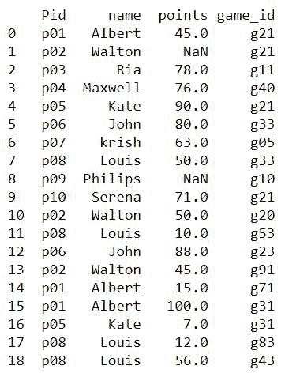
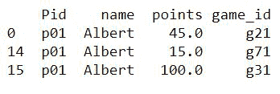
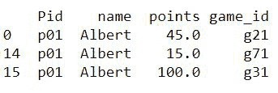
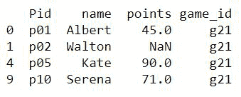
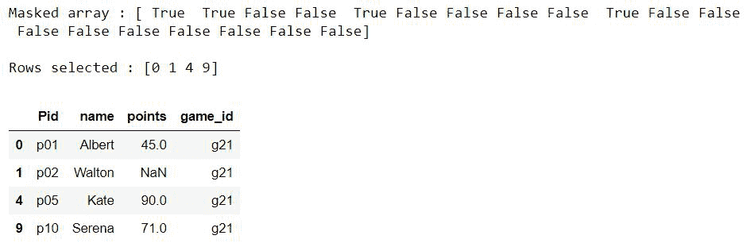
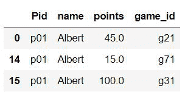
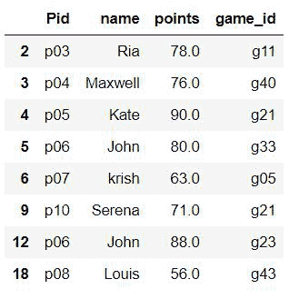
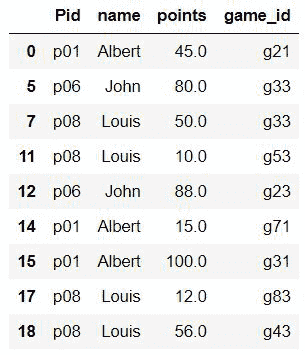
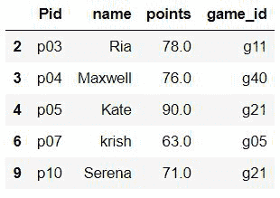
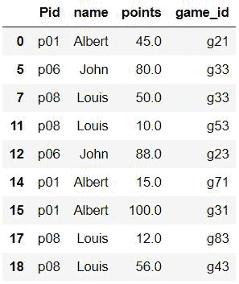

# 如何根据列值从数据框中选择行？

> 原文:[https://www . geesforgeks . org/如何基于列值从数据框中选择行/](https://www.geeksforgeeks.org/how-to-select-rows-from-a-dataframe-based-on-column-values/)

**先决条件:** [熊猫。Python 中的数据帧](https://www.geeksforgeeks.org/python-pandas-dataframe/)

数据框的行可以根据条件进行选择，就像我们使用 SQL 查询一样。本文通过示例说明了实现这一点的各种方法。为了解释这种方法，我们创建了一个数据集，其中包含了 10 个人在各种游戏中得分的数据。数据集被加载到数据框中，并首先可视化。拥有唯一玩家 id( **Pid** )的十个人用不同的游戏 id( **game_id** )玩了不同的游戏，每场游戏的得分都作为一个条目添加到表格中。玩家的一些积分没有被记录，因此 **NaN** 值出现在表格中。

**注意:**要获取使用的 CSV 文件，请点击此处。

## 蟒蛇 3

```
import pandas as pd

df=pd.read_csv(r"__your file path__\example2.csv")
print(df)
```

**输出:**



数据集示例 2.csv

## 布尔索引方法

在此方法中，对于指定的列条件，将检查每一行的真/假。输出将考虑产生**真**的行。这可以通过多种方式实现。使用的查询是**选择列 Pid = ' P01 '**的行

**示例 1:索引时检查条件**

## 蟒蛇 3

```
# Choose entries with id p01
df_new = df[df['Pid'] == 'p01']

print(df_new)
```

**输出**



**示例 2:指定** **条件“掩码”变量**

所选行被分配给新的数据框，旧数据框中的行索引作为新数据框中的索引，列保持不变。

## 蟒蛇 3

```
# condition mask
mask = df['Pid'] == 'p01'

# new dataframe with selected rows
df_new = pd.DataFrame(df[mask])

print(df_new)
```

**输出**



**示例 3:组合掩码和数据帧.值属性**

这里的查询是**选择 game_id 为‘g21’**的行。

## 蟒蛇 3

```
# condition with df.values property
mask = df['game_id'].values == 'g21'

# new dataframe
df_new = df[mask]

print(df_new)
```

**输出**



## 位置索引

方法 **loc()和 iloc()** 可以用来对 Python 中的数据帧进行切片。在 loc()和 iloc() 之间的[差异中，需要注意的重要一点是 **iloc()** 只接受整数索引，而 **loc()** 也可以接受布尔索引。](https://www.geeksforgeeks.org/difference-between-loc-and-iloc-in-pandas-dataframe/)

**例 1:使用 loc()**

**掩码**给出布尔值作为每一行的索引，结果中将出现评估为真的行。这里的查询是**选择** **行，其中 game_id 为 g21** 。

## 蟒蛇 3

```
# for boolean indexing
mask = df['game_id'].values == 'g21'

# using loc() method
df_new = df.loc[mask]

print(df_new)
```

**输出**


**示例 2:使用 iloc()**

该查询与上面的查询相同。 **iloc()** 只接受整数作为参数，因此掩码数组作为参数传递给 numpy 的[flat 非零()](https://www.geeksforgeeks.org/numpy-flatnonzero-in-python/)函数，该函数返回列表中值不为零的索引(false)

## 蟒蛇 3

```
# condition mask
mask = df['game_id'].values == 'g21'
print("Mask array :", mask)

# getting non zero indices
pos = np.flatnonzero(mask)
print("\nRows selected :", pos)

# selecting rows
df.iloc[pos]
```

**输出**



## 使用 dataframe.query()

[**query()**](https://www.geeksforgeeks.org/python-filtering-data-with-pandas-query-method/) 方法采用返回布尔值的表达式，处理数据帧中的所有行，并返回带有选定行的结果数据帧。

**示例 1:选择 name="Albert"** 所在的行

## 蟒蛇 3

```
df.query('name=="Albert"')
```

**输出**



**例 2:选择点数> 50 且玩家不是艾伯特的行。**

这个例子是为了演示像**和/或**这样的逻辑运算符可以用来检查多个条件。

## 蟒蛇 3

```
df.query('points>50 & name!="Albert"')
```

**输出**



## 使用 isin()

这种数据帧方法将一个可迭代的或一系列的或另一个数据帧作为参数，并检查数据帧的元素是否存在于其中。结果中将考虑评估为真的行。

**示例 1:选择玩家为艾伯特、路易斯和约翰的行。**

## 蟒蛇 3

```
#Players to be selected
li=['Albert','Louis','John']

df[df.name.isin(li)]
```

**输出**



**例 2:选择点数> 50 且玩家不是艾伯特、路易斯和约翰的行。**

平铺符号(~)提供计算表达式的否定。

## 蟒蛇 3

```
# values to be present in selected rows
li = ['Albert', 'Louis', 'John']

# selecting rows from dataframe
df[(df.points > 50) & (~df.name.isin(li))]
```

**输出**



## 使用 np.where()

numpy 的 **where()** 功能可以与熊猫的 **isin()** 功能结合起来产生更快的结果。 [numpy.where()](https://www.geeksforgeeks.org/numpy-where-in-python/) 被证明比上面使用的常规方法产生结果更快。

**示例:**

## 蟒蛇 3

```
import numpy as np

df_new = df.iloc[np.where(df.name.isin(li))]
```

**输出**



### 与其他方法的比较

## 蟒蛇 3

```
# to calculate timing
import numpy as np
% % timeit

# using mixture of numpy and pandas method
df_new = df.iloc[np.where(df.name.isin(li))]
```

**输出:**

> 每个环路 756 s 132 s(平均标准。戴夫。7 次运行，每次 1000 个循环)

## 蟒蛇 3

```
# to calculate time
%%timeit

li=['Albert','Louis','John']

# Pandas method only
df[(df.points>50)&(~df.name.isin(li))]
```

**输出**

> 每个环路 1.7 ms 307 s(平均标准。戴夫。7 次运行，每次 1000 个循环)