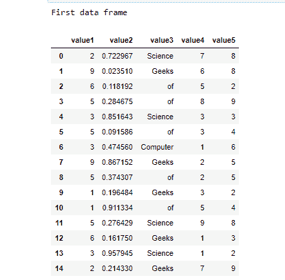
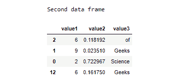

# 如何使用另一个数据帧的索引选择数据帧的行？

> 原文:[https://www . geeksforgeeks . org/如何使用另一个数据框的索引选择数据框的行/](https://www.geeksforgeeks.org/how-to-select-the-rows-of-a-dataframe-using-the-indices-of-another-dataframe/)

**先决条件:**

*   [熊猫](https://www.geeksforgeeks.org/pandas-tutorial/)
*   [随机](https://www.geeksforgeeks.org/random-numbers-in-python/)

使用 Pandas 模块，可以使用另一个数据框中的索引从一个数据框中选择行。本文对此进行了详细讨论。建议实现 jupyter 笔记本中的所有代码，以便于实现。

### 方法:

*   导入模块
*   创建第一个数据框。在下面给出的示例中 [choice()](https://www.geeksforgeeks.org/python-numbers-choice-function/) 、 [randint()](https://www.geeksforgeeks.org/python-randint-function/) 和 random()都属于随机模块，用于生成数据帧。

**1)choice()–**choice()是 Python 编程语言中的一个内置函数，它从列表、元组或字符串中返回一个随机项。

> **语法:**随机选择(序列)
> 
> **参数:**序列是一个强制参数，可以是列表、元组或字符串。
> 
> **返回:**选项()返回随机项目。

**2) randint()-** 此函数用于生成随机数

> **语法:** randint(开始，结束)
> 
> **参数:**
> 
> (开始，结束) **:** 两者都必须是整型值。
> 
> **返回:**
> 
> 范围[开始，结束]的随机整数，包括结束点。

**3) random()-** 用于生成 0 到 1 之间的浮点数。

*   使用 random()函数创建另一个数据框，并随机选择第一个数据集的行。
*   现在我们将使用 [dataframe.loc[]](https://www.geeksforgeeks.org/python-pandas-dataframe-loc/) 函数，使用第二个数据帧的索引来选择第一个数据帧的行值。熊猫DataFrame.loc[]属性通过给定数据帧中的标签或布尔数组访问一组行和列。

> ***语法:**数据框. loc*
> 
> ***参数:**无*
> 
> ***返回:**标量、序列、数据帧*

*   显示选定的行

下面给出了使用上述概念的实现:

**程序:**

## 蟒蛇 3

```py
# Importing Required Libraries
import pandas as pd
import random

# Creating data for main dataframe
col1 = [random.randint(1, 9) for i in range(15)]
col2 = [random.random() for i in range(15)]
col3 = [random.choice(['Geeks', 'of', 'Computer', 'Science'])
        for i in range(15)]
col4 = [random.randint(1, 9) for i in range(15)]
col5 = [random.randint(1, 9) for i in range(15)]

# Defining Column name for main dataframe
data_generated = {
    'value1': col1,
    'value2': col2,
    'value3': col3,
    'value4': col4,
    'value5': col5
}

# Creating the dataframe using DataFrame() function
print("First data frame")
dataframe = pd.DataFrame(data_generated)
display(dataframe)

# Creating a second dataframe that will be the subset of main dataframe
print("Second data frame")
dataframe_second = dataframe[['value1', 'value2', 'value3']].sample(n=4)
display(dataframe_second)

# Rows of a dataframe using the indices of another dataframe
print("selecting rows of first dataframe using second dataframe")
display(dataframe.loc[dataframe_second.index])
```

**输出:**

  