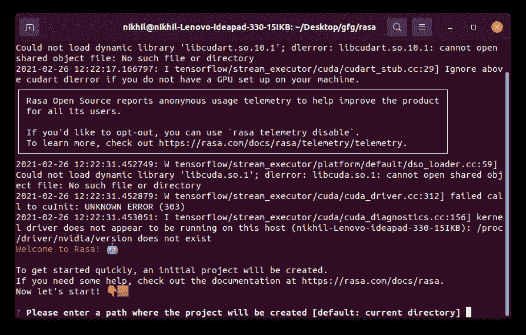
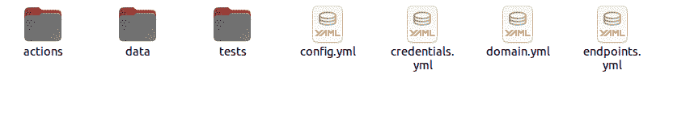
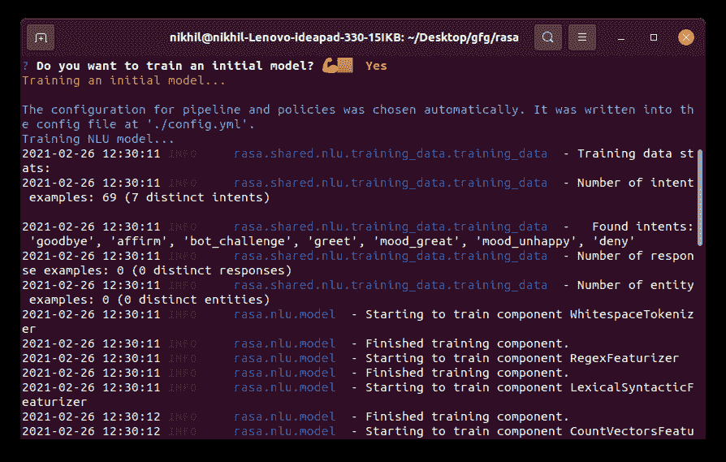
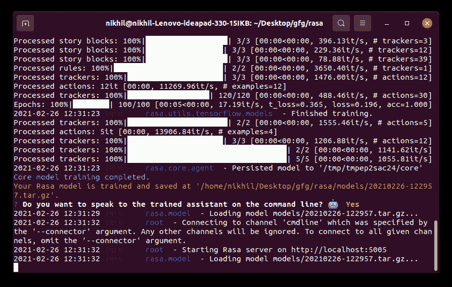
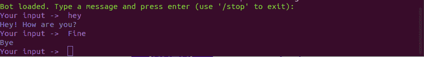
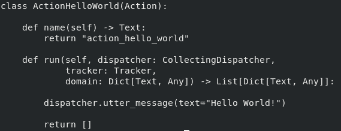
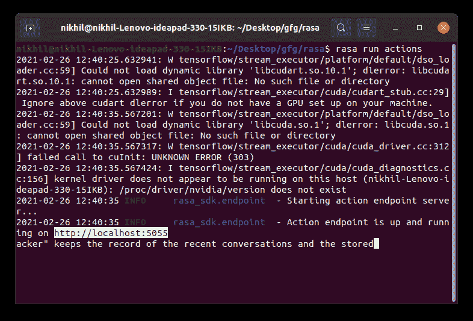
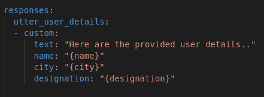
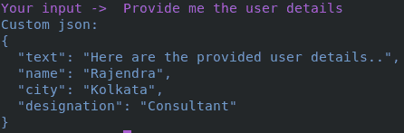

# 如何从 Rasa Chatbot 的自定义动作发送自定义 Json 响应？

> 原文:[https://www . geesforgeks . org/how-send-custom-JSON-response-from-rasa-chat bots-custom-action/](https://www.geeksforgeeks.org/how-to-send-custom-json-response-from-rasa-chatbots-custom-action/)

**Rasa** 是一个开源的机器学习框架，用于自动化基于文本语音的上下文助手。**拉萨 NLU** 借助其预先训练的 NLU 数据理解正确的意图。 **Rasa Core** 决定下一步做什么，并根据与训练故事同步的回复。它还能够存储实体(为将来使用而存储的特定于名词类型的信息)。默认情况下，它可以用文本、图像链接、按钮对象等进行响应。

## **安装**

要开始使用自己的上下文助手，只需在下面提到的命令的帮助下安装 Rasa:

```
pip install rasa
```

确保您安装了最新版本的 **PIP** 这将安装最新版本的 rasa 2.0，如果您在使用 python 版本时遇到任何困难，请安装 **Python 3.6.8** 创建虚拟环境。

## **创建 Rasa 项目**

创建一个 rasa 项目非常简单，rasa 给你一个内置的命令来为你创建一个示例项目。

```
rasa init 
```



成功执行此命令后，您将获得一个包含文件列表的目录结构，您可以通过在终端上键入**“ls-la”**来检查创建的文件。在此基础上，我们将能够训练我们的 rasa 模型根据我们的要求执行各种任务。



*   “数据”文件夹中的 **nlu.yml** 文件包含提取意图和实体的各种训练数据。
*   “数据”文件夹中的 **stories.yml** 文件包含训练 chatbot 的示例用户故事，rasa core 将使用它并预测下一个合适的动作/响应。
*   **config.yml** 文件包含与机器学习管道相关的配置，使用该配置，句子将被预处理并由 nlu 和核心模型使用。
*   **domain.yml** 文件包含意图、实体、响应和动作的列表，这些都应该在域文件中列出。
*   actions 文件夹中的 **actions.py** 文件包含在 domain.yml 文件中定义的每个自定义操作的各种 python 函数。这是一个非常有用的文件，因为它包含了将由机器人在特定意图上执行的动作定义，无论是对数据执行一些计算、调用 API 还是 python 函数可以执行的许多其他操作。

编写这些文件的格式将由我们在“rasa init”的帮助下创建的示例项目自动提供。我们只需添加我们自己的培训数据，列出意图、响应并编写所需的自定义操作，我们就可以开始了。

我们可以通过下面的简单命令来训练我们的模型:

```
rasa train
```

 

模型经过训练后，我们可以通过下面提供的简单命令在终端中测试我们的模型:

```
rasa shell 
```



有了这个，我们可以开始与机器人的对话，并测试我们的训练模型。我们还可以使用**–debug**标志来查看各种参数，如置信度、检测到的意图、下一个响应、捕获的实体等，这些将有助于我们了解模型的见解，并可以以更好的方式进一步训练模型，以获得更准确的响应。

## **自定义操作**

Rasa 为用户提供了很多功能，只需编写一个 python 类，用一些方法来满足需求，就可以完成任何任务。这些函数写在 actions.py 文件中。每个函数都附加了一个以“action_”关键字开头的特定操作名称，在 domain.yml 文件中以及在 stories.yml 文件中编写的用户故事中都应该准确地提到这个名称。这个自定义操作是在 nlu 捕获到特定意图后触发的，它将执行编码任务，然后返回所需的响应。

下面是示例自定义操作代码，以便更好地理解:



我们可以通过打开一个新的终端窗口来启动操作服务器，导航到项目目录并运行下面提供的命令:

```
rasa run actions
```



## **在自定义操作方法中检索存储的实体**

让我们看看下面的命令，它将帮助我们检索本地机器人内存中存储的实体:

```
variable_name = tracker.latest_message['entities']
```

“追踪器”保存最近对话的记录和存储的实体。上面的命令将返回一个存储实体的数组。我们将不得不迭代这个数组来获得我们想要的实体值。

## **发送自定义 JSON 响应**

通常，机器人会发送一条文本消息(字符串)作为响应(参考上面给出的截图)，但是当我们必须以 JSON 数据的形式发送一些自定义响应来满足机器人最终用户的需求时，挑战就来了。

让我们定义一个用例，在这个用例中，我们必须使用一个自定义响应，并将 JSON 数据发送回用户界面通道。

假设 Rasa 机器人在对话期间存储了一些用户数据，现在用户想要一份他/她提供的详细信息列表。接下来的任务是以 JSON 数据的形式发送定制响应，这将有助于前端开发人员隔离响应，并轻松地在用户界面中填充数据。

下面是编写自定义操作方法的 Python 代码，它将检索用户存储的实体并返回适当的值:

## 蟒蛇 3

```
class ListUserDetails(Action):

    def name(self) -> Text:
        # Name of the action mentioned in the domain.yml file
        return "action_list_user_details"

    def run(self, dispatcher: CollectingDispatcher,
            tracker: Tracker,
            domain: Dict[Text, Any]) -> List[Dict[Text, Any]]:

        # It will return array of entities
        entities = tracker.latest_message['entities']

        # Iterating through the array to retrieve the desired entity
        for e in entities:
            if e['entity'] == "user_name":
                entity_name = e['value']
            elif e['entity'] == "city_name":
                entity_city = e['value']
            elif e['entity'] == "designation":
                entity_designation = e['value']

        dispatcher.utter_message(
            template="utter_user_details",
            name=entity_name,
            city=entity_city,
            designation=entity_designation
        )

        return []
```

上面写的是 Rasa 聊天机器人的示例自定义动作 Python 代码，用于在理解用户的确切意图时执行特定的所需动作。在这里，拉莎·NLU 获取用户的信息，并找出正确的意图，在上面的例子中是“列出所有用户的详细信息”。

此后，Rasa 调用与特定意图相关联的自定义操作(action_list_user_details)并执行任务。在上面的代码中，我们在跟踪器的帮助下获取作为实体存储在机器人本地存储器中的用户详细信息，如姓名、城市和名称，并在**调度员的帮助下将获取的结果作为单个响应发送到模板**“outt _ user _ details”**。outt _ message()**

上面的代码将调用 domain.yml 文件中提到的“ut _ user _ details”响应，并将获取的用户详细信息作为参数。最后，我们必须在 domain.yml 文件中编写响应“ut _ user _ details”，使用自定义关键字向通道发送一个 JSON 对象作为对用户消息的响应。以下是回复的格式:



按照这个方法，带有所提供属性的 JSON 响应将被发送到相应的输出通道。下面代码的输出看起来类似于这样:



类似地，使用自定义响应，我们可以以 JSON 格式发送所需的数据，前端开发人员可以很好地处理这些数据。