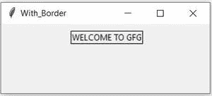
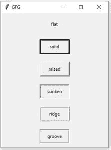

# 如何设置 Tkinter 标签小部件的边框？

> 原文:[https://www . geeksforgeeks . org/如何设置 tkinter-label-widget 的边框/](https://www.geeksforgeeks.org/how-to-set-border-of-tkinter-label-widget/)

这里的任务是使用[Tkit](https://www.geeksforgeeks.org/python-gui-tkinter/)模块起草一个 python 程序来设置标签小部件的边框。Tkinter 标签小部件是显示文本或图像的区域。我们可以随时更新这篇文章。

### 方法

*   导入模块
*   创建窗口
*   为边框设置带有所需属性的标签小部件
*   将此小部件放在创建的窗口上

> **语法:**标签(主，选项，…)
> 
> **参数:**
> 
> *   **主**:代表父窗口。
> *   **选项:**标签有很多选项，像 bg、fg、字体、bd 等

现在要设置标签的边框，我们需要向标签属性添加两个选项:

*   **边框宽度:**它将代表标签周围边框的大小。默认情况下，borderwidth 为 2 像素。“bd”也可以作为 borderwidth 的简写。
*   **浮雕:**它将指定标签周围装饰边框的外观。默认情况下，它是平面的。除了平面，还有许多更容易接受的值，如凸起、脊形、实心等。

下面给出了设置边框并根据需要进行编辑的实现。

**程序 1:** 设置边框

## 蟒蛇 3

```
# import tkinter
from tkinter import *

# Create Tk object
window = Tk()

# Set the window title
window.title('With_Border')

# set the window size
window.geometry('300x100')

# take one Label widget
label = Label(window, text="WELCOME TO GFG", borderwidth=1, relief="solid")

# place that label to window
label.grid(column=0, row=1, padx=100, pady=10)
window.mainloop()
```

**输出:**



**程序 2:** 设置边框，根据需要进行编辑。

## 蟒蛇 3

```
# import tkinter
from tkinter import *

# Create Tk object
window = Tk()

# Set the window title
window.title('GFG')

# take Label widgets
A = Label(window, text="flat", width=10,
          height=2, borderwidth=3, relief="flat")
B = Label(window, text="solid", width=10,
          height=2, borderwidth=3, relief="solid")
C = Label(window, text="raised", width=10,
          height=2, borderwidth=3, relief="raised")
D = Label(window, text="sunken", width=10,
          height=2, borderwidth=3, relief="sunken")
E = Label(window, text="ridge", width=10,
          height=2, borderwidth=3, relief="ridge")
F = Label(window, text="groove", width=10,
          height=2, borderwidth=3, relief="groove")

# place that labels to window
A.grid(column=0, row=1, padx=100, pady=10)
B.grid(column=0, row=2, padx=100, pady=10)
C.grid(column=0, row=3, padx=100, pady=10)
D.grid(column=0, row=4, padx=100, pady=10)
E.grid(column=0, row=5, padx=100, pady=10)
F.grid(column=0, row=6, padx=100, pady=10)

window.mainloop()
```

**输出:**

