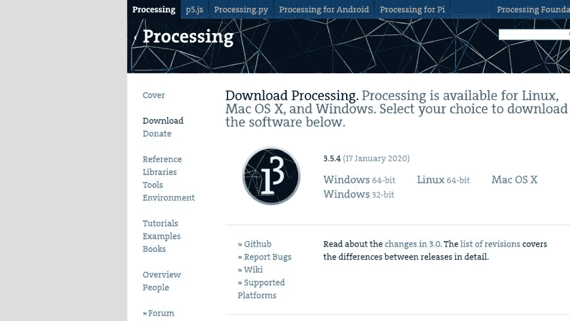
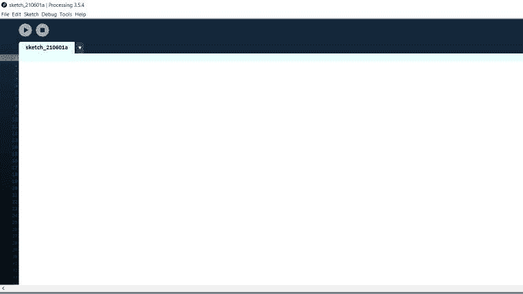
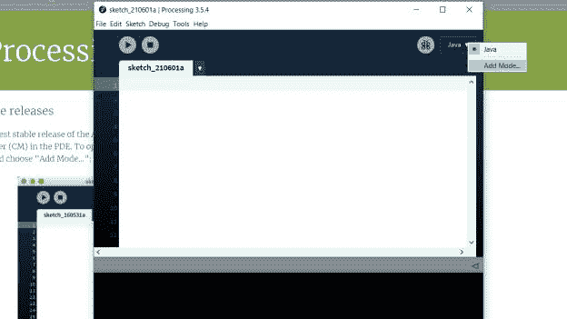
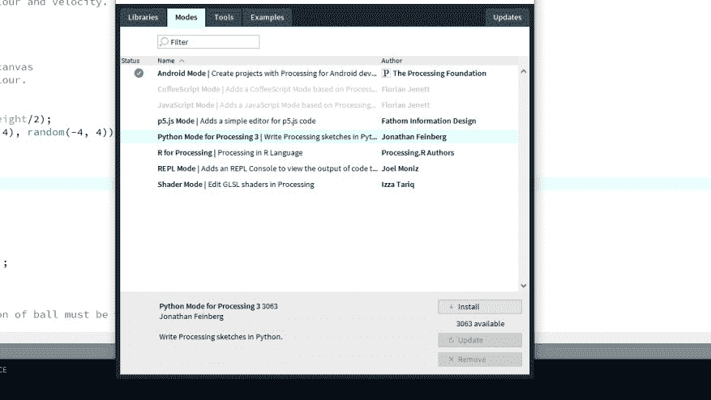
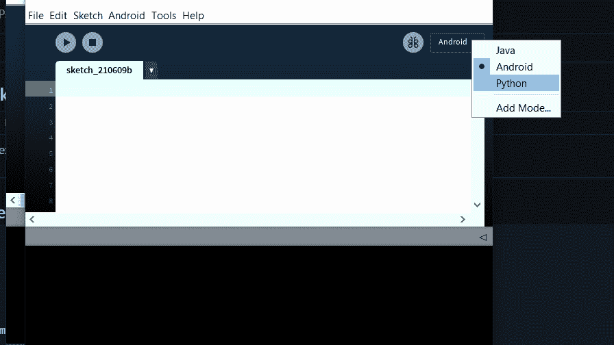
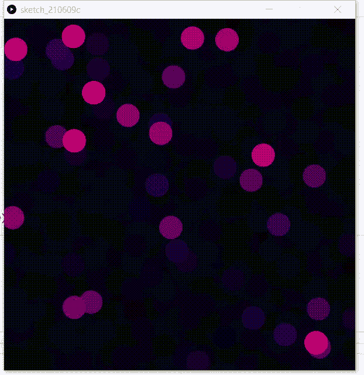

# 如何设置 Python 模式进行处理？

> 原文:[https://www . geesforgeks . org/如何设置-python 处理模式/](https://www.geeksforgeeks.org/how-to-set-up-python-mode-for-processing/)

Processing 是用于电子艺术和视觉设计社区的开源软件。我们可以用我们的编码技巧创造不同类型的艺术。例子有游戏、动画和物理引擎等。

**第一步:**下载[视窗(64/32 位)](https://processing.org/download/)



**步骤 2:** 提取任意文件夹中的 Zip 文件并打开 processing .exe。


**第三步:**加工 IDE 将打开。之后写你自己的代码。



**第 4 步:**要设置 python 模式进行处理，请点击**添加更多。**



**第五步:**点击 **Python 模式进行处理 3** 点击安装按钮。



**第六步:**安装后，我们可以看到在处理 ide 中加入了 Python 模式。



**示例:**在代码块中添加代码，查看动画。

## 蟒蛇 3

```
# Function to set up size of output window
# and colour mode.
def setup():
    size(600, 600)
    colorMode(HSB)
    noStroke()

# Function to set up colour fill and ellise size.
def draw():
    fill(0x11000000)
    fill(0x1000000)
    fill(0x11000011)

    rect(0, 0, width, height)
    fill(frameCount % 255, 255, 255)
    ellipse(random(0,width), random(0,height), 40, 40)
```

**输出:**

