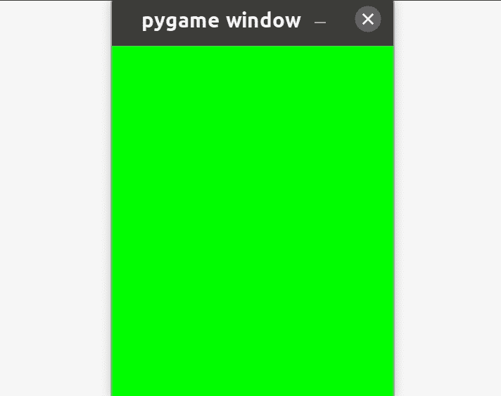

# 如何在 PygGame 中设置游戏循环？

> 原文:[https://www . geesforgeks . org/如何设置游戏循环中的 pyggame/](https://www.geeksforgeeks.org/how-to-set-up-the-game-loop-in-pyggame/)

在本文中，我们将看到如何在 PyGame 中设置游戏循环。**游戏循环**是保持游戏运行的循环。它会一直运行，直到用户想要退出。当游戏循环运行时，它主要执行以下任务:

1.  更新我们的游戏窗口以显示视觉变化
2.  根据用户输入更新我们的游戏状态
3.  处理不同类型的事件
4.  保持游戏窗口运行

简单地说，游戏循环是一个 while 循环，只有一个条件来检查我们保持游戏运行的布尔条件是否为真。

## 设置游戏循环

**第一步:**声明一个布尔变量为真，这个变量将用于检查我们的玩家是否想继续玩我们的游戏。

```
keepGameRunning=true
```

**第二步:**创建一个 while 循环，检查我们上面的布尔变量是否为真。如果为真，保持循环运行，这意味着保持我们的游戏循环运行。在这个 while 循环中，检查事件，如果事件退出，那么将上面的变量设置为 false，以退出我们的游戏循环并结束我们的 pygame 窗口。

```
while keepGameRunning:
    for event in pygame.event.get():
        if event.type == pygame.QUIT:  
           keepGameRunning = False
```

下面是完整的实现。

在下面的代码中，我们创建了一个简单的游戏循环，它创建了一个 pygame 窗口，并检查事件类型是否为退出，如果为真，则退出游戏。

## 蟒蛇 3

```
# import pygame package
import pygame

# initializing imported module
pygame.init()

# displaying a window of height
# 500 and width 400
pygame.display.set_mode((400, 500))

# Setting name for window
pygame.display.set_caption('GeeksforGeeks')

# creating a bool value which checks
# if game is running
running = True

# Game loop
# keep game running till running is true
while running:

    # Check for event if user has pushed
    # any event in queue
    for event in pygame.event.get():

        # if event is of type quit then set
        # running bool to false
        if event.type == pygame.QUIT:
            running = False
```

**输出:**


在下面的代码中，我们在我们的游戏循环中增加了一个任务，即在每个循环中更新我们的屏幕。这里，我们通过更新每个循环中的屏幕来更改每个循环的背景颜色。

## 蟒蛇 3

```
# import pygame package
import pygame

# initializing imported module
pygame.init()

# displaying a window of height
# 500 and width 400
window = pygame.display.set_mode((400, 500))

# creating a bool value which checks
# if game is running
running = True

# setting variable to storecolor
color = "red"

# keep game running till running is true
while running:

    # Check for event if user has pushed
    # any event in queue
    for event in pygame.event.get():

        # if event is of type quit then set
        # running bool to false
        if event.type == pygame.QUIT:
            running = False

    # set background color to our window
    window.fill(color)

    # Update our window
    pygame.display.flip()

    # if color is red change it to green and
    # vice-versa
    if(color == "red"):
        color = "green"

    else:
        color = "red"
```

**输出:**

