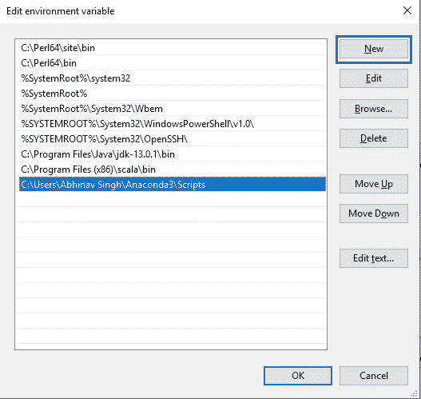
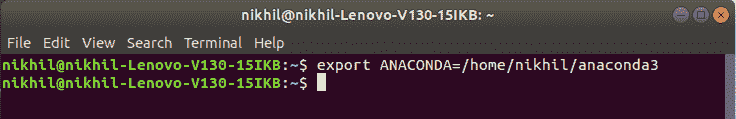
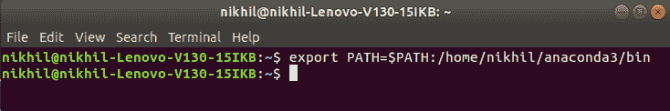

# 如何设置 Anaconda 到环境变量的路径？

> 原文:[https://www . geesforgeks . org/how-setup-anaconda-path-to-environment-variable/](https://www.geeksforgeeks.org/how-to-setup-anaconda-path-to-environment-variable/)

Anaconda 是开源软件，包含 Jupyter、spyder 等，用于大型数据处理、数据分析、重型科学计算。Anaconda 为 R、 [python 编程语言](https://www.geeksforgeeks.org/python-language-introduction/) s 工作，python 使用 Spyder(Anaconda 的子应用)。python 的 Opencv 将在 spyder 中工作。软件包版本由名为 conda 的软件包管理系统管理。

#### 环境变量是什么？

环境变量基本上定义了环境的行为。它们会影响正在进行的过程或在环境中执行的程序。可以访问或定义该变量的区域称为变量的范围。

#### 设置环境变量的步骤:

Windows

*   下载 Python 的[蟒蛇](https://www.anaconda.com/distribution/)。确保下载“Python 3.7 版本”以获得合适的体系结构。


*   下载结束后，通过[如何在 windows 上安装 Anaconda？](https://www.geeksforgeeks.org/how-to-install-anaconda-on-windows/)并遵循给定的说明。
*   安装完成后，我们需要设置环境变量。
    转到**控制面板- >系统和安全- >系统**
    在**高级系统设置**选项下点击**环境变量**，如下图:

 

*   现在，我们必须更改系统变量下的**“路径”**变量，以便它也包含到 Anaconda 环境的路径。选择**“路径”**变量，点击**编辑**按钮，如下图:


*   我们会看到不同路径的列表，点击**新建**按钮，然后添加安装 Anaconda 的路径。



*   点击确定，保存设置，就完成了！！现在检查安装是否正确，打开命令提示符，输入 **anaconda-navigator** 。如果安装正确，它将启动蟒蛇导航应用程序。

Linux

在 Linux 中，有几种方法可以安装 Anaconda。但是我们将参考使用终端安装 Anaconda 的最简单易行的方法。穿越[如何在 Linux 上安装 Anaconda？](https://www.geeksforgeeks.org/how-to-install-anaconda-on-linux/)并按照说明操作。通常，路径变量是在安装时在 Linux 中自动设置的，但也可以通过以下步骤手动设置:

*   转到**应用- >配件- >终端**
*   要设置环境变量，请使用安装路径在终端中键入以下命令:

```
export ANACONDA = /home/nikhil/anaconda3
```



*   要设置环境值，请使用安装路径在终端中键入以下命令:

```
export PATH = $PATH:/home/nikhil/anaconda3/bin
```



*   完成了！！现在检查安装是否正确，打开终端，输入**蟒蛇-导航器**。如果安装正确，它将启动蟒蛇导航应用程序。