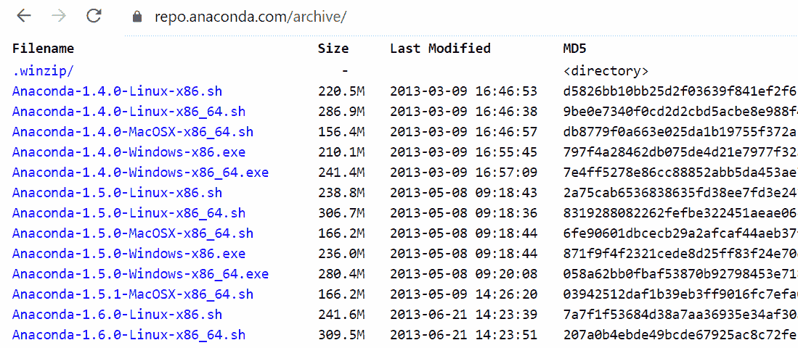
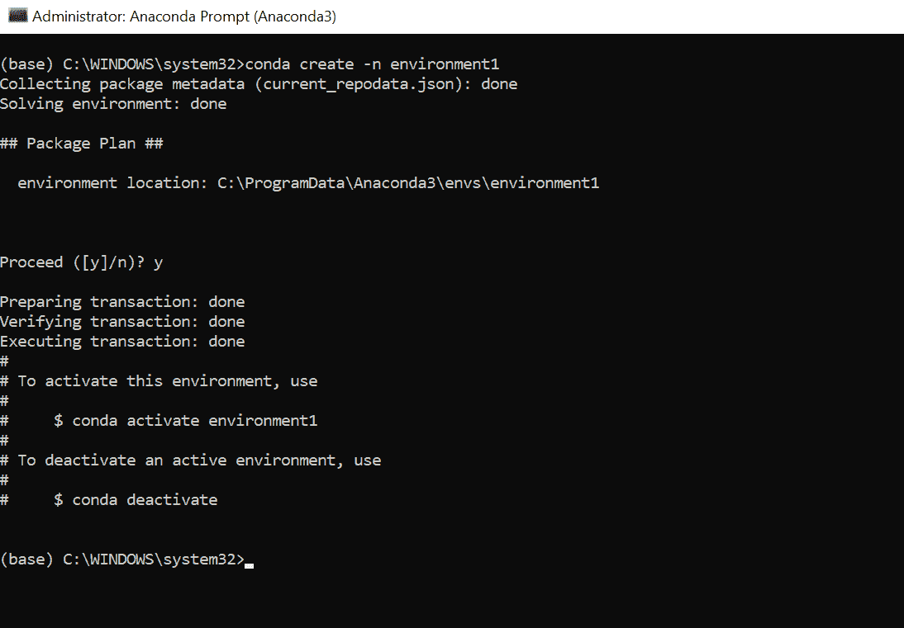
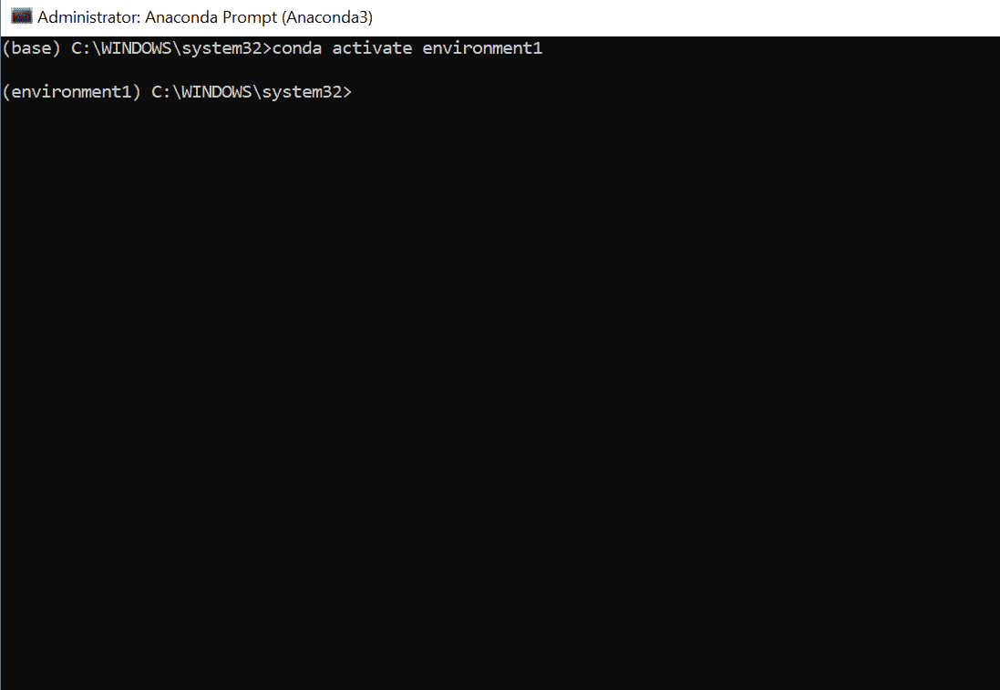
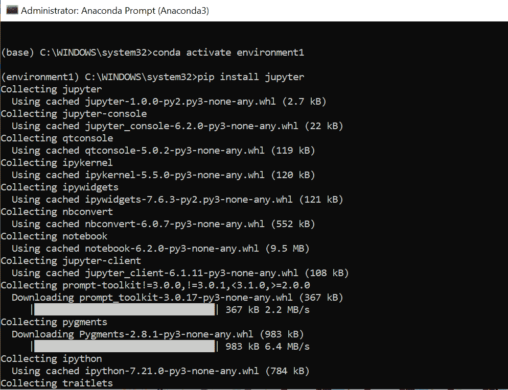
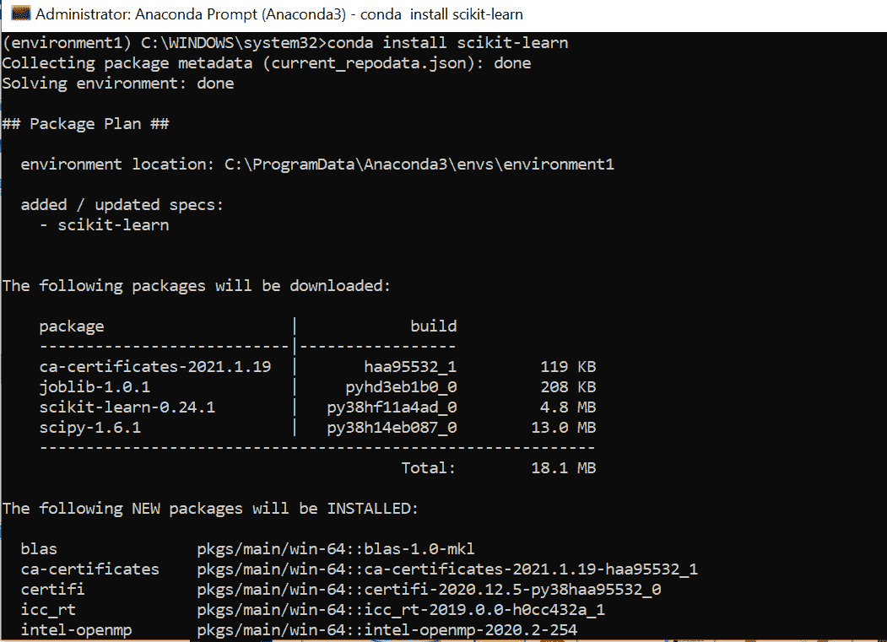
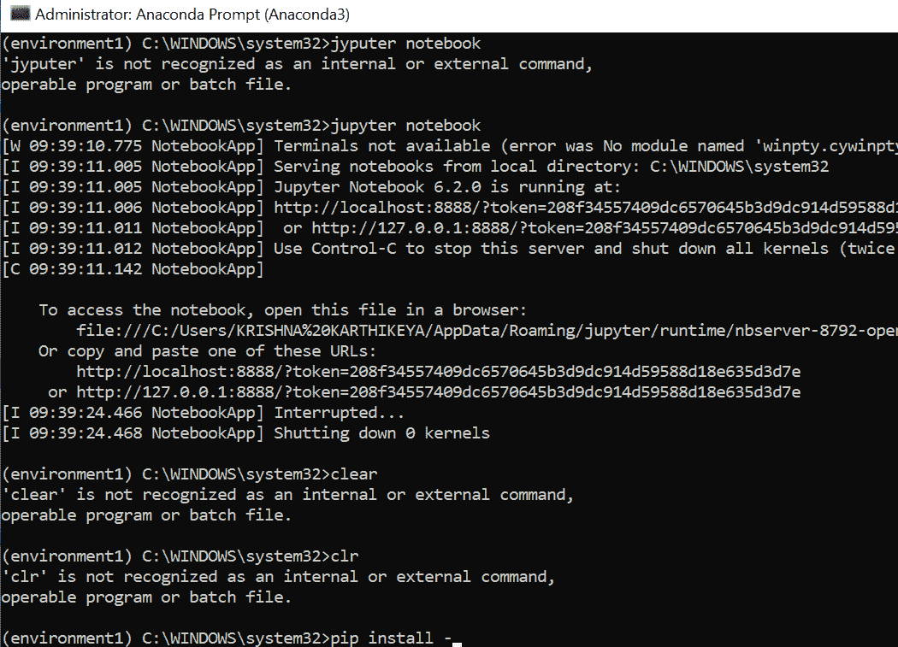

# 如何用 Jupyter 笔记本设置 Conda 环境？

> 原文:[https://www . geeksforgeeks . org/how-setup-conda-environment-with-jupyter-notebook/](https://www.geeksforgeeks.org/how-to-setup-conda-environment-with-jupyter-notebook/)

Anaconda 是开源软件，包含 Jupyter、spyder 等，用于大型数据处理、数据分析、重型科学计算。Anaconda 为 R 和 [python 编程语言](https://www.geeksforgeeks.org/python-language-introduction/)工作。python 使用 spyder(Anaconda 的子应用程序)。python 的 Opencv 将在 spyder 中工作。软件包版本由名为 conda 的软件包管理系统管理。

在开始设置编码环境之前，让我们看看如何安装 Anaconda

### **蟒蛇安装:**

*   去任何浏览器，搜索蟒蛇回购
*   找到蟒蛇仓库网站[https://repo.anaconda.com/](https://repo.anaconda.com/)

*   然后找到 anaconda 安装程序，并点击查看所有安装程序。

*   找到最新的安装程序，然后单击该安装程序。
*   点击安装程序后，浏览器会自动下载安装程序。
*   以管理员身份运行安装程序。
*   按照安装步骤安装 anaconda。

### **用 jupyter 笔记本设置蟒蛇编码环境:**

*   安装完成后，转到 start 并找到 anaconda 提示符。
*   以管理员身份运行 anaconda 提示符。
*   打开 anaconda 命令提示符后，键入**conda create-n environment _ name**

*   有了这个命令，我们可以为自己创建一个编码环境。
*   要激活环境，执行**秒激活环境名称**

*   要在环境中安装 jupyter 笔记本，我们需要执行命令 **conda 安装 jupyter 笔记本**
*   执行上述命令后，我们将进入环境。
*   现在我们可以使用命令 **pip 安装 jupyter** 在环境中安装 jupyter 笔记本

*   现在我们可以安装我们需要的软件包，如熊猫，numpy，matplotlib，sklearn，scikit-learn，seaborn 等。
*   要安装上述软件包，请使用命令 **pip install package_name。**
*   有些软件包不能使用 pip 命令安装。然后用 conda 代替 pip。

*   安装所需的库和包后，键入命令 jupyter notebook。
*   上面的命令将打开 jupyter 笔记本。

*   如果 jupyter 笔记本没有打开，会自动复制屏幕上显示的链接。链接看起来像 *localhost:8888/？代币*还是*127.0.0.1:8888/？令牌*并粘贴在任意浏览器的搜索栏上。
*   因此，您可以重定向到 jupyter 笔记本主页。
*   在那里，我们可以为自己创建一个文件夹，并可以进行我们的项目。
*   要创建新的 python3 文件，请转到导航的右侧，找到一个新按钮并单击它。
*   你能找到的选择很少。选择 python3。
*   打开新的 python3 文件来执行 python 程序。
*   我们可以使用 pip 命令直接在 python3 文件中安装新的包。