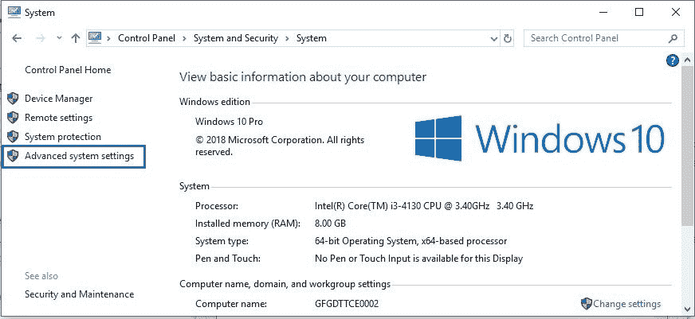
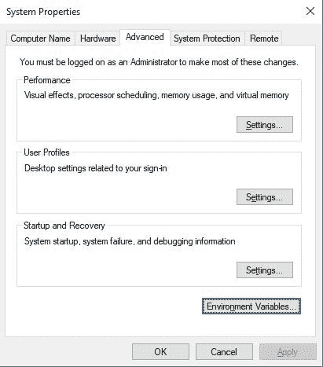
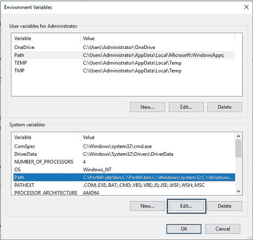
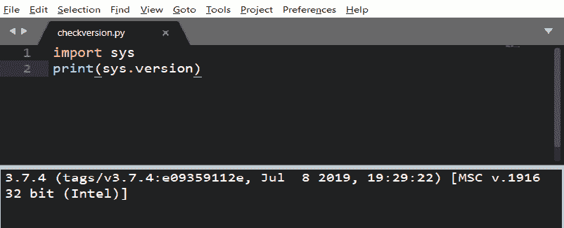
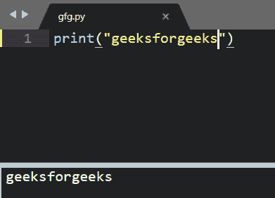

# 如何在 Windows 中为 Python 设置崇高文本 3？

> 原文:[https://www . geeksforgeeks . org/如何设置-崇高-文本-3-for-python-in-window/](https://www.geeksforgeeks.org/how-to-setup-sublime-text-3-for-python-in-windows/)

由谷歌工程师编写的崇高文本是一个用 C++和 Python 开发的跨平台 IDE。它对 Python 有基本的内置支持。崇高的文本是快速的，你可以根据需要定制这个编辑器来创建一个完整的 Python 开发环境。您可以安装调试、自动完成、代码林挺等软件包。还有各种科学发展包，Django，Flask 等等。

#### 下载和安装

崇高文本 3 可以从其官方网站[sublimetext.com](https://www.sublimetext.com/3)下载。要在 Windows 上安装崇高文字 3，请通过[如何在 Windows 中安装崇高文字 3？](https://www.geeksforgeeks.org/how-to-install-sublime-text-3-in-windows/)

#### 设置环境变量

*   **第一步:**点击**高级系统设置**链接。
    

*   **Step 2:** Click **Environment Variables**. In the section System Variables, find the PATH environment variable and select it. Click Edit. If the PATH environment variable does not exist, click New.
    

    

*   **步骤 3:** 在编辑系统变量(或新系统变量)窗口中，指定**路径环境变量**的值。单击确定。单击确定关闭所有剩余窗口。

#### 致力于卓越的文本 3

**第一步:**新建一个文件，用扩展名保存。以 py 为例，将其保存为 **checkversion.py** 。现在，转到**工具- >构建系统- > Python** 然后键入您的**check version . py**

这是 Python 的显示版本。这意味着 python 已经成功安装并添加到环境变量中。

**步骤 2:** 在你的崇高**工具上添加新的构建系统- >构建系统- >新的构建系统**并确保新的构建系统具有以下命令

```
{
 "cmd":["C:/Users/<user>/AppData/Local/Programs/Python/Python37-32/python.exe", "-u", "$file"],
 "file_regex": "^[ ]File \"(...?)\", line ([0-9]*)",
 "selector": "source.python"
}
```

选择你的新系统版本**新 Python3** 并重新运行 **checkversion.py** ，现在它应该使用 **Python 3**

全部完成…
现在创建任何文件并保存。py 扩展

现在，您可以使用 **CTRL+SHIFT+B** 运行您的 Python 代码，并从 2 个选项中进行选择。

