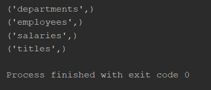
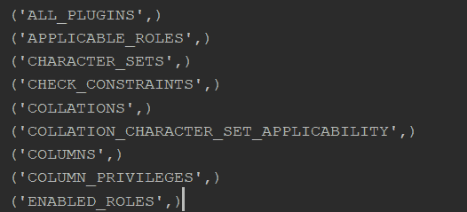

# 如何用 Python 显示 MySQL 中的所有表？

> 原文:[https://www . geeksforgeeks . org/如何使用 python 显示 mysql 中的所有表/](https://www.geeksforgeeks.org/how-to-show-all-tables-in-mysql-using-python/)

当我们不得不使用 mysql 和其他编程语言时，连接器就被使用了。 [mysql-connector](https://www.geeksforgeeks.org/connect-mysql-database-using-mysql-connector-python/) 的工作是提供对所需语言的 MySQL Driver 的访问。因此，它在编程语言和 MySQL 服务器之间生成了一个连接。

为了让 python 与 MySQL 数据库进行交互，我们使用了 Python-MySQL-Connector。在这里，我们将尝试实现 SQL 查询，它将显示数据库或服务器中存在的所有表的名称。

> **语法:**
> 
> **显示数据库中存在的表的名称:**
> 
> 显示表格；
> 
> **显示服务器中存在的表的名称:**
> 
> 选择表名
> 
> FROM information _ schema.tables

**正在使用的数据库:**


所用数据库的模式

以下程序实现了相同的功能。

**示例 1:** 显示数据库中存在的表名:

## 蟒蛇 3

```
import mysql.connector

mydb = mysql.connector.connect(
    host="localhost",
    user="root",
    password="",
    database="gfg"
)

mycursor = mydb.cursor()

mycursor.execute("Show tables;")

myresult = mycursor.fetchall()

for x in myresult:
    print(x)
```

**输出:**



gfg 数据库中的表名

**示例 2:** 显示服务器中存在的表名:

## 蟒蛇 3

```
import mysql.connector

mydb = mysql.connector.connect(
  host="localhost",
  user="root",
  password="",
)

mycursor = mydb.cursor()

mycursor.execute("SELECT table_name FROM information_schema.tables;")

myresult = mycursor.fetchall()

for x in myresult:
  print(x)
```

**输出:**



服务器中的表名