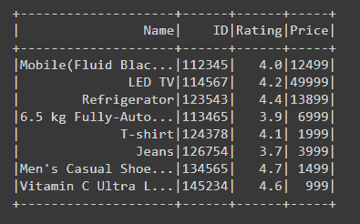
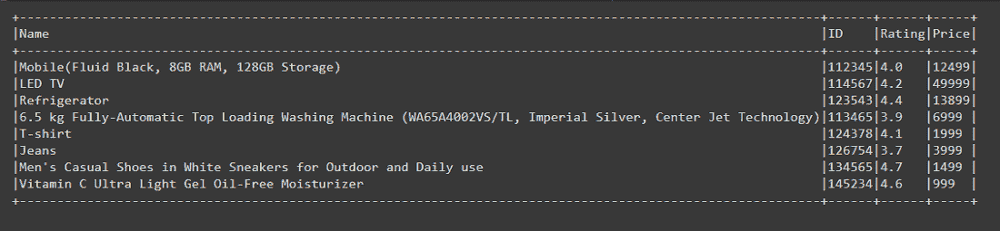
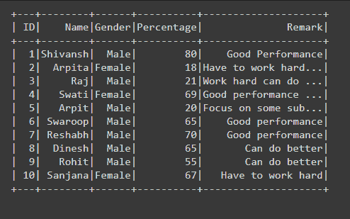
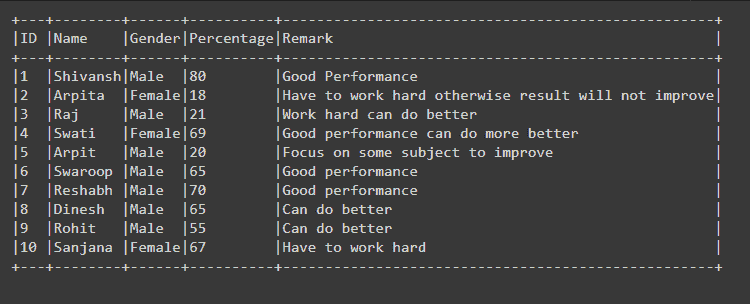
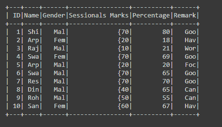
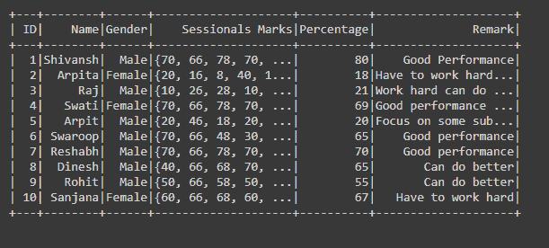
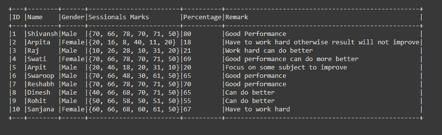

# 如何在 PySpark Dataframe 中显示完整的列内容？

> 原文:[https://www . geesforgeks . org/how-show-full-column-content-in-a-py spark-data frame/](https://www.geeksforgeeks.org/how-to-show-full-column-content-in-a-pyspark-dataframe/)

有时在数据框中，当列数据包含长内容或大句子时，PySpark SQL 以压缩形式显示数据框意味着显示句子的前几个单词，其他单词后面是点，表示有更多的数据可用。



从上面的示例数据框中，我们可以很容易地看到名称列的内容没有完全显示出来。这个事情是由 PySpark 自动完成的，通过这种方式系统地显示数据帧，数据帧看起来不会很乱，但是在某些情况下，我们需要阅读或查看特定列的全部内容。

因此，在本文中，我们将学习如何在 PySpark Dataframe 中显示完整的列内容。显示完整列内容的唯一方法是使用 show()函数。

> **语法:** df.show(n，truncate=True)
> 
> 其中 df 是数据帧
> 
> *   show():函数用于显示数据帧。
> *   n:要显示的行数。
> *   truncate:通过这个参数，我们可以告诉 Output 接收器通过将 truncate 选项设置为 false 来显示完整的列内容，默认情况下这个值为 true。

**示例 1:显示 PySpark 数据框的全列内容。**

## 计算机编程语言

```py
# importing necessary libraries
from pyspark.sql import SparkSession

# function to create new SparkSession

def create_session():
    spk = SparkSession.builder \
        .master("local") \
        .appName("Product_details.com") \
        .getOrCreate()
    return spk

def create_df(spark, data, schema):
    df1 = spark.createDataFrame(data, schema)
    return df1

if __name__ == "__main__":

    # calling function to create SparkSession
    spark = create_session()

    input_data = [("Mobile(Fluid Black, 8GB RAM, 128GB Storage)",
                   112345, 4.0, 12499),

                  ("LED TV", 114567, 4.2, 49999),

                  ("Refrigerator", 123543, 4.4, 13899),

                  ("6.5 kg Fully-Automatic Top Loading Washing Machine \
                  (WA65A4002VS/TL, Imperial Silver, Center Jet Technology)",
                   113465, 3.9, 6999),

                  ("T-shirt", 124378, 4.1, 1999),

                  ("Jeans", 126754, 3.7, 3999),

                  ("Men's Casual Shoes in White Sneakers for Outdoor and\
                  Daily use", 134565, 4.7, 1499),

                  ("Vitamin C Ultra Light Gel Oil-Free Moisturizer",
                   145234, 4.6, 999),
                  ]

    schema = ["Name", "ID", "Rating", "Price"]

    # calling function to create dataframe
    df = create_df(spark, input_data, schema)

    # visualizing full content of the Dataframe
    # by setting truncate to False
    df.show(truncate=False)
```

**输出:**

 

**示例 2:通过将截断设置为 0 来显示数据框的完整列内容。**

在示例中，我们设置了参数 *truncate=0，*在这里，如果我们从 1 开始设置任何整数，例如 3，那么它将显示最多三个字符或整数位置的列内容，不超过下图所示的位置。但是在这里，如果我们传递 0，它将代替 false，这也将充当 False，就像在二进制数字 0 中引用 False 并在 Dataframe 中显示完整的列内容一样。

## 计算机编程语言

```py
# importing necessary libraries
from pyspark.sql import SparkSession

# function to create new SparkSession
def create_session():
  spk = SparkSession.builder \
      .master("local") \
      .appName("Student_report.com") \
      .getOrCreate()
  return spk

def create_df(spark,data,schema):
  df1 = spark.createDataFrame(data,schema)
  return df1

if __name__ == "__main__":

  # calling function to create SparkSession
  spark = create_session()

  input_data = [(1,"Shivansh","Male",80,"Good Performance"),
          (2,"Arpita","Female",18,"Have to work hard otherwise \
          result will not improve"),
          (3,"Raj","Male",21,"Work hard can do better"),
          (4,"Swati","Female",69,"Good performance can do more better"),
          (5,"Arpit","Male",20,"Focus on some subject to improve"),
          (6,"Swaroop","Male",65,"Good performance"),
          (7,"Reshabh","Male",70,"Good performance"),
          (8,"Dinesh","Male",65,"Can do better"),
          (9,"Rohit","Male",55,"Can do better"),
          (10,"Sanjana","Female",67,"Have to work hard")]

  schema = ["ID","Name","Gender","Percentage","Remark"]

  # calling function to create dataframe
  df = create_df(spark,input_data,schema)

  # visualizing full column content of the dataframe by setting truncate to 0
  df.show(truncate=0)
```

**输出:**

  

**示例 3:使用 show()函数显示 PySpark Dataframe 的全列内容。**

在通过传递参数 *df.count()、truncate=False、*来显示完整列内容的代码中，我们可以编写为 *df.show(df.count()、truncate=False)* ，这里 show 函数将第一个参数作为 n，即要显示的行数，因为 df.count()返回 Dataframe 中存在的总行数的计数，就像上面的情况一样，总行数是 10，所以在 show()函数中，n 被传递为 10，这只是总数

## 计算机编程语言

```py
# importing necessary libraries
from pyspark.sql import SparkSession

# function to create new SparkSession

def create_session():
    spk = SparkSession.builder \
        .master("local") \
        .appName("Student_report.com") \
        .getOrCreate()
    return spk

def create_df(spark, data, schema):
    df1 = spark.createDataFrame(data, schema)
    return df1

if __name__ == "__main__":

    # calling function to create SparkSession
    spark = create_session()

    input_data = [(1, "Shivansh", "Male", (70, 66, 78, 70, 71, 50), 80,
                   "Good Performance"),

                  (2, "Arpita", "Female", (20, 16, 8, 40, 11, 20), 18,
                   "Have to work hard otherwise result will not improve"),

                  (3, "Raj", "Male", (10, 26, 28, 10, 31, 20),
                   21, "Work hard can do better"),

                  (4, "Swati", "Female", (70, 66, 78, 70, 71, 50),
                   69, "Good performance can do more better"),

                  (5, "Arpit", "Male", (20, 46, 18, 20, 31, 10),
                   20, "Focus on some subject to improve"),

                  (6, "Swaroop", "Male", (70, 66, 48, 30, 61, 50),
                   65, "Good performance"),

                  (7, "Reshabh", "Male", (70, 66, 78, 70, 71, 50),
                   70, "Good performance"),

                  (8, "Dinesh", "Male", (40, 66, 68, 70, 71, 50),
                   65, "Can do better"),

                  (9, "Rohit", "Male", (50, 66, 58, 50, 51, 50),
                   55, "Can do better"),

                  (10, "Sanjana", "Female", (60, 66, 68, 60, 61, 50),
                   67, "Have to work hard")]

    schema = ["ID", "Name", "Gender",
              "Sessionals Marks", "Percentage", "Remark"]

    # calling function to create dataframe
    df = create_df(spark, input_data, schema)

    # visualizing full column content of the
    # dataframe by setting n and truncate to
    # False
    df.show(df.count(), truncate=False)
```

**输出:**

 