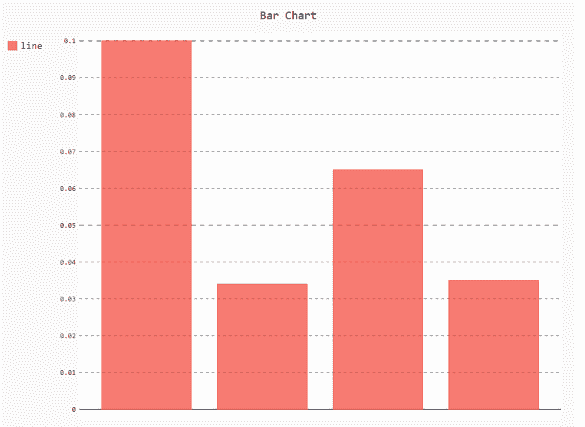
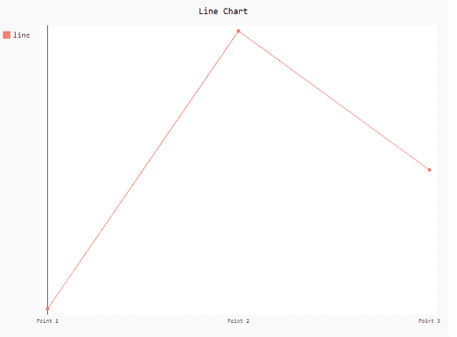
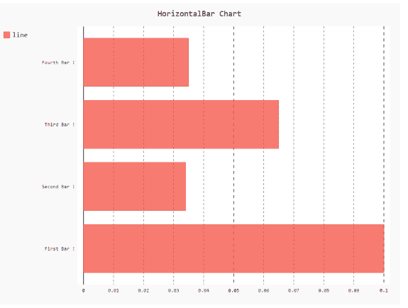

# 如何在 Pygal 中显示或隐藏标签？

> 原文:[https://www . geesforgeks . org/how-to-show-or-hide-labels-in-pygal/](https://www.geeksforgeeks.org/how-to-show-or-hide-labels-in-pygal/)

**先决条件:** [皮格尔](http://www.pygal.org/en/stable/)

Pygal 是 Python 的图形和用户界面库，提供设计和科学应用程序通常需要的功能。在制作剧情的同时，优化它的标签、标题、大小对我们来说很重要。在本文中，我们将看到如何在 Pygal 模块中显示/隐藏绘图窗口的标签值。以下是根据我们的要求更改默认显示/隐藏标签的各种方法。

**进场:**

*   导入所需模块。
*   创建图表对象。
*   显示或隐藏标签值。
*   给图表贴上标签。
*   显示图形。

上面讨论的概念的实现在下面给出 **:**

**例 1:**

## 蟒蛇 3

```
# import library
import pygal
import numpy

# creating the chart object
# enable/disable labels
chart = pygal.Bar(show_x_labels=False)

# Random data
chart.x_labels = [
    'First Bar !',
    'Second Bar !',
    'Third Bar !',
    'Fourth Bar !']
chart.add('line', [0.1, .034, .065, .035])

# naming the title
chart.title = 'Bar Chart'

chart.render_to_png('aa.png')
```

**输出**



**例 2:**

## 蟒蛇 3

```
# import library
import pygal

# enable/disable labels
chart = pygal.Line(show_y_labels=False, show_x_labels=True)

# X-label
chart.x_labels = 'Point 1', 'Point 2', 'Point 3'
# y-label
chart.add('line', [.0002, .0005, .00035])

# naming the title
chart.title = 'Line Chart'

chart.render_to_png('aa.png')
```

**输出**



**例 3:**

## 蟒蛇 3

```
# import library
import pygal
import numpy

# creating the chart object
# enable/disable labels
chart = pygal.HorizontalBar(show_x_labels=True, show_y_labels=True)

# Random data
chart.x_labels = [
    'First Bar !',
    'Second Bar !',
    'Third Bar !',
    'Fourth Bar !']
chart.add('line', [0.1, .034, .065, .035])

# naming the title
chart.title = 'HorizontalBar Chart'

chart.render_to_png('aa.png')
```

**输出**

