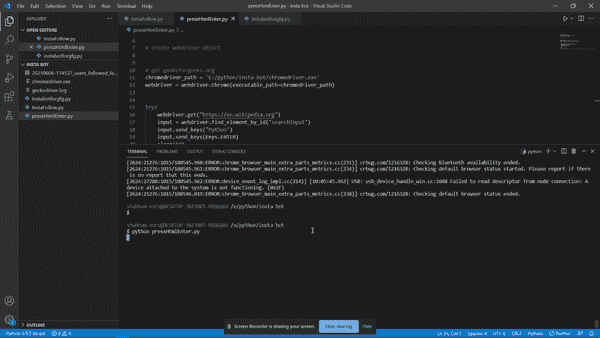
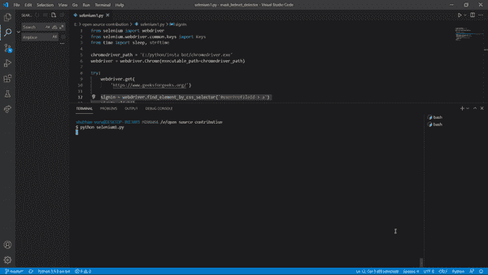

# 如何用 Selenium 模拟 HTML 文本输入中按 enter 键？

> 原文:[https://www . geesforgeks . org/如何模拟-按下-输入-html-text-input-with-selenium/](https://www.geeksforgeeks.org/how-to-simulate-pressing-enter-in-html-text-input-with-selenium/)

[Selenium](https://www.geeksforgeeks.org/selenium-python-tutorial/) 是 python 中提供的内置模块，允许用户进行自动化的套件和测试。我们可以使用 selenium 构建代码或脚本来在网络浏览器中自动执行任务。硒用于自动化测试软件。此外，程序员可以使用 selenium 为软件或应用程序创建自动化测试用例。

通过阅读本教程，用户将能够使用 selenium 在 HTML 文本输入中模拟按 enter 键。此外，我们将编写一个简单的代码，可以在维基百科网站上自动搜索文本，并在极客网站上执行自动登录。

**先决条件:**

*   [Python 3.7+](https://www.geeksforgeeks.org/python-programming-language/)
*   [硒](https://www.geeksforgeeks.org/selenium-python-tutorial/)
*   [网页驱动程序](https://chromedriver.chromium.org/downloads)

用户应该已经在他们的系统中安装了 python 3.7+来使用 selenium。要安装 selenium，请在终端上运行以下命令。

```
pip install selenium
```

**下载 chrome webdriver:** 接下来，用户需要根据自己想要运行自动化软件的浏览器来下载 webdriver。Chrome webdriver 是最好的 webdriver 之一。用户可以从[这里](https://chromedriver.chromium.org/downloads)下载 chrome 网络驱动。下载 chrome webdriver 时，请确保 webdriver 版本与浏览器版本兼容。

为了模拟按 enter 键，用户可以在 python 自动化脚本代码中添加下面一行。

```
HTML_ELEMENT.send_keys(Keys.ENTER)
```

**在维基百科上使用 selenium 搜索文本:**在这一部分，我们将介绍用户如何打开维基百科网站，并使用 selenium 在维基百科或其他网站上自动搜索文本。

**进场:**

1.  从 selenium 导入 webdriver
2.  初始化 webdriver 路径
3.  打开任何网址
4.  使用下面的任何方法查找搜索元素
5.  在搜索栏中输入文本
6.  按回车键搜索输入文本

**示例:**

## 蟒蛇 3

```
# Python program to search automatically
# on wikipedia using selenium

# Import webdriver
from selenium import webdriver
from selenium.webdriver.common.keys import Keys
from time import sleep, strftime

# Initialize webdriver object
chromedriver_path = '<Chrome webdriver path>'
webdriver = webdriver.Chrome(executable_path=chromedriver_path)

try:
    # Opening wikipedia website
    webdriver.get("https://en.wikipedia.org")

    # Finding the search field by id
    input = webdriver.find_element_by_id("searchInput")

    # Sending input text to search field
    input.send_keys("Python")

    # Pressing enter to search input text
    input.send_keys(Keys.ENTER)
    sleep(10)

finally:

    # Closing the webdriver
    webdriver.close()
```

**注意:**别忘了设置 chrome web 驱动的路径。

**输出:**



**使用 selenium 模块自动登录 geeks forgeek:**在这一部分，我们将介绍用户如何使用 selenium 机器人登录 geeks forgeek。

**进场:**

1.  从 selenium 导入 webdriver
2.  初始化 webdriver 路径
3.  打开 Geeksforgeeks URL
4.  查找并按登录按钮上的回车
5.  在极客网站找到用户名和密码元素
6.  在输入字段中设置用户名和密码
7.  找到登录按钮
8.  按回车键或点击登录按钮

**示例:**

## 蟒蛇 3

```
# Python program to login to the Geeksforgeeks
# using selenium

from selenium import webdriver
from selenium.webdriver.common.keys import Keys
from time import sleep, strftime

chromedriver_path = '<chrome web driver path>'
webdriver = webdriver.Chrome(executable_path=chromedriver_path)

try:
    # Opening the geeksforgeeks website
    webdriver.get('https://www.geeksforgeeks.org/')

    # Clicking on the sign in button
    signIn = webdriver.find_element_by_css_selector('#userProfileId > a')
    signIn.click()
    sleep(4)

    # Finding the username input field and sending the username
    username = webdriver.find_element_by_css_selector('#luser')
    username.send_keys('<Geeksforgeeks Username>')

    # Finding the password input field and sending password
    password = webdriver.find_element_by_css_selector('#password')
    password.send_keys('<Geeksforgeeks password>')

    # Pressing enter on the signin button
    button_login = webdriver.find_element_by_css_selector(
        '#Login > button')
    button_login.click()
    sleep(6)

finally:
    webdriver.close()
```

**注意:**不要忘记设置 web 驱动程序路径、Geeksforgeeks 用户名和密码。

**输出:**

