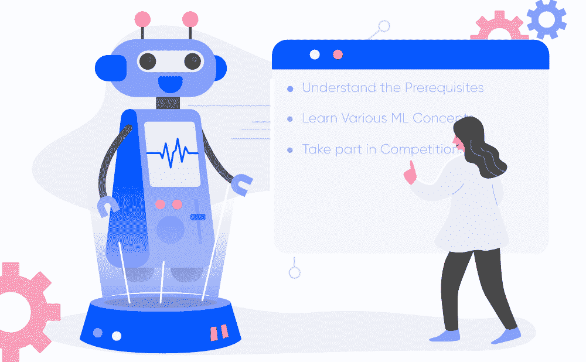

# 如何开始学习机器学习？

> 原文:[https://www . geesforgeks . org/how-start-learning-machine-learning/](https://www.geeksforgeeks.org/how-to-start-learning-machine-learning/)

阿瑟·萨缪尔在 1959 年创造了“机器学习”这个术语，并将其定义为“T2 的研究领域，赋予计算机无需明确编程就能学习的能力”。

这就是机器学习的开始！在现代，机器学习是最流行的(如果不是最流行的话！)职业选择。根据[的确](http://blog.indeed.com/2019/03/14/best-jobs-2019/)，机器学习工程师是 2019 年最好的工作，每年有 *344%* 的增长和**146，085 美元**的平均基本工资。

但是对于机器学习到底是什么，如何开始学习，还是有很多疑问的。因此，本文讨论了机器学习的基础知识，以及你最终成为一名成熟的机器学习工程师的道路。现在让我们开始吧！！！

### 什么是机器学习？

[机器学习](https://www.geeksforgeeks.org/machine-learning/)涉及到人工智能的使用，使机器能够从经验中学习一项任务，而无需专门为该任务编程。(简而言之，机器不用人手握就能自动学习！！！)这个过程从给它们输入高质量的数据开始，然后通过使用数据和不同的算法建立各种机器学习模型来训练机器。算法的选择取决于我们拥有什么类型的数据，以及我们试图自动化什么类型的任务。

### 如何开始学习 ML？

这是一个粗略的路线图，你可以按照它去成为一个才华横溢的机器学习工程师。当然，你可以随时根据你的需要修改步骤，以达到你想要的最终目标！

### 步骤 1–了解先决条件

如果你是一个天才，你可以直接开始 ML，但是通常，你需要知道一些先决条件，包括线性代数、多元微积分、统计学和 Python。如果你不知道这些，永远不要害怕！你不需要这些主题的博士学位就可以开始，但你需要基本的理解。

#### (一)学习线性代数和多元微积分

线性代数和多元微积分在机器学习中都很重要。然而，你需要它们的程度取决于你作为数据科学家的角色。如果你更专注于重应用的机器学习，那么你就不会那么专注于数学，因为有很多通用的库。但是如果你想专注于机器学习中的 R&D，那么掌握线性代数和多元微积分是非常重要的，因为你必须从头开始实现许多 ML 算法。

#### 学习统计

数据在机器学习中起着巨大的作用。事实上，作为 ML 专家，你大约 80%的时间将花在收集和清理数据上。统计是一个处理数据收集、分析和呈现的领域。所以你需要学习它并不奇怪！！！
统计学中一些重要的关键概念是统计显著性、概率分布、假设检验、回归等。此外，贝叶斯思维也是 ML 的一个非常重要的部分，它处理各种概念，如条件概率、先验和后验、最大似然等。

#### 学习 Python

有些人更喜欢跳过线性代数、多元微积分和统计学，边试边学。但是有一点你绝对不能跳过的就是 [Python](https://www.geeksforgeeks.org/python-programming-language/) ！虽然还有其他语言可以用于机器学习，如 R、Scala 等。Python 是目前 ML 最流行的语言。事实上，有许多 Python 库特别适用于人工智能和机器学习，如 [Keras](https://keras.io/) 、 [TensorFlow](https://www.tensorflow.org/) 、 [Scikit-learn](https://scikit-learn.org/stable/) 等。

所以想学 ML，最好是学 Python！你可以使用各种在线资源和课程来做到这一点，比如在极客网站上免费提供的 [**【叉蟒】**](https://practice.geeksforgeeks.org/courses/fork-python) 。

### 步骤 2–学习各种最大似然概念

现在你已经完成了先决条件，你可以继续学习 ML 了(这是有趣的部分！！！)最好先从基础开始，然后再进行更复杂的事情。ML 中的一些基本概念是:

#### 机器学习术语

*   **模型–**模型是通过应用某种机器学习算法从数据中学习到的特定表示。模型也被称为假设。
*   **特征–**特征是数据的一个单独的可测量属性。一组数字特征可以方便地用特征向量来描述。特征向量作为模型的输入。例如，为了预测一种水果，可能会有颜色、气味、味道等特征。
*   **目标(标签)–**目标变量或标签是我们的模型要预测的值。对于功能部分中讨论的水果示例，每组输入的标签都是水果的名称，如苹果、橘子、香蕉等。
*   **训练–**这个想法是给出一组输入(特征)和它的预期输出(标签)，所以在训练之后，我们将有一个模型(假设)，然后将新数据映射到训练的类别之一。
*   **预测–**一旦我们的模型准备好了，就可以向它输入一组输入，它将向这些输入提供预测输出(标签)。

#### 机器学习的类型

*   **监督学习–**这包括使用分类和回归模型从带有标记数据的训练数据集进行学习。这个学习过程一直持续到达到要求的性能水平。
*   **无监督学习–**这涉及到使用未标记的数据，然后在数据中找到底层结构，以便使用因子和聚类分析模型来了解更多关于数据本身的信息。
*   **半监督学习–**这涉及到使用无标记数据，如带有少量标记数据的无监督学习。使用标记数据大大提高了学习的准确性，并且比监督学习更具成本效益。
*   **强化学习–**这包括通过反复试验来学习最佳动作。因此，下一步行动是由基于当前状态的学习行为决定的，这将在未来获得最大回报。

#### 如何练习机器学习？

*   ML 中最耗时的部分其实是**数据的采集、整合、清洗、预处理。**所以一定要用这个来练习，因为你需要高质量的数据，但是大量的数据往往是肮脏的。所以这是你大部分时间要去的地方！！！
*   **学习各种模型，在真实数据集上练习。**这将有助于你围绕哪些类型的模型适合不同的情况来创造你的直觉。
*   伴随着这些步骤，同样重要的是**理解如何解释通过使用不同模型获得的结果。**如果了解不同模型上应用的各种调优参数和正则化方法，这就更容易做到了。

#### 学习机器学习的资源:

有各种线上线下资源(有免费的也有付费的！)可以用来学习机器学习。这里提供了其中一些:

*   对于机器学习的广泛介绍，斯坦福大学由吴恩达教授的[机器学习课程](https://www.coursera.org/learn/machine-learning)相当受欢迎。它侧重于机器学习、数据挖掘和统计模式识别，讲解视频非常有助于理清 ML 背后的理论和核心概念。
*   如果你想要一份机器学习自学指南，那么来自谷歌的[机器学习速成班](https://developers.google.com/machine-learning/crash-course/)对你有好处，因为它将通过视频讲座、真实案例研究和动手实践练习为你提供机器学习入门。
*   如果你喜欢线下课程，Geeksforgeeks [机器学习基础](https://practice.geeksforgeeks.org/courses/machine-learning-foundation?vb=163)课程将是你的理想选择。本课程将教你机器学习的各种概念，以及在课堂环境中实现它们的实践经验。

### 第三步——参加比赛

在你理解了机器学习的基础之后，你就可以进入疯狂的部分了！！！竞赛！这些基本上会让你更加精通 ML，将你的大部分理论知识与实际实现相结合。这里给出了一些你可以在[卡格尔](https://www.kaggle.com/)上开始的基本比赛，这些比赛将帮助你建立信心:

*   **泰坦尼克号:灾难中的机器学习:**[泰坦尼克号:灾难中的机器学习](https://www.kaggle.com/c/titanic/overview)挑战赛是 ML 非常受欢迎的初学者项目，因为它有多个教程可用。因此，这是对 ML 概念的一个很好的介绍，如数据探索、特征工程和模型调优。
*   **数字识别器:**[数字识别器](https://www.kaggle.com/c/digit-recognizer)是在你有了一些 Python 和 ML 基础知识之后的一个项目。这是一个令人兴奋的世界神经网络使用一个经典的数据集，其中包括预先提取的特征的伟大介绍。

在你完成了这些比赛和其他这样简单的挑战之后…祝贺你！！！你正在成为一名成熟的机器学习工程师，你可以通过应对越来越多的挑战并最终创建越来越多的创造性和困难的机器学习项目来继续提高你的技能。