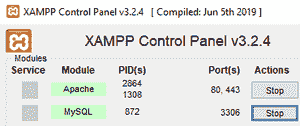
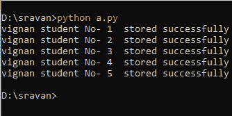
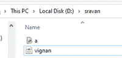
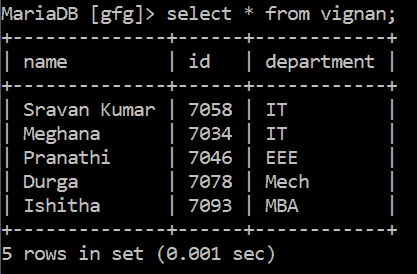

# 如何使用 Python 将 XML 数据存储到 MySQL 数据库中？

> 原文:[https://www . geesforgeks . org/如何使用 python 将 xml 数据存储到 mysql 数据库中/](https://www.geeksforgeeks.org/how-to-store-xml-data-into-a-mysql-database-using-python/)

在本文中，我们将使用 python 通过 XAMPP 服务器将 XML 数据存储到 MySQL 数据库中。因此，我们获取学生 XML 数据，并将这些值存储到数据库中。

### **要求**

*   **XAMPP 服务器:**是一个跨平台的 web 服务器，用于在本地服务器上开发和测试程序。它由 Apache Friends 开发和管理，是开源的。它有一个 Apache HTTP 服务器、MariaDB 和 11 种不同编程语言(如 Perl 和 PHP)的解释器。XAMPP 代表跨平台、Apache、MySQL、PHP 和 Perl。可以从[这里](https://www.geeksforgeeks.org/how-to-install-xampp-on-windows/)轻松安装。
*   **MySQL 连接器:**Python 的 MySQL 连接器模块用于连接 MySQL 数据库和 Python 程序，它使用 Python 数据库应用编程接口规范 v2.0 (PEP 249)来实现。它使用 Python 标准库，没有依赖关系。可以使用以下命令安装:

```
pip install mysql.connector
```

### **接近**

*   启动 XAMPP 服务器



*   创建 XML 文件。

XML 结构:

> <subchild>…..</subchild>

我们将使用 XML 模块。

*   xml.etree.ElementTree

这是一个元素树 XML 应用编程接口，用于实现一个简单有效的应用编程接口来解析和创建 XML 数据。所以我们需要导入这个模块。

**语法:**

> 导入 xml.etree.ElementTree

要创建的 XML 文件名为 *vignan.xml* 。

## 可扩展标记语言

```
<?xml version="1.0"?>
<studentdata>
    <student>
        <name>Sravan Kumar</name>
        <id>7058</id>
        <department>IT</department>
    </student>
    <student>
        <name>Meghana</name>
        <id>7034</id>
        <department>IT</department>
    </student>
    <student>
        <name>Pranathi</name>
        <id>7046</id>
        <department>EEE</department>
    </student>
    <student>
        <name>Durga</name>
        <id>7078</id>
        <department>Mech</department>
    </student>
    <student>
        <name>Ishitha</name>
        <id>7093</id>
        <department>MBA</department>
    </student>
</studentdata>
```

*   对于 Python 代码:

1.  创建一个 python 文件名 *a.py.*
2.  导入所需模块。
3.  建立联系。
4.  读取 XML 文件。
5.  从 XML 中检索数据，并将其插入数据库的表中。
6.  成功插入数据时显示消息。

## 计算机编程语言

```
# import xml element tree
import xml.etree.ElementTree as ET

# import mysql connector
import mysql.connector

# give the connection parameters
# user name is root
# password is empty
# server is localhost
# database name is database
conn = mysql.connector.connect(user='root', 
                               password='', 
                               host='localhost', 
                               database='database')

# reading xml file , file name is vignan.xml
tree = ET.parse('vignan.xml')

# in our xml file student is the root for all 
# student data.
data2 = tree.findall('student')

# retrieving the data and insert into table
# i value for xml data #j value printing number of 
# values that are stored
for i, j in zip(data2, range(1, 6)):
    name = i.find('name').text
    id = i.find('id').text
    department = i.find('department').text

    # sql query to insert data into database
    data = """INSERT INTO vignan(name,id,department) VALUES(%s,%s,%s)"""

    # creating the cursor object
    c = conn.cursor()

    # executing cursor object
    c.execute(data, (name, id, department))
    conn.commit()
    print("vignan student No-", j, " stored successfully")
```

**输出:**



*   保存两个文件



*   验证最近插入值的表的内容。

