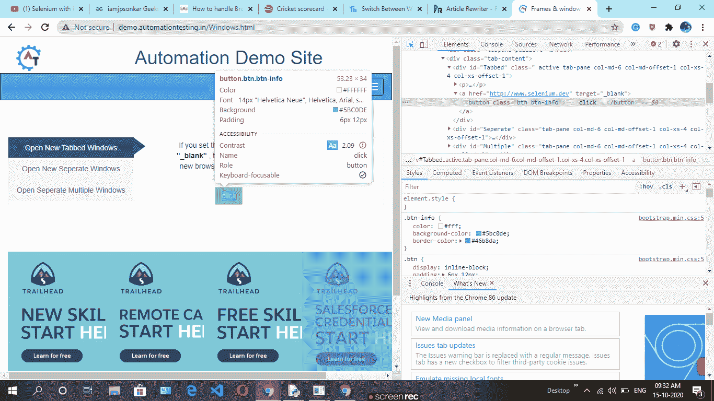
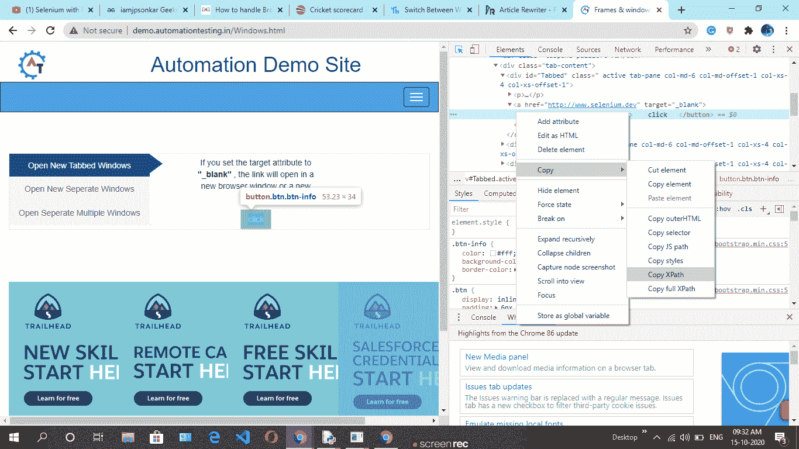
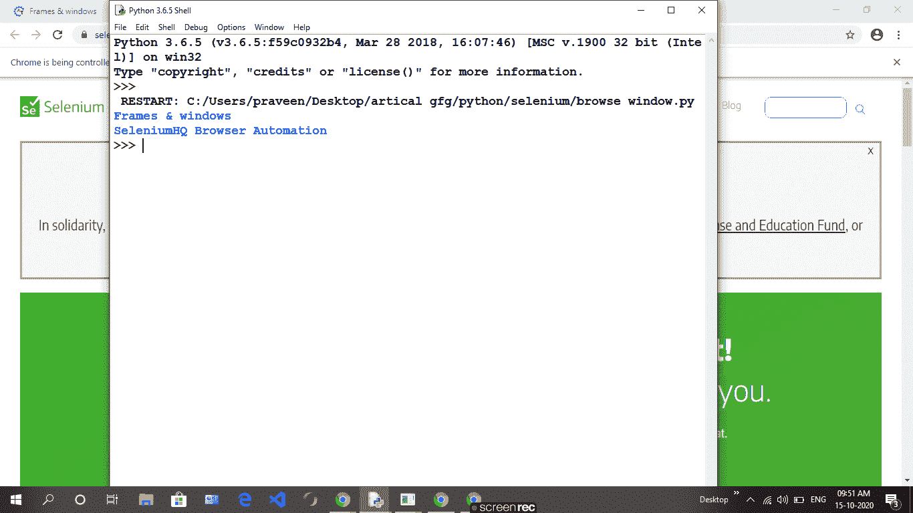

# 如何使用 Python 中的 Selenium 在窗口之间切换？

> 原文:[https://www . geesforgeks . org/如何使用 python 中的硒在窗口之间切换/](https://www.geeksforgeeks.org/how-to-switch-between-window-using-selenium-in-python/)

硒是通过程序控制互联网浏览器的有效设备。它对所有浏览器都是有目的的，适用于所有基本操作系统，其脚本是用许多语言编写的，如 Python、Java、C#等，我们可以用 Python 运行。

我们打开大范围的窗户是非常可行的。每个窗口可能还需要我们执行一些动作来完成从停止到停止的流程。为此，我们需要能够在它们之间转移。我们希望在管理上进行额外的交换，然后执行所需的操作，因为借助于使用默认值，兴趣点停留在图形窗口。

**要求:**

您需要安装 chromedriver 并设置路径。 [**点击此处**](https://sites.google.com/a/chromium.org/chromedriver/downloads) 下载更多信息跟随 [**本链接**](https://www.geeksforgeeks.org/browser-automation-using-selenium/) 。WebDriver 支持使用“switch_to_window()”方法在这些窗口之间移动。

> driver.switch_to_window(" ")

**循序渐进法:**

如果我们打开多个窗口，那么我们希望打印每个窗口页面的标题，但是我们只打印标题的父窗口，而不是所有窗口页面的标题。这个问题将通过**driver . switch _ to _ window(")**解决。使用这种方法，我们能够打印标题的每一页。

*   取任意 [**网址**](http://demo.automationtesting.in/Windows.html) 。
*   我们想要这个网页的子窗口，然后使用 *find_element_by_xpath()* 方法点击任意按钮来查找 xpath。
*   创建一个句柄变量，存储打开的浏览器窗口的所有句柄值

> 句柄=driver.window_handles

*   然后使用循环打印网页的所有标题。

 

**实施:**

## 蟒蛇 3

```
# import selenium module
from selenium import webdriver

# import select class
from selenium.webdriver.support.ui import Select

# using chrome driver
driver = webdriver.Chrome()

# web page url and open first window page
driver.get("http://demo.automationtesting.in/Windows.html")

# find xpath of button for child window page
# this page no. 2
driver.find_element_by_xpath('//*[@id="Tabbed"]/a/button').click()

# return all handles value of open browser window
handles = driver.window_handles
for i in handles:
    driver.switch_to.window(i)

    # print every open window page title
    print(driver.title)
```

**输出:**

