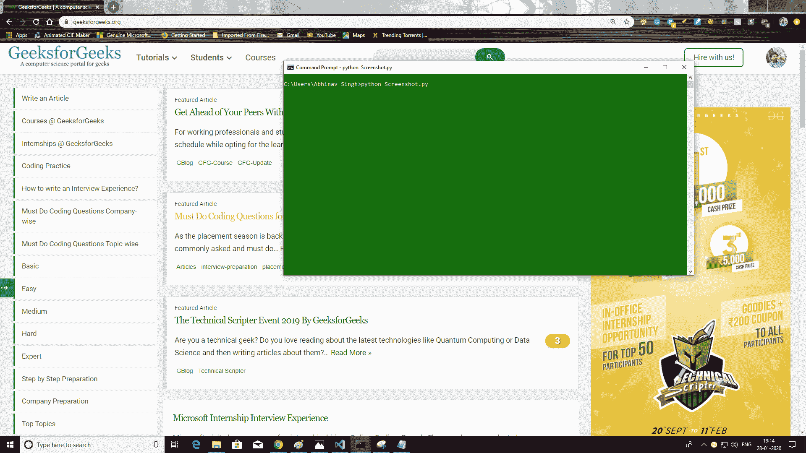

# 如何用 python 截图？

> 原文:[https://www . geeksforgeeks . org/如何截图-使用-python/](https://www.geeksforgeeks.org/how-to-take-screenshots-using-python/)

Python 是一种广泛使用的通用语言。它允许执行各种任务。其中一个可以截图。它提供了一个名为 **pyautogui** 的模块，可以用来截图。该模块与`NumPy`和`OpenCV`一起提供了操作和保存图像的方法(本例中为截图)

`pyautogui`以 PIL(python 图像库)的形式拍摄图片，支持打开、操作和保存多种不同的图像文件格式。然后我们需要把图像转换成 NumPy 数组，这样就可以把它从 RGB 转换成 BGR，因为当使用`imread()`用 OpenCV 读取图像文件时，颜色的顺序应该是 BGR(蓝、绿、红)。

#### 需要的模块

*   **Numpy:** 要安装 Numpy，请在终端中键入以下命令。

    ```py
    pip install numpy

    ```

*   **pyautogui:** 要安装 pyautogui，请在终端中键入以下命令。

    ```py
    pip install pyautogui

    ```

*   **OpenCV:** 要安装 OpenCV，请在终端中键入以下命令。

    ```py
    pip install opencv-python

    ```

下面是实现。

```py
# Python program to take
# screenshots

import numpy as np
import cv2
import pyautogui

# take screenshot using pyautogui
image = pyautogui.screenshot()

# since the pyautogui takes as a 
# PIL(pillow) and in RGB we need to 
# convert it to numpy array and BGR 
# so we can write it to the disk
image = cv2.cvtColor(np.array(image),
                     cv2.COLOR_RGB2BGR)

# writing it to the disk using opencv
cv2.imwrite("image1.png", image)
```

**输出:**

[](https://media.geeksforgeeks.org/wp-content/uploads/20200128191537/python-screenshot.png)