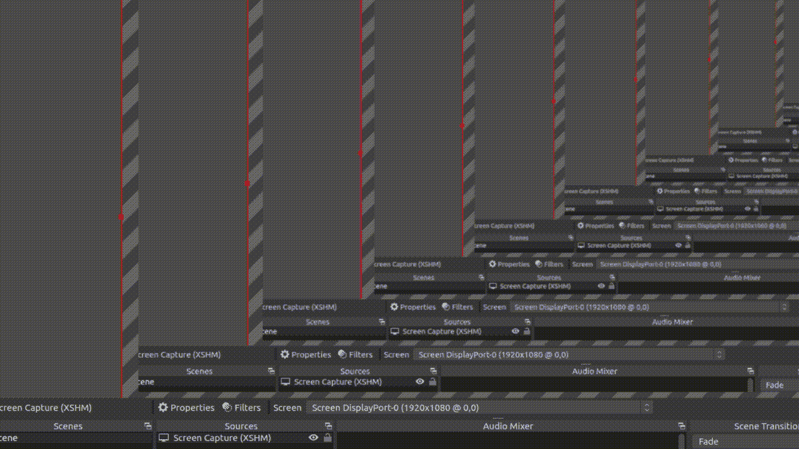
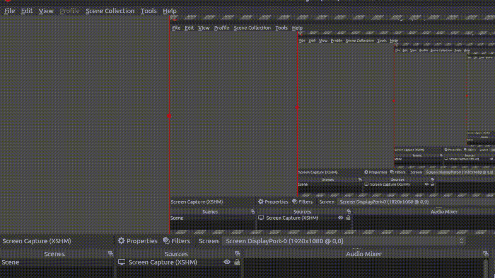

# 如何在循环中更新同一图形上的一个图？

> 原文:[https://www . geesforgeks . org/如何在循环中更新同一图形上的绘图/](https://www.geeksforgeeks.org/how-to-update-a-plot-on-same-figure-during-the-loop/)

我们可以使用 [matplotlib](https://www.geeksforgeeks.org/python-introduction-matplotlib/) 在循环期间的每次迭代中更新一个图。借助[**matplotlib . pyplot . draw()**](https://www.geeksforgeeks.org/matplotlib-pyplot-draw-in-python/)**功能我们可以在循环期间更新同一个图上的剧情。**

****使用 matplotlib.pyplot.draw():** 用于更新已更改的图形。它将重新绘制当前图形。**

> ****语法:** figure.canvas.draw()**

**在此之前我们使用 **figure.ion()** 函数运行一个 GUI 事件循环。不使用**图注()**我们可能看不到图形用户界面图。**

### **方法:**

**在给定的例子中，首先我们要导入我们将要使用的所有必要的库。然后创建 **X** 和 **Y. X** 保存从 0 到 10 的值，这些值被均匀地分成 100 个值。例如，我们正在用均匀间隔的 5 个值(np.linspace(2，3，5))创建从 2 到 3 的值。它应该像这样输出从 2 到 3 的均匀间隔的**数组([2，2.25，2.5，2.75，3 ])。**之后我们使用 **plt.ion()** 函数初始化 GUI，现在我们要创建一个子剧情，这样我们就可以绘制 **X 和 Y** 值。之后，我们运行一个 for 循环直到一些迭代，并创建一个保存我们的更新值的新 _y 值，然后我们使用 **set_xdata()** 和 **set_ydata()** 更新 **X 和 Y** 的值。 **canvas.draw()** 将绘制更新值， **canvas.flush_events()** 保存图形用户界面事件，直到用户界面事件处理完毕。这将一直运行到循环结束，并且值将不断更新。**

****代码:****

## **蟒蛇 3**

```py
# importing libraries
import numpy as np
import time
import matplotlib.pyplot as plt

# creating initial data values
# of x and y
x = np.linspace(0, 10, 100)
y = np.sin(x)

# to run GUI event loop
plt.ion()

# here we are creating sub plots
figure, ax = plt.subplots(figsize=(10, 8))
line1, = ax.plot(x, y)

# setting title
plt.title("Geeks For Geeks", fontsize=20)

# setting x-axis label and y-axis label
plt.xlabel("X-axis")
plt.ylabel("Y-axis")

# Loop
for _ in range(50):
    # creating new Y values
    new_y = np.sin(x-0.5*_)

    # updating data values
    line1.set_xdata(x)
    line1.set_ydata(new_y)

    # drawing updated values
    figure.canvas.draw()

    # This will run the GUI event
    # loop until all UI events
    # currently waiting have been processed
    figure.canvas.flush_events()

    time.sleep(0.1)
```

****输出:****

**

更新图** 

**这里，**figure . canvas . flush _ events()**用于在绘制更新后的图之前清除旧图。**

****示例 2:** 在这个示例代码中，我们使用 **set_xdata()** 更新循环中 y 的值，并每次使用 canvas.draw()重新绘制图形。**

## **蟒蛇 3**

```py
from math import pi
import matplotlib.pyplot as plt
import numpy as np
import time

# generating random data values
x = np.linspace(1, 1000, 5000)
y = np.random.randint(1, 1000, 5000)

# enable interactive mode
plt.ion()

# creating subplot and figure
fig = plt.figure()
ax = fig.add_subplot(111)
line1, = ax.plot(x, y)

# setting labels
plt.xlabel("X-axis")
plt.ylabel("Y-axis")
plt.title("Updating plot...")

# looping
for _ in range(50):

    # updating the value of x and y
    line1.set_xdata(x*_)
    line1.set_ydata(y)

    # re-drawing the figure
    fig.canvas.draw()

    # to flush the GUI events
    fig.canvas.flush_events()
    time.sleep(0.1)
```

****输出:****

**

更新图。**