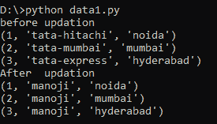
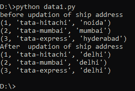

# 如何使用 Python 更新 SQLite 表特定列的所有值？

> 原文:[https://www . geeksforgeeks . org/如何使用 python 更新 sqlite 表的特定列的所有值/](https://www.geeksforgeeks.org/how-to-update-all-the-values-of-a-specific-column-of-sqlite-table-using-python/)

在本文中，我们将使用 Python 更新给定 SQLite 表的特定列的所有值。为了更新 SQL 中特定表的所有列，我们使用了 update 查询。SQL 中的 UPDATE 语句用于更新数据库中现有表的数据。根据我们的要求，我们可以使用 update 语句更新单个列和多个列。

**语法:**

> 更新表名
> 
> SET 列名=值；

我们将创建一个表，然后在其中执行更新操作。

## 蟒蛇 3

```
# importing sqlite module
import sqlite3

# create connection to the database my_database
connection = sqlite3.connect('my_database.db')

# create table named address of customers 
# with 4 columns id,name age and address
connection.execute('''CREATE TABLE ship (ship_id INT, ship_name \
TEXT NOT NULL, ship_destination CHAR(50) NOT NULL); ''')

print("Ship table created successfully")

# close the connection
connection.close()
```

**输出:**

```
Ship table created successfully
```

**例 1:**

用于插入记录和执行更新查询的 Python 程序。这里我们将 ship_name 列中的所有数据更新为 manoji。

## 蟒蛇 3

```
# import sqlite module database
import sqlite3

# create connection to the database
# my_database
connection = sqlite3.connect('my_database.db')

# insert query to insert values
connection.execute("INSERT INTO ship  VALUES (1, 'tata-hitachi','noida' )")
connection.execute("INSERT INTO ship  VALUES (2, 'tata-mumbai','mumbai' )")
connection.execute("INSERT INTO ship  VALUES (3, 'tata-express','hyderabad' )")

# query to display all data in the table
cursor = connection.execute("SELECT * from ship")
print("before updation")

# display row by row
for row in cursor:
    print(row)

# query to update all data in ship_name 
# column to manoji
connection.execute("UPDATE ship set ship_name='manoji'")

print("After  updation")

# display row by row
cursor = connection.execute("SELECT * from ship")
for row in cursor:
    print(row)

# close the connection
connection.close()
```

**输出:**



**例 2:**

在这个程序中，我们首先插入数据，然后将 ship_address 中的所有数据更新到同一个表中的德里。

## 蟒蛇 3

```
# import sqlite module database
import sqlite3

# create connection to the database 
# my_database
connection = sqlite3.connect('my_database.db')

# insert query to insert values
connection.execute("INSERT INTO ship  VALUES (1, 'tata-hitachi','noida' )")
connection.execute("INSERT INTO ship  VALUES (2, 'tata-mumbai','mumbai' )")
connection.execute("INSERT INTO ship  VALUES (3, 'tata-express','hyderabad' )")

# query to display all data in the table
cursor = connection.execute("SELECT * from ship")
print("before updation of ship address")

# display row by row
for row in cursor:
    print(row)

# query to update all data in  ship_address
connection.execute("UPDATE ship set ship_destination='delhi'")

print("After  updation of ship address")

# display row by row
cursor = connection.execute("SELECT * from ship")
for row in cursor:
    print(row)

# close the connection
connection.close()
```

**输出:**

