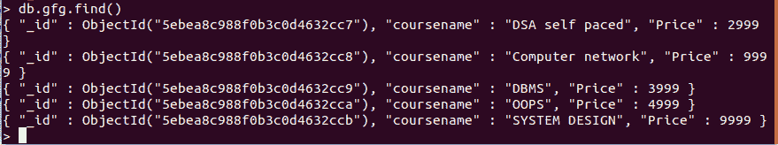
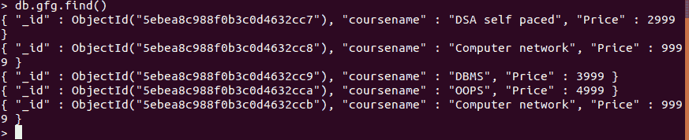

# 如何使用 Python 更新集合中的数据？

> 原文:[https://www . geesforgeks . org/如何使用 python 更新集合中的数据/](https://www.geeksforgeeks.org/how-to-update-data-in-a-collection-using-python/)

[**MongoDB**](https://www.geeksforgeeks.org/mongodb-and-python/)是一个跨平台、面向文档的数据库，致力于集合和文档的概念。MongoDB 提供了高速度、高可用性和高扩展性。

## 更新蒙古数据库中的数据

我们可以使用 update_one()方法和 update _ multi()方法来更新集合中的数据。

### update_one()

如果找到查询，Update_one()方法将更新第一个匹配项。

> **语法** :update_one(查询，newvalues)
> 
> **参数:**
> **查询:**是查询对象。
> **新值:**是文档的新值。

**示例:**

**样本数据库:**


## 蟒蛇 3

```py
import pymongo

client = pymongo.MongoClient("mongodb://localhost:27017/")

# Database name
db = client["GFG"]

# Collection name
col = db["gfg"]

# Query to be updated
query = { "coursename": "SYSTEM DESIGN" }

# New value
newvalue = { "$set": { "coursename": "Computer network" } }

# Update the value
col.update_one(query, newvalue)
```

**输出** :



### **update_many()**

update _ multi()方法更新所有查询值。

> **语法:**update _ multi(查询，newvalues)
> 
> **参数:**
> **查询:**是查询对象。
> **新值:**是文档的新值。

**例:**

## 蟒蛇 3

```py
import pymongo

client = pymongo.MongoClient("mongodb://localhost:27017/")

# Database name
db = client["GFG"]

# Collection name
col = db["gfg"]

# Query to be updated
query = { "coursename": "SYSTEM DESIGN" }

# New value
newvalue = { "$set": { "coursename": "Computer network" } }

# Update the value
col.update_many(query, newvalue)
```

**输出:**

