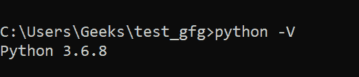
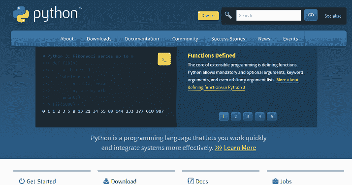
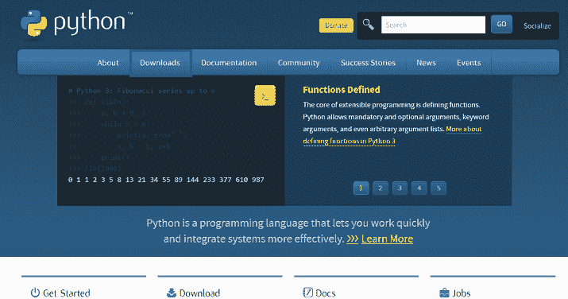
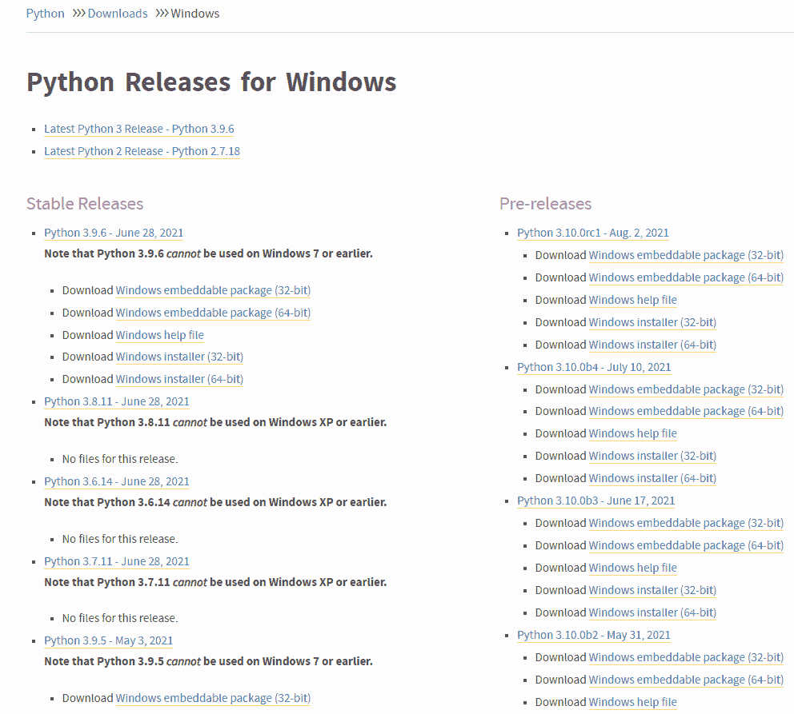
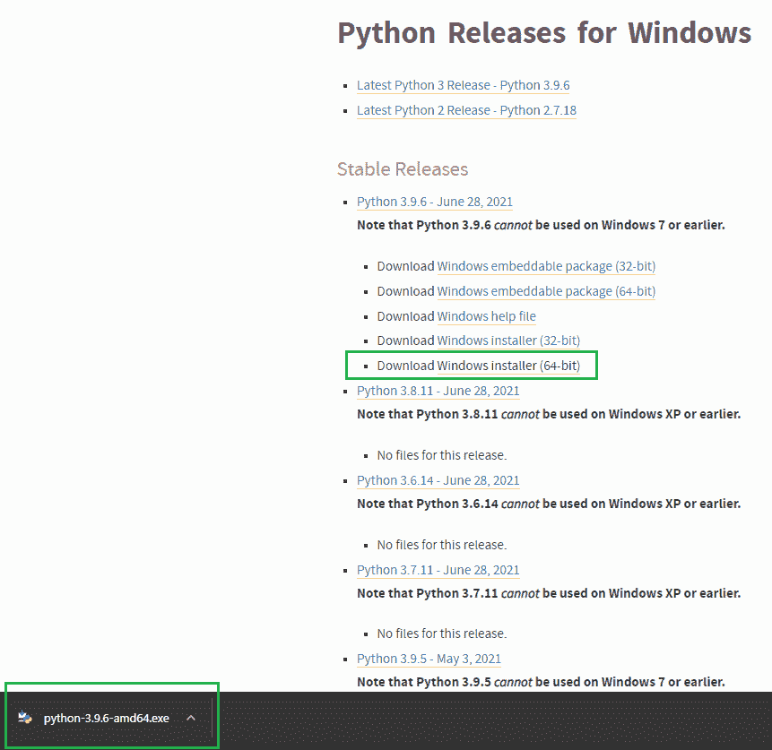
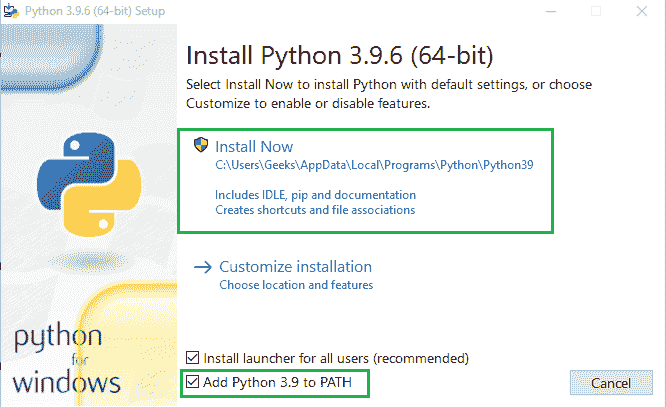
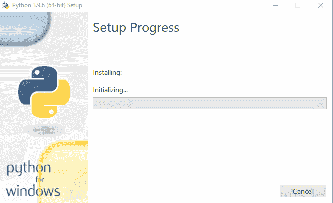
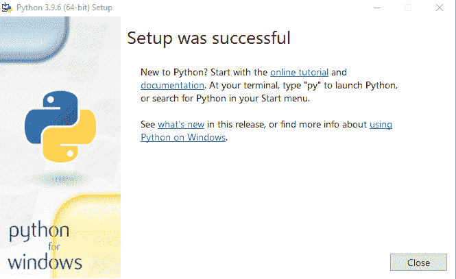
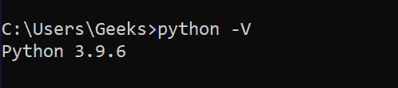

# 如何在 Windows 上更新 Python？

> 原文:[https://www . geesforgeks . org/如何更新-windows 上的 python/](https://www.geeksforgeeks.org/how-to-update-python-on-windows/)

在本文中，我们将看到如何在 Windows 系统中更新 Python。为了举例，我们将从 Python 3.6.8 升级到 Python 3.9.6。

要检查系统中 python 的当前版本，请在命令提示符下使用以下命令:

```py
python -V
```

这将显示您当前的 python 版本，如下所示:



### 使用可执行安装程序:

按照以下步骤更新您的 python 版本:

**第一步:**前往[巨蟒官方网站。](https://www.python.org/)



**第二步:**点击****下载**标签。**

****

**在这里，您将获得可用版本的列表。**

****

****第三步:**根据系统规格下载需要升级的版本(即 32 位或 64 位)。这里我们将下载 3.9.6 的 64 位安装程序。**

****

****第四步:**点击安装程序，开始安装。确保选择**“将 Python 3.9 添加到路径”**选项。点击**“立即安装”。****

****

**这将开始安装，如下所示:**

****

**安装成功后，您将收到以下消息:**

****

**现在，如果您打开 cmd 并使用以下命令:**

```py
python -V
```

**您将看到您的 Python 版本已经更新到 3.9.6，如下所示:**

****