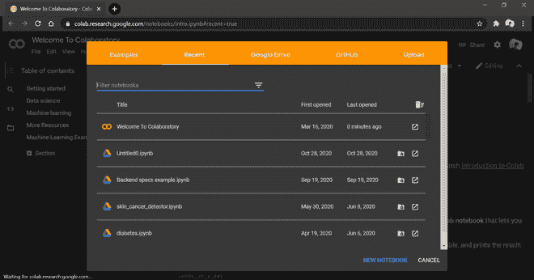
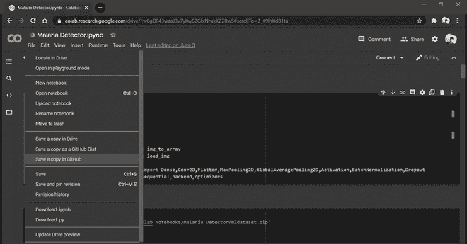
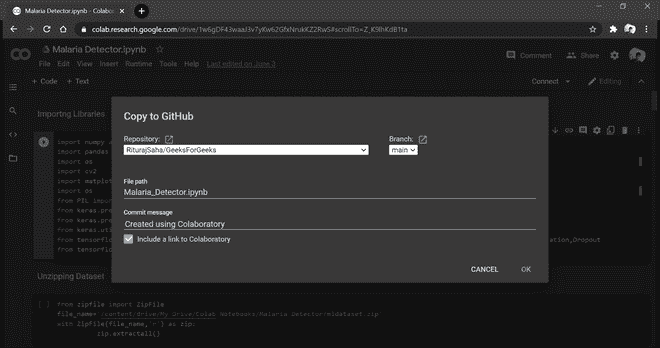

# 如何从谷歌 Colab 上传 GitHub 上的项目？

> 原文:[https://www . geesforgeks . org/how-upload-project-on-github-from-Google-colab/](https://www.geeksforgeeks.org/how-to-upload-project-on-github-from-google-colab/)

如果你想创建一个机器学习模型但又说你没有一台可以承担工作量的电脑， [**谷歌 Colab**](https://colab.research.google.com/) 就是一个为你准备的开源平台。即使你有一个图形处理器或一台好电脑，用 anaconda 创建一个本地环境，安装软件包和解决安装问题也是一件麻烦事。
Colaboratory 是谷歌提供的免费 Jupyter 笔记本环境，在这里可以使用免费的 GPU 和 TPU，可以解决所有这些问题。

> 要查看更多关于 Google Colab 的信息，请访问 [如何使用 Google Colab](https://www.geeksforgeeks.org/how-to-use-google-colab/)

**可以使用 Google Colab 开发机器学习项目，按照以下步骤可以轻松上传到 Github:**

*   从任何浏览器打开 Google Colab，即访问[网站](https://colab.research.google.com/) 。
*   点击*新笔记本*打开现有笔记本或创建新笔记本。

*   开发完一个项目后，点击左上角的*文件*，然后导航到*在 Github* 中保存一个副本，点击*。*

*   单击时，将出现一个关于填充您的 Github 凭据的弹出窗口，然后会出现一个新的 Colab 弹出窗口，如下图所示。
*   现在，您需要选择您的存储库、分支，并检查其他细节。然后，点击*确定。*

*   之后，您的项目将被上传到给定的 Github 存储库中，完成后，您的 Colab 项目将在 Github 存储库中的新选项卡中打开。

通过这种方式，人们可以将在 Colab 中开发的项目上传到自己的 Github 存储库中。