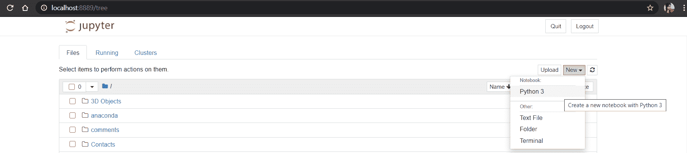
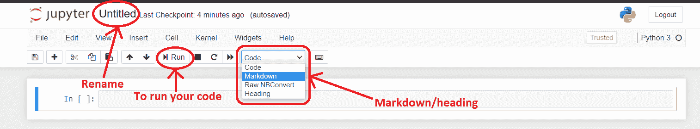
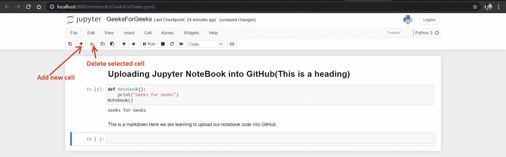
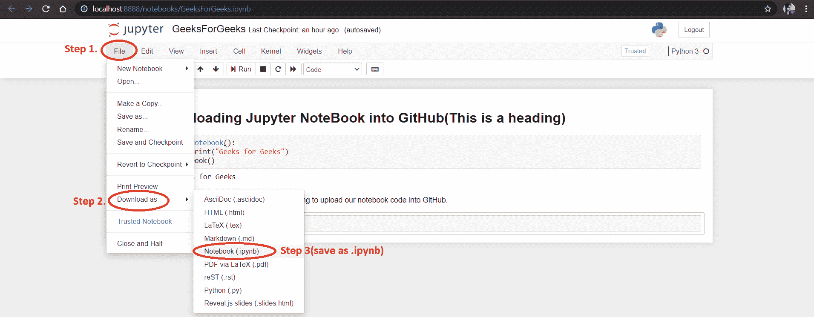

# 如何从 Jupyter 笔记本上传 GitHub 上的项目？

> 原文:[https://www . geesforgeks . org/how-upload-project-on-github-from-jupyter-notebook/](https://www.geeksforgeeks.org/how-to-upload-project-on-github-from-jupyter-notebook/)

Jupyter 笔记本既不是简单的文本编辑器，也不是功能齐全的 IDE，而是一个包含编程代码和文本描述的电子文件。它还可以包含嵌入的图表、绘图、图像、视频和链接。它们在火狐或谷歌浏览器等网络浏览器中运行。

它们可以包含各种编程语言的代码，尽管主要是 Python 中流行的*。py* 扩展，他们也支持带*的 Markdowns。md* 分机。一种认为 Jupyter 笔记本是 Python *REPL* 和 Python 模块*的组合。py* 文件带减价*。md* 文件在代码段之间抛出。

### **安装:**

安装 Jupyter 笔记本最简单的方法是下载并安装 Python 的 Anaconda 发行版。Python 的 Anaconda 发行版附带了 Jupyter 笔记本，无需进一步的安装步骤。

您可以在窗口中安装蟒蛇的[。](https://www.geeksforgeeks.org/how-to-install-anaconda-on-windows/)

### 从笔记本上传 Github 上的项目:

安装完成后，**打开 Anaconda Navigator** 开始使用 jupyter 笔记本。


在这里，**推出 Jupyter 笔记本**。

一个 **Jupyter 文件浏览器**将在一个**网页浏览器标签**中打开，你会看到你的基本(主)目录。

在右上方，你可以点击**新建(下拉)- >蟒 3**



之后，Jupyter 笔记本的一个**新标签会在你的浏览器中打开。**


现在，点击**无题- >重命名提示将打开- >重命名您的文件。**

您也可以点击代码下拉菜单，选择**标记**字段进行解释(段落)或选择**标题**字段进行标题。



然后**在笔记本上写一些代码**。要运行代码，**按下运行**按钮，如上图所示。

这是我们的代码:



### 不使用笔记本直接将项目上传到 Github:

1.  点击**文件- >下载为- >笔记本(** ***)。ipynb*** **)**
2.  在 Github 中创建一个**新存储库**。
3.  单击**添加文件- >创建新文件。**
4.  浏览您的目录并**上传您的文件**(示例文件名: *GeeksForGeeks.ipynb* )并单击打开。
5.  **提交**变更。



### 使用 git 命令上传项目:

**注意:** Git 应该安装在系统中。

**在命令提示符下打开文件的下载位置**(示例文件名:GeeksForGeeks.ipynb)。

然后，在 GitHub 中创建新的存储库。并在命令提示符下使用以下命令:

```
1\. git init
2\. git add README.md  
3\. git add GeeksForGeeks.ipynb
4\. git commit -m "notebook first commit" 
5\. git remote add origin https://github.com/{Your repo}/GeeksForGeeks.git 
6\. git push -u origin master 
```

太好了。现在你已经上传了你的第一个笔记本代码到 GitHub。