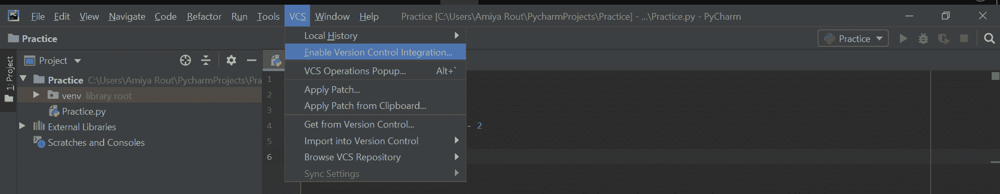
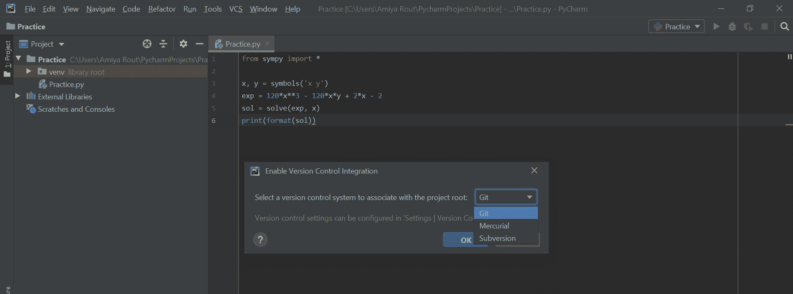
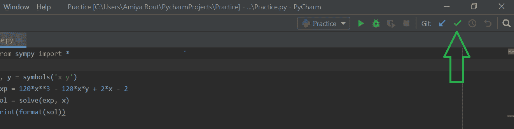
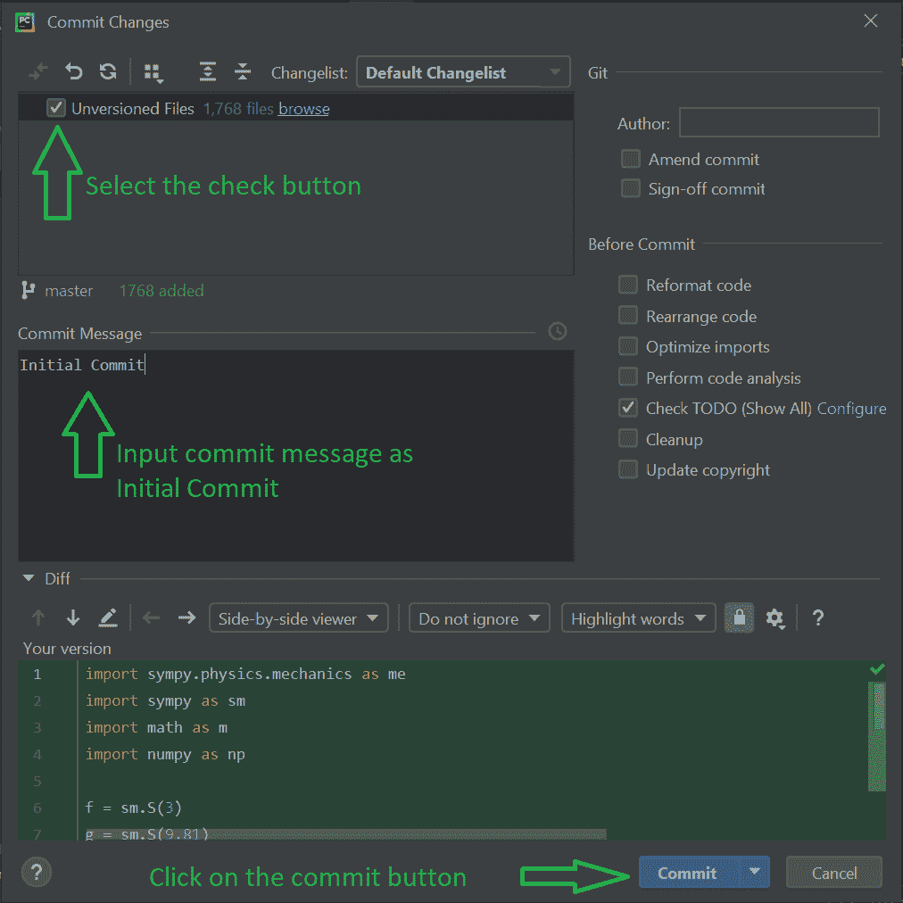
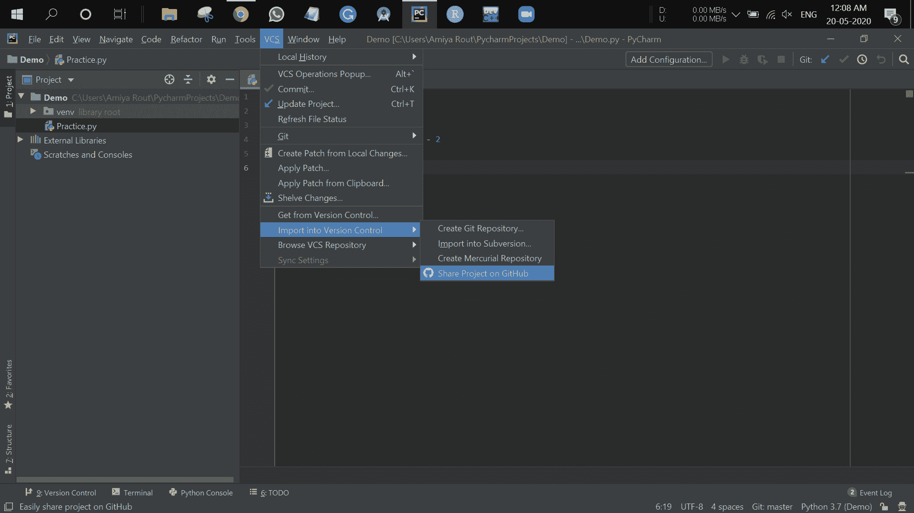
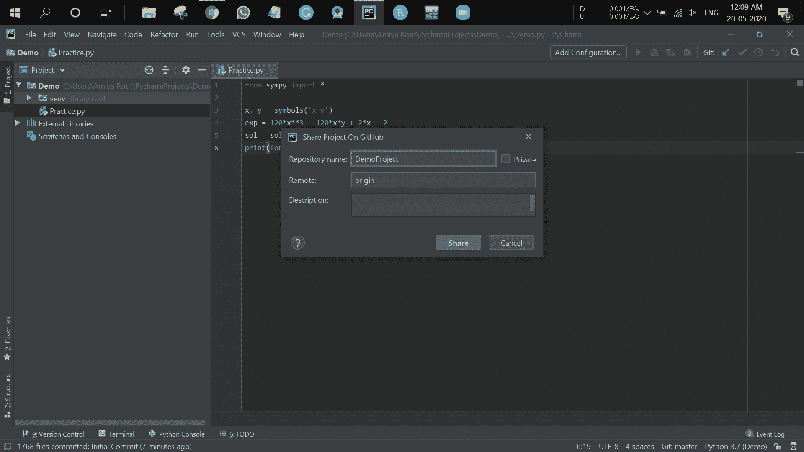

# 如何从 Pycharm 上传 GitHub 上的项目？

> 原文:[https://www . geesforgeks . org/how-upload-project-on-github-from-py charm/](https://www.geeksforgeeks.org/how-to-upload-project-on-github-from-pycharm/)

[PyCharm](https://www.geeksforgeeks.org/how-to-install-python-pycharm-on-windows/) 是 JetBrains 开发的最流行的 Python-IDE 之一，用于执行 Python 语言的脚本。PyCharm 提供了一些非常有用的特性，比如代码完成和检查、调试过程、对各种编程框架的支持，比如 Flask 和 Django、包管理等。PyCharm 为 Python 中的生产性开发提供了各种工具。

[Git](https://www.geeksforgeeks.org/git-lets-get-into-it/) 是一个开源的版本控制系统。这意味着，每当开发人员开发某个项目(比如应用程序)或其他东西时，他/她都会不断地更新它，以满足用户、技术以及其他方面的需求。版本控制系统保持这些修订的正确性，将修改存储在中央存储库中。它允许开发人员轻松协作，因为他们可以下载软件的新版本，进行更改，并上传最新版本。每个开发人员都可以看到这些新的变化，下载它们，并做出贡献。Git 用于存储项目的源代码，并跟踪该代码所有更改的完整历史，而 GitHub 是围绕 Git 工具构建的基于云的平台。所以有必要在 GitHub 上传你的项目。

**先决条件**:在阅读本文之前，请考虑一个人必须已经有一个 GitHub 帐户。此外，考虑一下您一定已经在 Pycharm 上开发了一个 Python 项目。

从 pycharm 上传 GitHub 上的 Python 项目的逐步过程:

*   **Step 1**: Go to **VCS** panel which is present on the top of pycharm and click on it. After clicking select the “**Enable Version Control Integration**“.

    

    单击启用版本控制集成后，将出现如下弹出窗口。然后从下拉菜单中选择 **Git** ，点击确定。这将为 GitHub 初始化项目。

    

*   **Step 2**: The next step is to click on the **green tik** present in the upper part of the pycharm. Basically this symbol refers to **Commit** and what it does is it will collect all unversioned files and make them ready to update on gitHub.

    

    点击此处后，将弹出如下所示的新屏幕。现在，首先选择**未版本文件**，然后输入提交消息为“**初始提交**，然后点击**提交**按钮。

    

    现在项目已经可以在 GitHub 上传了。

*   **Step 3**: The last step to be followed is to go to **VCS** then select **Import into Version Control** and then click on **Share project on GitHub**.

    

    点击此处后，将出现一个弹出窗口，用户必须输入其 GitHub 登录 id 和密码。成功登录到其帐户后，会出现一个类似以下的弹出窗口:用户必须给出其存储库的**存储库名称**和**描述**。然后点击**分享**按钮，完成。

    > **注意:**在给存储库命名时，不要放空格或特殊字符。

    