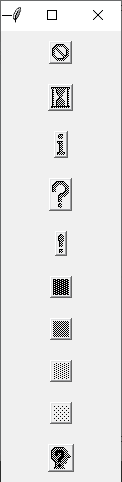
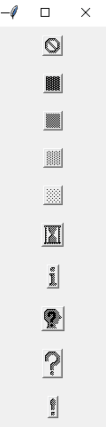

# 如何在 Tkinter 中使用按钮中的位图图像？

> 原文:[https://www . geeksforgeeks . org/如何使用-位图-图像-按钮-按钮-tkinter/](https://www.geeksforgeeks.org/how-to-use-bitmap-images-in-button-in-tkinter/)

**先决条件:**[**Python GUI–tkinter**](https://www.geeksforgeeks.org/python-gui-tkinter/)

Python 为开发图形用户界面提供了多个选项。在所有的 GUI 方法中，tkinter 是最常用的方法。它是 Python 附带的 Tk 图形用户界面工具包的标准 Python 接口。

**位图**是表示图像中像素值的二进制数据数组。一个 **GIF** 是一个有位图的图形图像文件的例子。

要创建位图图像，使用 button()函数的“位图”属性进行显示。它可以采用以下值:

*   错误
*   灰色 75
*   灰色 50
*   灰色 25
*   灰色 12
*   沙漏
*   信息
*   questhead
*   问题
*   警告

**语法:**

> 按钮(……，位图=“<value>”)</value>

**方法 1:**

*   导入模块
*   创建对象
*   创建按钮
*   执行代码

**程序:**

## 蟒蛇 3

```
# Import Module
from tkinter import *

# Create Objects
root = Tk()

# Buttons
Button(root, relief=RAISED, bitmap="error").pack(pady=10)
Button(root, relief=RAISED, bitmap="hourglass").pack(pady=10)
Button(root, relief=RAISED, bitmap="info").pack(pady=10)
Button(root, relief=RAISED, bitmap="question").pack(pady=10)
Button(root, relief=RAISED, bitmap="warning").pack(pady=10)
Button(root, relief=RAISED, bitmap="gray75").pack(pady=10)
Button(root, relief=RAISED, bitmap="gray50").pack(pady=10)
Button(root, relief=RAISED, bitmap="gray25").pack(pady=10)
Button(root, relief=RAISED, bitmap="gray12").pack(pady=10)
Button(root, relief=RAISED, bitmap="questhead").pack(pady=10)

# Execute Tkinter
root.mainloop()
```

**输出:**



**方法 2:**

在这个方法中，我们将创建一个位图列表，并遍历所有位图，同时将它们传递给 button()函数。

*   导入模块
*   创建对象
*   创建位图列表
*   遍历列表
*   迭代时创建按钮
*   执行代码

**程序:**

## 蟒蛇 3

```
# Import Module
from tkinter import *

# Create Objects
root = Tk()

# Create Bitmaps List
bitmaps = ["error",
           "gray75",
           "gray50",
           "gray25",
           "gray12",
           "hourglass",
           "info",
           "questhead",
           "question",
           "warning"]

# Iterate through all bitmap list
for bit in bitmaps:
    Button(root, relief=RAISED, bitmap=bit).pack(pady=10)

# Execute Tkinter
root.mainloop()
```

**输出:**

