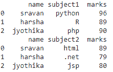
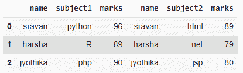
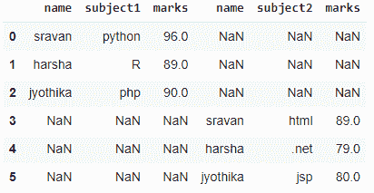
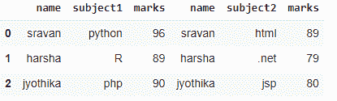

# 如何在 Python 中使用 cbind？

> 原文:[https://www.geeksforgeeks.org/how-to-use-cbind-in-python/](https://www.geeksforgeeks.org/how-to-use-cbind-in-python/)

在本文中，我们将讨论 Python 中的 cbind。我们已经在 R 编程语言中看到了 cbind()函数，用于按列组合指定的向量、矩阵或数据框。但是在 Python 中，有 [concat()](https://www.geeksforgeeks.org/pandas-concat-function-in-python/) 函数，相当于 r 的 cbind()函数。

### 创建用于演示的数据帧:

## 蟒蛇 3

```py
# import pandas module
import pandas as pd

# create dataframe
data1 = pd.DataFrame({'name': ['sravan', 'harsha', 'jyothika'],
                      'subject1': ['python', 'R', 'php'],
                      'marks': [96, 89, 90]})

# create dataframe
data2 = pd.DataFrame({'name': ['sravan', 'harsha', 'jyothika'],
                      'subject2': ['html', '.net', 'jsp'],
                      'marks': [89, 79, 80]})

# display
print(data1)

print(data2)
```

**输出**:



## 示例 1:用相等的索引连接数据帧

这将基于索引连接逐行数据。这里的两个数据帧索引是相同的。

## 蟒蛇 3

```py
# import pandas module
import pandas as pd

# create dataframe
data1 = pd.DataFrame({'name': ['sravan', 'harsha', 'jyothika'],
                      'subject1': ['python', 'R', 'php'],
                      'marks': [96, 89, 90]})

# create dataframe
data2 = pd.DataFrame({'name': ['sravan', 'harsha', 'jyothika'],
                      'subject2': ['html', '.net', 'jsp'],
                      'marks': [89, 79, 80]})

# concat dataframes
pd.concat([data1, data2], axis=1)
```

**输出**:



## 示例 2:连接索引不相等的数据帧

在这种情况下，两个数据帧的索引是不相等的，当我们应用 concat()函数时，这将产生一个具有 NaN 值的新数据帧

## 蟒蛇 3

```py
# import pandas module
import pandas as pd

# create dataframe
data1 = pd.DataFrame({'name': ['sravan', 'harsha', 'jyothika'],
                      'subject1': ['python', 'R', 'php'],
                      'marks': [96, 89, 90]}, index=[0, 1, 2])

# create dataframe
data2 = pd.DataFrame({'name': ['sravan', 'harsha', 'jyothika'],
                      'subject2': ['html', '.net', 'jsp'],
                      'marks': [89, 79, 80]}, index=[3, 4, 5])

# concat dataframes
pd.concat([data1, data2], axis=1)
```

**输出**:



为了删除这些 NaN 行，我们必须使用 reset_index()方法删除索引

> **语法**:data frame . reset _ index(drop =真，inplace =真)

**示例:**

## 蟒蛇 3

```py
# import pandas module
import pandas as pd

# create dataframe
data1 = pd.DataFrame({'name': ['sravan', 'harsha', 'jyothika'],
                      'subject1': ['python', 'R', 'php'],
                      'marks': [96, 89, 90]}, index=[0, 1, 2])

# create dataframe
data2 = pd.DataFrame({'name': ['sravan', 'harsha', 'jyothika'],
                      'subject2': ['html', '.net', 'jsp'],
                      'marks': [89, 79, 80]}, index=[3, 4, 5])

# remove dataframe 1 indices
data1.reset_index(drop=True, inplace=True)

# remove dataframe 2 indices
data2.reset_index(drop=True, inplace=True)

# concat dataframes
pd.concat([data1, data2], axis=1)
```

**输出**:

