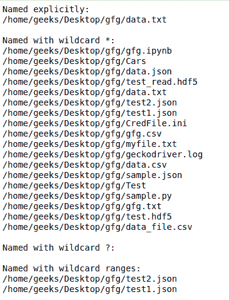
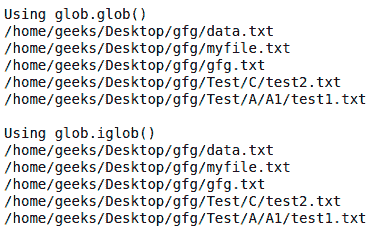

# 如何在 Python 中使用 Glob()函数递归查找文件？

> 原文:[https://www . geesforgeks . org/如何使用-glob-function-to-find-files-在 python 中递归/](https://www.geeksforgeeks.org/how-to-use-glob-function-to-find-files-recursively-in-python/)

Glob 是一个通用术语，用于定义根据与 Unix shell 相关的规则匹配指定模式的技术。Linux 和 Unix 系统和外壳也支持 glob，也在系统库中提供函数`glob()`。

在 Python 中，glob 模块用于检索符合指定模式的**文件/路径名**。glob 的模式规则遵循标准的 Unix 路径扩展规则。据预测，根据基准，它比其他方法更快地匹配目录中的路径名。使用 glob，除了精确字符串搜索外，我们还可以使用通配符`("*, ?, [ranges])`，使路径检索更加简单方便。

**注意:**本模块内置 Python，无需外接安装。

**示例:**

```py
# Python program to demonstrate
# glob using different wildcards

import glob

print('Named explicitly:')
for name in glob.glob('/home/geeks/Desktop/gfg/data.txt'):
    print(name)

# Using '*' pattern 
print('\nNamed with wildcard *:')
for name in glob.glob('/home/geeks/Desktop/gfg/*'):
    print(name)

# Using '?' pattern
print('\nNamed with wildcard ?:')
for name in glob.glob('/home/geeks/Desktop/gfg/data?.txt'):
    print(name)

# Using [0-9] pattern
print('\nNamed with wildcard ranges:')
for name in glob.glob('/home/geeks/Desktop/gfg/*[0-9].*'):
    print(name)
```

**输出:**



#### 使用 Glob()函数递归查找文件

我们可以直接从 glob 模块中使用函数`glob.glob()`或`glob.iglob()`从目录/文件和子目录/子文件中递归检索路径。

**语法:**

```py
glob.glob(pathname, *, recursive=False)

```

```py
glob.iglob(pathname, *, recursive=False)

```

**注意:**设置递归时`True`“`**`”后跟路径分隔符`('./**/')`将匹配任何文件或目录。

**示例:**

```py
# Python program to find files
# recursively using Python

import glob

# Returns a list of names in list files.
print("Using glob.glob()")
files = glob.glob('/home/geeks/Desktop/gfg/**/*.txt', 
                   recursive = True)
for file in files:
    print(file)

# It returns an iterator which will 
# be printed simultaneously.
print("\nUsing glob.iglob()")
for filename in glob.iglob('/home/geeks/Desktop/gfg/**/*.txt',
                           recursive = True):
    print(filename)
```

**输出:**


**对于旧版 python:**
最简单的方法是使用 [os.walk()](https://www.geeksforgeeks.org/os-walk-python/) 因为它是专门设计和优化的，允许递归浏览目录树。或者我们也可以使用 [os.listdir()](https://www.geeksforgeeks.org/python-os-listdir-method/) 获取目录和子目录中的所有文件，然后过滤掉。

让我们通过一个例子来看一下-
**例子:**

```py
# Python program to find files
# recursively using Python

import os

# Using os.walk()
for dirpath, dirs, files in os.walk('src'): 
  for filename in files:
    fname = os.path.join(dirpath,filename)
    if fname.endswith('.c'):
      print(fname)

"""
Or
We can also use fnmatch.filter()
to filter out results.
"""
for dirpath, dirs, files in os.walk('src'): 
  for filename in fnmatch.filter(files, '*.c'):
    print(os.path.join(dirpath, filename))

# Using os.listdir()
path = "src"
dir_list = os.listdir(path)
for filename in fnmatch.filter(dir_list,'*.c'):
  print(os.path.join(dirpath, filename))
```

**输出:**

```py

./src/add.c
./src/subtract.c
./src/sub/mul.c
./src/sub/div.c

./src/add.c
./src/subtract.c
./src/sub/mul.c
./src/sub/div.c

./src/add.c
./src/subtract.c
./src/sub/mul.c
./src/sub/div.c

```