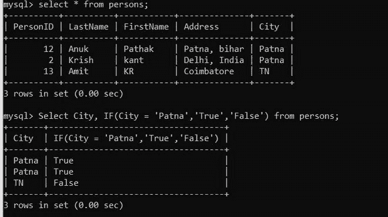

# 如何使用 Python 在 MySQL 中使用 IF 语句

> 原文:[https://www . geesforgeks . org/如何使用 if 语句-in-mysql-using-python/](https://www.geeksforgeeks.org/how-to-use-if-statement-in-mysql-using-python/)

**先决条件:** [Python: MySQL 创建表](https://www.geeksforgeeks.org/python-mysql-create-table/)

在本文中，我们将看到如何使用 Python 在 MySQL 中使用 if 语句。Python 允许广泛的数据库服务器与应用程序的集成。从 Python 访问数据库需要数据库接口。 [**MySQL 连接器**](https://www.geeksforgeeks.org/mysql-connector-python-module-in-python/) -Python 模块是 Python 中的一个 API，用于与 MySQL 数据库进行通信。

**进场:**

*   导入模块。
*   向数据库发出连接请求。
*   为数据库游标创建一个对象。
*   执行以下 MySQL 查询:

```py
IF(condition, value_if_true, value_if_false)
```

**例 1:**

在本例中，我们将该数据库表用于以下查询；


**下面是实现:**

## 蟒蛇 3

```py
# Establish connection to MySQL database
import mysql.connector

db = mysql.connector.connect(
  host="localhost",
  user="root",
  password="root123",
  database = "geeks"
  )

#getting the cursor by cursor() method
mycursor = db.cursor()

insertQuery = " Select Value, IF(Value>1000,'MORE','LESS') from salary;"
mycursor.execute(insertQuery)
myresult = mycursor.fetchall()
print(myresult)

# close the Connection
db.close()
```

**输出:**


**例 2:**

在本例中，我们将该数据库表用于以下查询；



**以下是完整实现:**

## 蟒蛇 3

```py
# Establish connection to MySQL database
import mysql.connector

db = mysql.connector.connect(
  host="localhost",
  user="root",
  password="root123",
  database = "geeks"
  )

#getting the cursor by cursor() method
mycursor = db.cursor()

insertQuery = " Select City, IF(City = 'Patna','True','False') from persons;"
mycursor.execute(insertQuery)
myresult = mycursor.fetchall()

print(myresult)

# close the Connection
db.close()
```

**输出:**

