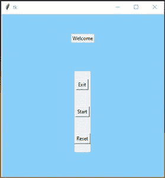
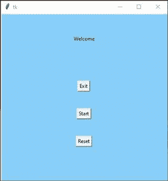
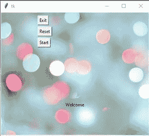

# 如何在 Tkinter 中使用图像作为背景？

> 原文:[https://www . geesforgeks . org/如何使用图片作为背景 in-tkinter/](https://www.geeksforgeeks.org/how-to-use-images-as-backgrounds-in-tkinter/)

**先决条件**:[Python GUI–tkinter](https://www.geeksforgeeks.org/python-gui-tkinter/)、 [框架](https://www.geeksforgeeks.org/python-tkinter-frame-widget/)

在本文中，我们将编写一个在后台使用图像的程序。在 Tkinter 中，没有内置的图像功能，所以可以作为背景图像使用。可以用各种方法来完成:

**方法 1:** 使用**摄影图像**方法。

对于基于图形用户界面的应用程序，图像起着至关重要的作用。从应用程序图标到动画，都很有用。

为了在标签、按钮、画布和文本小部件中显示图像，使用了 **PhotoImage** 类，该类存在于 text 包中。

**代码:**

## 蟒蛇 3

```py
# Import module 
from tkinter import *

# Create object 
root = Tk()

# Adjust size 
root.geometry("400x400")

# Add image file
bg = PhotoImage(file = "Your_image.png")

# Show image using label
label1 = Label( root, image = bg)
label1.place(x = 0, y = 0)

label2 = Label( root, text = "Welcome")
label2.pack(pady = 50)

# Create Frame
frame1 = Frame(root)
frame1.pack(pady = 20 )

# Add buttons
button1 = Button(frame1,text="Exit")
button1.pack(pady=20)

button2 = Button( frame1, text = "Start")
button2.pack(pady = 20)

button3 = Button( frame1, text = "Reset")
button3.pack(pady = 20)

# Execute tkinter
root.mainloop()
```

**输出:**



可以看到按钮和标签的背景颜色与图像颜色不同。

解决方法是设置按钮的背景颜色，并以此颜色标注为图像的颜色**“# 88 cffa”**。

## 蟒蛇 3

```py
# Import module 
from tkinter import *

# Create object 
root = Tk()

# Adjust size 
root.geometry("400x400")

# Add image file
bg = PhotoImage( file = "Your_img.png")

# Show image using label
label1 = Label( root, image = bg)
label1.place(x = 0,y = 0)

# Add text
label2 = Label( root, text = "Welcome",
               bg = "#88cffa")

label2.pack(pady = 50)

# Create Frame
frame1 = Frame( root, bg = "#88cffa")
frame1.pack(pady = 20)

# Add buttons
button1 = Button( frame1, text = "Exit")
button1.pack(pady = 20)

button2 = Button( frame1, text = "Start")
button2.pack(pady = 20)

button3 = Button( frame1, text = "Reset")
button3.pack(pady = 20)

# Execute tkinter
root.mainloop()
```

**输出:**



注意:此方法不适用于图像中的多种颜色。

**方法二:**使用[画布](https://www.geeksforgeeks.org/python-tkinter-canvas-widget/)方法。

**进场:**

*   与上面的实现相同。
*   添加图像文件。
*   创建画布并设置宽度和高度。
*   使用 create_image 显示图像。
*   使用 create_text 设置文本。
*   创建按钮。
*   最后一步使用 create_window 添加按钮。

**代码:**

## 蟒蛇 3

```py
# Import module 
from tkinter import *

# Create object 
root = Tk()

# Adjust size 
root.geometry("400x400")

# Add image file
bg = PhotoImage(file = "Your_img.png")

# Create Canvas
canvas1 = Canvas( root, width = 400,
                 height = 400)

canvas1.pack(fill = "both", expand = True)

# Display image
canvas1.create_image( 0, 0, image = bg, 
                     anchor = "nw")

# Add Text
canvas1.create_text( 200, 250, text = "Welcome")

# Create Buttons
button1 = Button( root, text = "Exit")
button3 = Button( root, text = "Start")
button2 = Button( root, text = "Reset")

# Display Buttons
button1_canvas = canvas1.create_window( 100, 10, 
                                       anchor = "nw",
                                       window = button1)

button2_canvas = canvas1.create_window( 100, 40,
                                       anchor = "nw",
                                       window = button2)

button3_canvas = canvas1.create_window( 100, 70, anchor = "nw",
                                       window = button3)

# Execute tkinter
root.mainloop()
```

**输出:**

