# 如何使用 Jupyter 笔记本——终极指南

> 原文:[https://www . geeksforgeeks . org/使用方法-jupyter-notebook-an-ultimate-guide/](https://www.geeksforgeeks.org/how-to-use-jupyter-notebook-an-ultimate-guide/)

Jupyter 笔记本是一个开源的网络应用程序，允许您创建和共享包含实时代码、公式、可视化和叙事文本的文档。用途包括数据清理和转换、数值模拟、统计建模、数据可视化、机器学习等等。Jupyter 支持 40 多种不同的编程语言，Python 就是其中之一。Python 是安装 Jupyter 笔记本本身的要求(Python 3.3 或更高版本，或 Python 2.7)。

> <font size="4">目录</font>
> 
> *   [安装](#installation)
> *   [启动 Jupyter 笔记本](#starting)
> *   [创建笔记本](#creating)
> *   [Jupyter 笔记本中的 Hello World](#hello)
> *   [Jupyter 笔记本中的单元格](#cell)
> *   [内核](#kernel)
> *   [命名笔记本](#naming)
> *   [笔记本扩展](#notebook)

## 装置

使用 Anaconda 发行版安装 Python 和 Jupyter，该发行版包括 Python、Jupyter 笔记本和其他用于科学计算和数据科学的常用软件包。你可以从[这里](https://www.anaconda.com/distribution/#linux)下载 Anaconda 最新的 Python3 版本。
现在，安装下载的 Anaconda 版本。

**使用 pip 安装 Jupyter 笔记本:**

```py
python3 -m pip install --upgrade pip
python3 -m pip install jupyter

```

## 启动 Jupyter 笔记本

要启动 jupyter 笔记本，请在终端中键入以下命令。

```py
jupyter notebook
```

这将在您的终端中打印有关笔记本服务器的一些信息，包括 web 应用程序的 URL(默认情况下，http://localhost:8888)，然后打开默认的 web 浏览器访问该 URL。

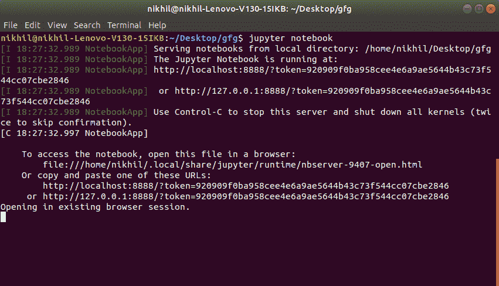

打开笔记本后，您将看到笔记本仪表板，它将显示笔记本服务器启动目录中的笔记本、文件和子目录的列表。大多数情况下，您会希望在包含笔记本的最高级别目录中启动笔记本服务器。通常这是你的主目录。

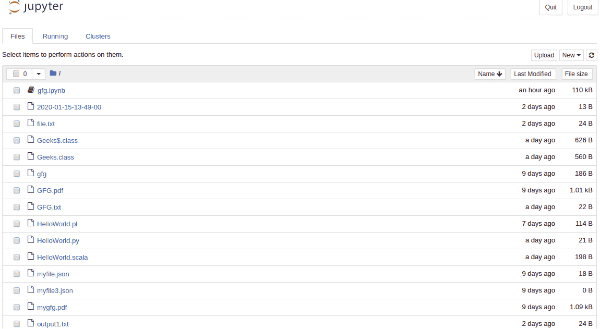

## 创建笔记本

要创建新笔记本，请单击右上角的新建按钮。单击它打开一个下拉列表，然后如果您单击 Python3，它将打开一个新笔记本。


网页应该如下所示:


## 木星笔记本里的你好世界

在 Jupyter Notebook 中成功安装并创建笔记本后，让我们看看如何在其中编写代码。Jupyter 笔记本提供了一个用于在其中编写代码的单元。代码的类型取决于您创建的笔记本的类型。例如，如果您创建了一个 Python3 笔记本，那么您可以在单元格中编写 Python3 代码。

现在，让我们添加以下代码–

```py
print("Hello World")
```

选择要执行的单元格后，点击运行按钮或按下 shift `**⇧** + enter **⏎**`来运行单元格。将上述代码写入 jupyter 笔记本后，输出结果为:


**注意:**当一个单元格执行了左边的标签，即`ln[]`变为`ln[1]`。如果该单元仍在执行中，标签仍为`ln[*]`。

## Jupyter 笔记本中的单元格

细胞可以被认为是朱庇特人的身体。在上面的截图中，带有绿色轮廓的框是一个单元格。有 3 种类型的细胞:

*   **代码**
*   **标记**
*   **原始 NBConverter**

#### 密码

这是键入代码的地方，当执行时，代码将在单元格下方显示输出。代码的类型取决于您创建的笔记本的类型。例如，如果创建了 Python3 的笔记本，那么可以添加 Python3 的代码。考虑下面的例子，其中创建了一个简单的斐波那契数列代码，该代码也从用户那里获取输入。

**示例:**

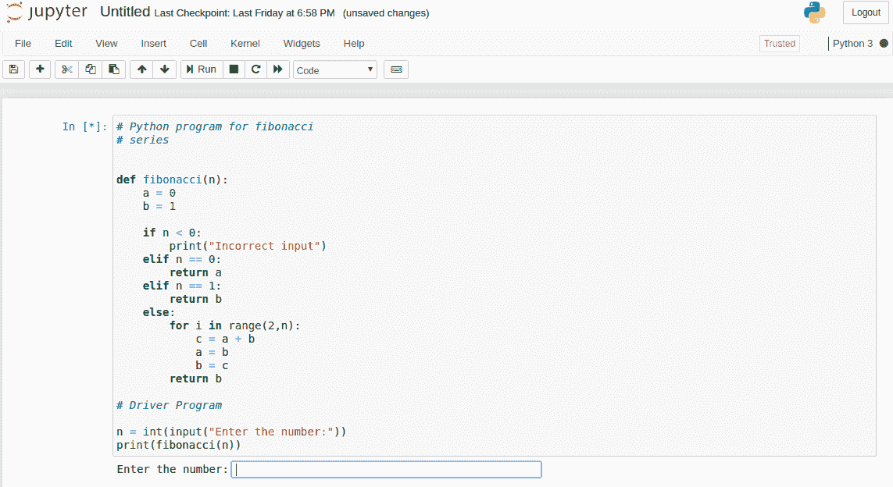

上面代码中的 tex 条提示用户输入。上述代码的输出如下:

**输出:**

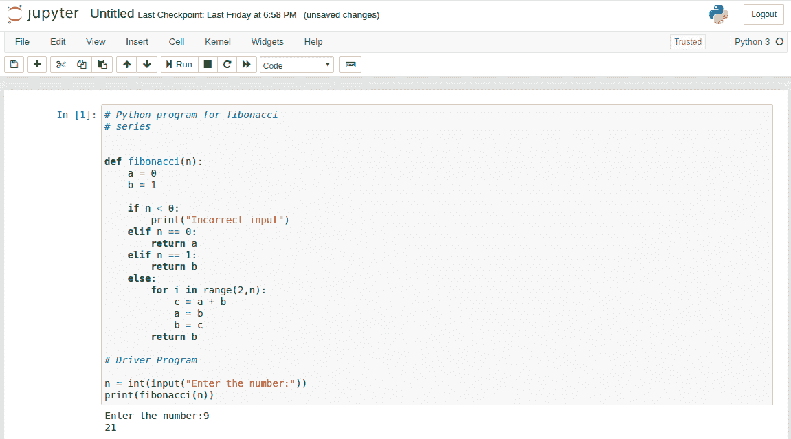

#### 减价

Markdown 是一种流行的标记语言，是 HTML 的超集。Jupyter 笔记本也支持降价。可以使用单元格菜单将单元格类型更改为减价。

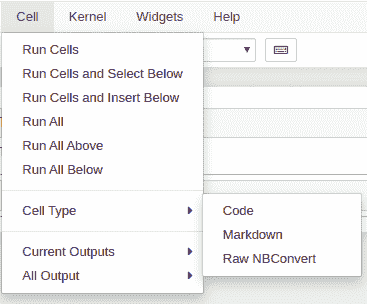

**添加标题:**

标题可以通过在任意一行前面加上单个或多个`'#'`后跟空格来添加。

**示例:**

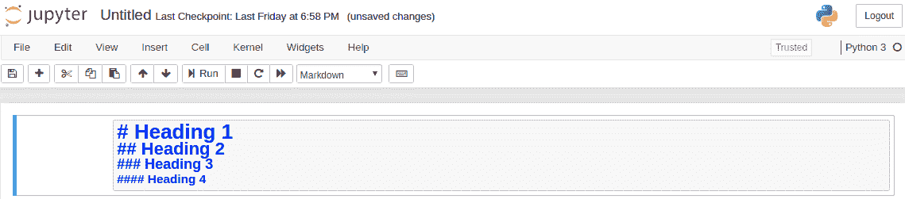

**输出:**

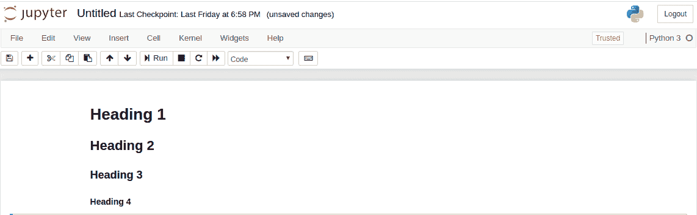

**添加 Lits:**

在 Jupyter 笔记本中添加 Lits 真的很简单。使用`'*'` 符号可以添加列表。嵌套列表可以通过缩进来创建。

**示例:**

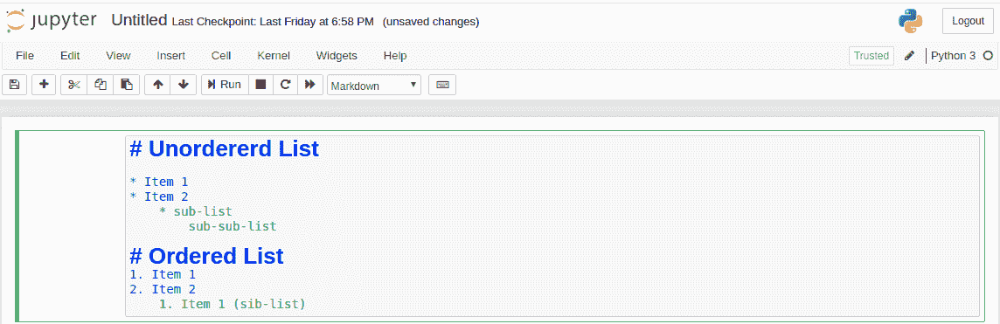

**输出:**

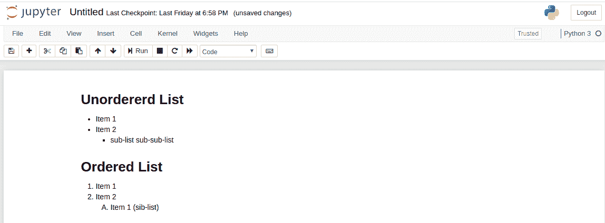

**添加乳胶方程式:**

乳胶表达式可以通过`'{content}apos;`包围乳胶代码来添加，为了在中间写表达式，通过`'$'`包围乳胶代码。

**示例:**

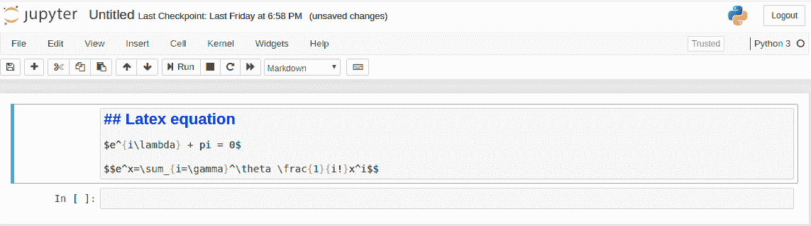

**输出:**

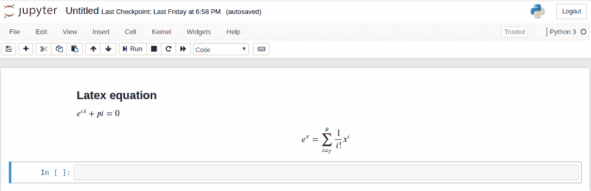

**添加表格:**

可以通过以下格式编写内容来添加表格。

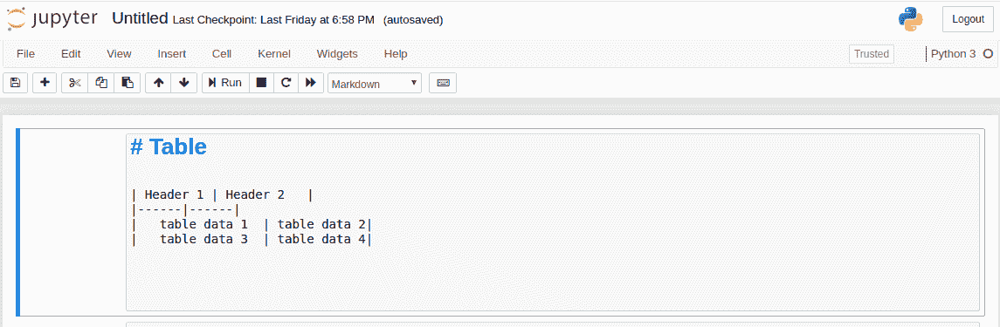

**输出:**

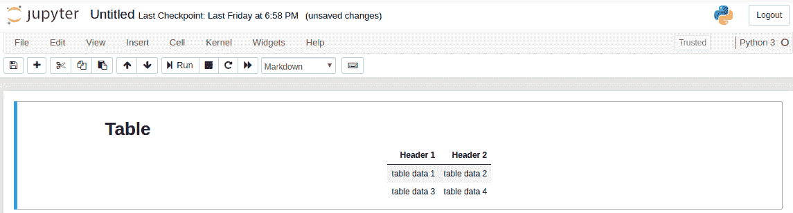

**注:**可将文字分别括在`'**'`和`'*'`内，使文字加粗或斜体。

#### 原始 NBConverter

提供原始单元直接写入输出。Jupyter 笔记本不评估此单元格。通过`nbconvert`后，原始单元格到达目标文件夹，无需任何修改。例如，一个人可以将完整的 Python 写入到原始单元格中，只有通过`nbconvert`转换后，才能由 Python 渲染。

## 核心

每个笔记本背后都有一个内核。每当执行一个单元格时，该单元格内的代码都会在内核中执行，并且输出会返回到要显示的单元格。内核作为一个整体继续存在于文档中，而不是单独的单元。

例如，如果在一个单元格中导入了一个模块，那么该模块将可用于整个文档。为了更好的理解，请看下面的例子。

**示例:**

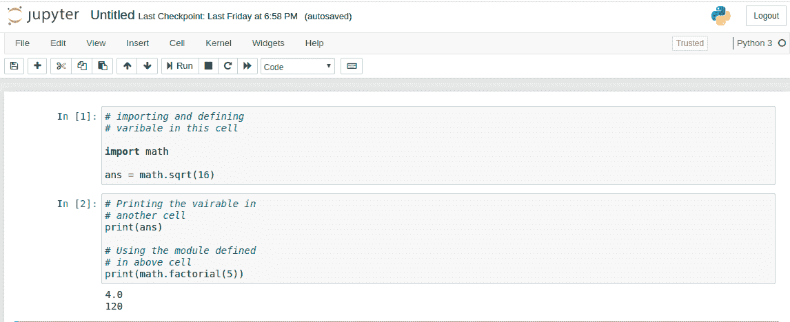

**注:**每个单元的执行顺序在单元的左侧。在上面的例子中，首先执行带有`In[1]`的单元格，然后执行带有`In[2]`的单元格。

**内核选项:**

Jupyter 笔记本为内核提供了多种选择。如果你想重置一些东西，这是很有用的。选项包括:

*   **重启:**这将重启内核，即清除所有定义的变量，清除导入的模块等。
*   **重新启动并清除输出:**这将执行与上面相同的操作，但也将清除单元格下方显示的所有输出。
*   **重启并全部运行:**这也与上面相同，但也将以自上而下的顺序运行所有单元格。
*   **中断:**该选项将中断内核执行。在程序继续执行或者内核被一些计算卡住的情况下，它会很有用。

## 命名笔记本

创建笔记本时，Jupyter Notebook 会将笔记本命名为默认的“无标题”。但是，笔记本可以重命名。要重命名笔记本，只需单击“无标题”一词。这将提示一个名为重命名笔记本的对话框。在文本栏中输入笔记本的有效名称，然后单击“确定”。

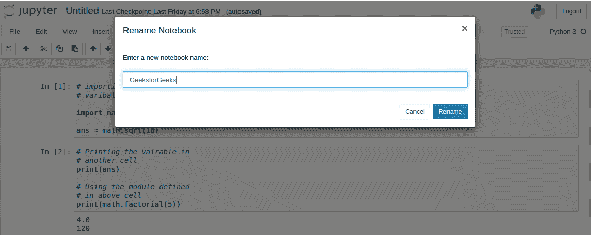

## 笔记本扩展

新的功能可以通过扩展添加到 Jupyter。扩展是 javascript 模块。您甚至可以编写自己的扩展来访问页面的 DOM 和 Jupyter Javascript API。Jupyter 支持四种类型的扩展。

*   核心
*   ipython 内核
*   笔记本
*   笔记本服务器

#### 安装扩展

大多数扩展都可以使用 Python 的 pip 工具来安装。如果无法使用 pip 安装扩展，请使用以下命令安装扩展。

```py
jupyter nbextension install extension_name

```

上面只安装了扩展，但没有启用它。要启用它，请在终端中键入以下命令。

```py
jupyter nbextension enable extension_name

```