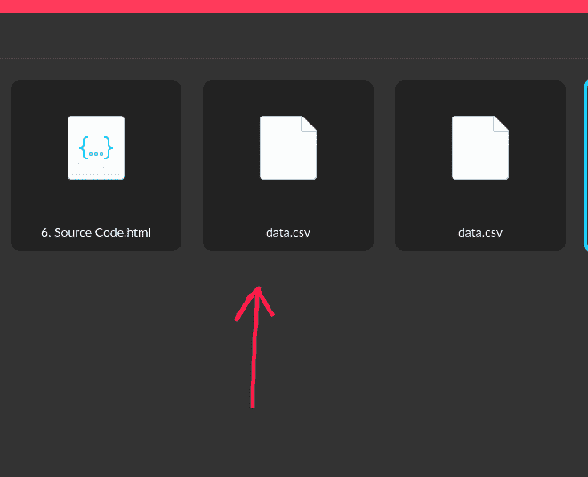
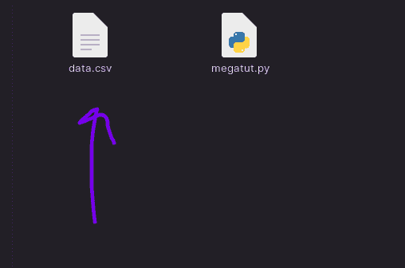

# 如何用 Python 使用 Mega.nz API？

> 原文:[https://www . geeksforgeeks . org/how-用法-mega-nz-api-with-python/](https://www.geeksforgeeks.org/how-to-use-mega-nz-api-with-python/)

在本文中，我们将看到如何在 Python 中使用 mega.nz API。MEGA。NZ 是端到端加密的，加密密钥归我们所有。这意味着。新西兰员工将无法读取个人数据。Mega.py 是一个很好的 Python 模块，用于与 mega.nz API 进行交互。它提供了易于使用的功能，可用于以下功能–

*   注册
*   上传
*   下载
*   删除
*   搜索
*   共享
*   重新命名

## 安装模块

超级。NZ 为 Python 提供了一个易于使用的 SDK，因此我们将在本教程中使用它。所以首先我们必须安装软件开发工具包。

```
pip install mega.py
```

运行上面的命令来安装软件开发工具包。现在转到您最喜欢的 IDE。

## 上传文件或文件夹

这里我们将在 mega.nz 云中上传文件。使用**上传()功能。**

## 蟒蛇 3

```
# Enter File/Folder Name
from mega import Mega

mega = Mega()
m = mega.login(email, password)
filename = "data.csv"
m.upload(filename)
```

**输出:**



## 获取关于您的超级帐户的信息

### 获取用户详细信息

**get_user()方法**返回包含用户相关数据的字典。

## 蟒蛇 3

```
from mega import Mega

mega = Mega()
m = mega.login(email, password)
details = m.get_user()
print(details)
```

**输出:**


### **获取账户盘面额度**

**get_quota()** 方法返回未使用的磁盘空间。

## 蟒蛇 3

```
from mega import Mega

mega = Mega()
m = mega.login(email, password)
quota = m.get_quota()
print("Total Space: ", quota)
```

**输出:**


## 从 Mega 下载文件

这里我们将使用 **download_url()** 方法从 mega 下载文件。

## 蟒蛇 3

```
from mega import Mega

mega = Mega()
m = mega.login(email, password)

# FIND FILE
file = m.find('myfile.doc')

# THEN DOWNLOAD USING THE FILE OBJECT
m.download(file)

# DOWNLOAD FILE USING MEGA FILE URL
m.download_url(
    'https://mega.co.nz/#!3tUF2KQD!Rg-zOOUIs9L\
    ipsqwH9c_9ZOfRjZ48Xb5k2I1M6QTMa4')

# SPECIFY DOWNLOAD LOCATION
m.download(file, '/home/john-smith/Desktop')
```

**输出:**



### 搜索文件

搜索文件需要使用 find()函数，在这里，如果找到文件，它将是一个字典，包含关于文件的各种信息，否则文件将只是一个无类型

## 蟒蛇 3

```
from mega import Mega

mega = Mega()
m = mega.login(email, password)
filename = ""
file = m.find(filename)
print(file)
```