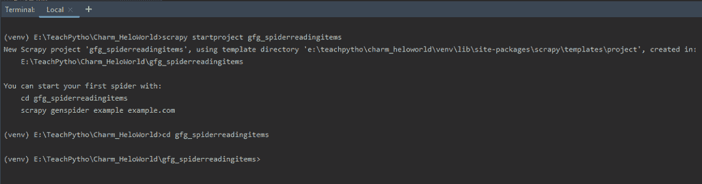
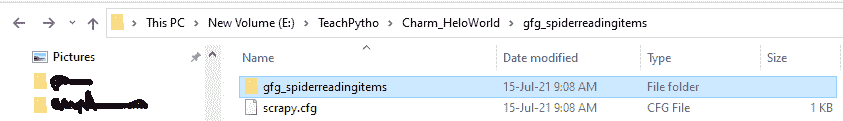
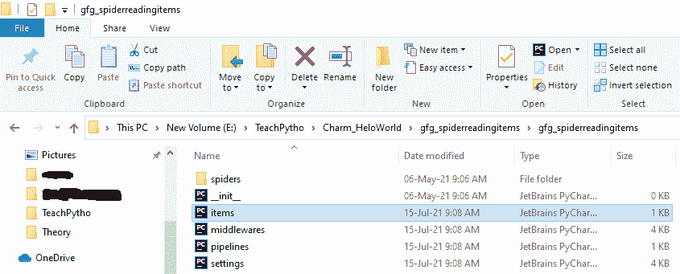
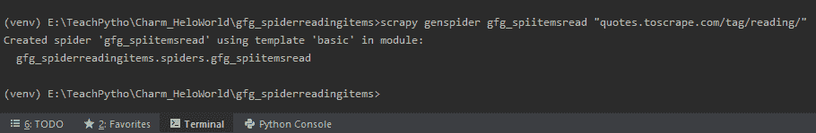
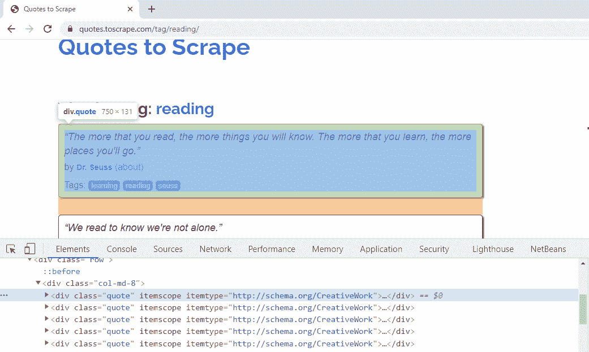
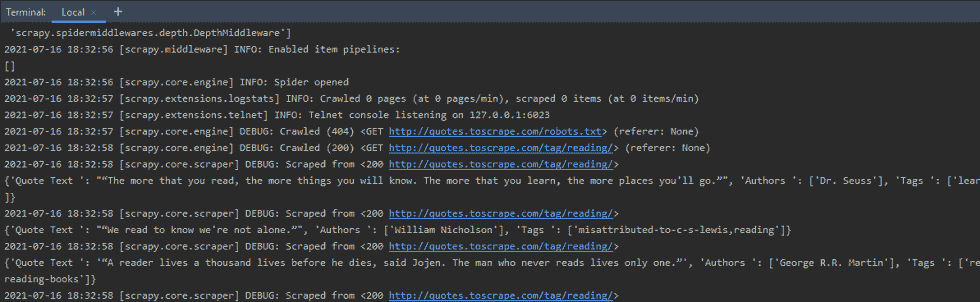
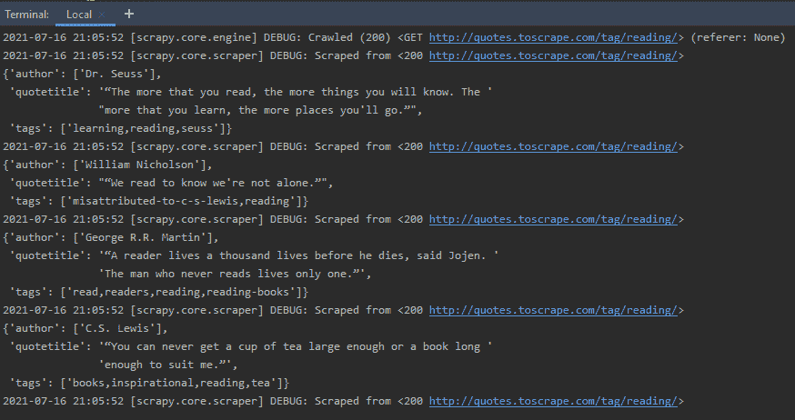

# 如何使用报废物品？

> 原文:[https://www.geeksforgeeks.org/how-to-use-scrapy-items/](https://www.geeksforgeeks.org/how-to-use-scrapy-items/)

在本文中，我们将从网页[https://quotes.toscrape.com/tag/reading/](https://quotes.toscrape.com/tag/reading/)中使用零碎项目来抓取报价数据。抓取的主要目标是从非结构化资源中准备结构化数据。剪贴簿项目是包装，字典数据结构。可以编写代码，使得提取的数据以“键值”对的格式作为项对象返回。在以下情况下，使用废品是有益的–

*   随着废弃数据量的增加，它们变得难以处理。
*   随着数据变得越来越复杂，它很容易出现错别字，有时可能会返回错误的数据。
*   由于项目对象可以进一步传递到项目管道，因此对收集的数据进行格式化更容易。
*   清理数据很容易，如果我们把数据作为项目来清理的话。
*   验证数据，处理丢失的数据，用废品更容易。

通过项目适配器库，Scrapy 支持各种项目类型。人们可以选择他们想要的项目类型。以下是支持的项目类型:

*   **词典–**条目可以以词典对象的形式编写。它们使用起来很方便。
*   **项目对象–**它们提供类似于应用编程接口的字典，我们需要在其中声明项目所需的字段。它由声明项类时使用的字段对象的键值对组成。在本教程中，我们将使用项目对象。
*   **数据类对象–**当您需要将刮取的值存储在 JSON 或 CSV 文件中时，会用到它们。这里我们需要定义每个字段的数据类型。
*   **attr . s–**attr . s 允许用字段名定义项目类，以便可以将抓取的数据导入到不同的文件格式中。它们的工作方式类似于 Dataclass 对象，只是需要安装 attr 包。

## **安装剪贴簿库**

剪贴簿库需要 3.6 及以上的 Python 版本。通过执行以下命令，在终端安装剪贴簿库–

> pip 安装剪贴簿

该命令将在项目环境中安装剪贴簿库。现在，我们可以创建一个 Scrapy 项目，来编写 Spider 代码。

## **创建报废项目**

Scrapy 有，一个高效的命令行工具，也叫‘Scrapy 工具’。命令根据其用途接受不同的参数和选项集。为了编写 Spider 代码，我们从创建一个 Scrapy 项目开始，在终端执行以下命令

> 斗志昂扬开始项目<project_name></project_name>

**输出:**



创建蜘蛛项目的简单“开始项目”命令

这将在您当前的目录中创建一个文件夹。它包含一个项目的配置文件“scrapy.cfg”。文件夹结构如下所示:



“gfg_spiderreadingitems”的文件夹结构

**scrapy.cfg，**是一个项目配置文件。包含此文件的文件夹是根目录。创建的文件夹的文件夹结构如下:



“gfg_spiderreadingitems”文件夹中的文件“items.py”

该文件夹包含 items.py、middlerwares.py 和其他设置文件，以及“蜘蛛”文件夹。爬行代码将被写在一个蜘蛛 python 文件中。我们将修改“items.py”文件，更不用说提取我们的数据项。保持“items.py”的内容不变。

## **蜘蛛码提取数据**

网页抓取的代码写在蜘蛛代码文件中。为了创建蜘蛛文件，我们将使用“genspider”命令。请注意，该命令是在存在 scrapy.cfg 文件的同一级别执行的。

我们正在[https://quotes.toscrape.com/tag/reading/](https://quotes.toscrape.com/tag/reading/)网页上抓取、阅读报价。因此，我们将运行以下命令–

> scrapy gens pider spider _ name URL _ to _ be _ scratch



使用“genspider”命令创建蜘蛛文件

上面的命令将在“蜘蛛”文件夹中创建一个蜘蛛文件“gfg _ spiitemsread.py”。蜘蛛的名字也将是“gfg _ spiitemsread”。相同的默认代码如下:

## 蟒蛇 3

```
# Import the required libraries
import scrapy

# Spider Class Created

class GfgSpiitemsreadSpider(scrapy.Spider):
    # Name of the spider
    name = 'gfg_spiitemsread'
    # The domain to be scraped
    allowed_domains = ['quotes.toscrape.com/tag/reading/']
    # The URLs from domain to scrape
    start_urls = ['http://quotes.toscrape.com/tag/reading//']

    # Spider default callback function
    def parse(self, response):
        pass
```

我们将从网页[https://quotes.toscrape.com/tag/reading/](https://quotes.toscrape.com/tag/reading/)中抓取报价标题、作者和标签。Scrapy 为我们提供了选择器，可以根据需要“选择”网页的某些部分。选择器是 CSS 或 XPath 表达式，用于从 HTML 文档中提取数据。在本教程中，我们将使用 XPath 表达式来选择我们需要的细节。让我们理解蜘蛛代码中编写选择器语法的步骤。

*   spider 类中负责处理接收到的响应的默认回调方法是 parse()方法。我们将在这里编写负责数据提取的带有 XPath 表达式的选择器。
*   选择要提取的元素，在网页上单击鼠标右键，然后选择“检查”选项。这将允许我们，查看它的 CSS 属性。
*   当我们右键单击第一个报价并选择检查时，我们可以看到它具有 CSS“类”属性“报价”。同样，网页上所有的引号，都有 CSS‘class’属性为“quote”。这可以从下面看出:



右键单击第一个引用，并检查其 CSS“类”属性

基于此，同样的，XPath 表达式可以写成–

*   quotes = response . XPath('//*[@ class = " quote "]')。该语法将获取所有元素，以“引号”作为 CSS“类”属性。
*   我们将获取所有报价的报价标题、作者和标签。因此，我们将编写 XPath 表达式来循环提取它们。对于报价标题，CSS“类”属性是“文本”。因此，同样的 XPath 表达式应该是–quote . XPath('。//*[@class="text"]/text()')。extract_first()。text()方法将提取报价标题的文本。extract_first()方法将给出第一个匹配值，带有 CSS 属性“text”。点运算符“.”开始时，表示从单引号中提取数据。
*   同样，CSS 属性中，“类”和“itemprop”，对于 author 元素来说，就是“author”。我们可以在 XPath 表达式中使用其中的任何一个。语法应该是–quote . XPath('。//*[@itemprop="author"]/text()')。提取()。这将提取作者姓名，其中 CSS“itempur”属性是“作者”。
*   标签元素的 CSS 属性“类”和“itemprop”是“关键字”。我们可以在 XPath 表达式中使用其中的任何一个。因为有许多标签，所以对于任何报价来说，遍历它们都是复杂的。因此，我们将从每个引用中提取 CSS 属性“内容”。相同的 XPath 表达式是–quote . XPath('。//*[@itemprop= "关键字"]/@content ")。提取()。这将从“内容”属性中提取报价的所有标签值。
*   我们使用“yield”语法来获取数据。我们可以使用“yield”语法收集数据，并将其转换为 CSV、JSON 和其他文件格式。
*   如果我们观察代码直到这里，它会爬行，并提取网页的数据。

代码如下:

## 蟒蛇 3

```
# Import the required library
import scrapy

# The Spider class
class GfgSpiitemsreadSpider(scrapy.Spider):
    # Name of the spider
    name = 'gfg_spiitemsread'

    # The domain allowed to scrape
    allowed_domains = ['quotes.toscrape.com/tag/reading']

    # The URL to be scraped
    start_urls = ['http://quotes.toscrape.com/tag/reading/']

    # Default callback function
    def parse(self, response):

        # Fetch all quotes tags
        quotes = response.xpath('//*[@class="quote"]')

        # Loop through the Quote selector elements
        # to get details of each
        for quote in quotes:

            # XPath expression to fetch text of the Quote title
            title = quote.xpath('.//*[@class="text"]/text()').extract_first()

            # XPath expression to fetch author of the Quote
            authors = quote.xpath('.//*[@itemprop="author"]/text()').extract()

            # XPath expression to fetch Tags of the Quote
            tags = quote.xpath('.//*[@itemprop="keywords"]/@content').extract()

            # Yield all elements
            yield {"Quote Text ": title, "Authors ": authors, "Tags ": tags}
```

爬行命令用于运行蜘蛛。在爬行命令中提到蜘蛛的名字。如果我们使用 crawl 命令运行上面的代码，那么终端的输出将是:

> 杂乱的爬网文件名

**输出:**



“收益率”语句显示的剔除报价

这里，yield 语句返回 Python 字典对象中的数据。

**理解 Python 字典和剪贴簿项目**

上面产生的数据是 Python 字典对象。使用它们的优势是–

*   当数据量较少时，它们方便且易于处理键值对结构。
*   当不需要进一步处理或格式化刮下的数据时，使用它们。
*   用字典，当你想刮的数据，是完整而简单的。

为了使用项目对象，我们将在以下文件中进行更改–

*   items.py 文件存在
*   生成的当前蜘蛛类，gfg _ spiitemsread.py 文件。

## **使用废品收集数据**

现在，我们将学习为报价编写剪贴簿的过程。为此，我们将遵循下面提到的步骤–

*   打开 items.py 文件。它与“蜘蛛”文件夹处于同一级别。在文件中提到我们需要提取的字段，如下所示:

## 蟒蛇 3

```
# Define here the models for your scraped
# items
# Import the required library
import scrapy

# Define the fields for Scrapy item here
# in class
class GfgSpiderreadingitemsItem(scrapy.Item):

    # Item key for Title of Quote
    quotetitle = scrapy.Field()

    # Item key for Author of Quote
    author = scrapy.Field()

    # Item key for Tags of Quote
    tags = scrapy.Field()
```

正如所看到的，在上面的文件中，我们定义了一个叫做“GfgSpiderreadingitemsItem”的零碎项目。这个类，是我们的蓝图，对于所有的元素，我们都会刮去。它将保持三个字段，即引用标题、作者姓名和标签。我们现在可以只添加我们在课堂上提到的字段。

Field()类是内置字典类的别名。它允许在一个位置定义所有字段元数据。它不提供任何额外的属性。

现在修改 spider 文件，将值存储在项目文件的类对象中，而不是直接产生它们。请注意，您需要导入项目类模块，如下面的代码所示。

## 蟒蛇 3

```
# Import the required library
import scrapy

# Import the Item class with fields
# mentioned in the items.py file
from ..items import GfgSpiderreadingitemsItem

class GfgSpiitemsreadSpider(scrapy.Spider):
    name = 'gfg_spiitemsread'
    allowed_domains = ['quotes.toscrape.com/tag/reading']
    start_urls = ['http://quotes.toscrape.com/tag/reading/']

    def parse(self, response):

        # Write XPath expression to loop through
        # all quotes
        quotes = response.xpath('//*[@class="quote"]')

        # Loop through all quotes
        for quote in quotes:

            # Create an object of Item class
            item = GfgSpiderreadingitemsItem()

            # XPath expression to fetch text of the
            # Quote title Store the title in the class
            # attribute in key-value pair
            item['quotetitle'] = quote.xpath(
                './/*[@class="text"]/text()').extract_first()

            # XPath expression to fetch author of the Quote
            # Store the author in the class attribute in
            # key-value pair
            item['author'] = quote.xpath(
                './/*[@itemprop="author"]/text()').extract()

            # XPath expression to fetch tags of the Quote title
            # Store the tags in the class attribute in key-value
            # pair
            item['tags'] = quote.xpath(
                './/*[@itemprop="keywords"]/@content').extract()

            # Yield the item object
            yield item
```

如上所述，在 Item 类中提到的键现在可以被 XPath 表达式用来收集抓取的数据。确保你在两个地方都提到了，确切的键名。例如，当“作者”是 items.py 文件中定义的键时，使用“item['author']”。

在终端产生的项目如下所示:



使用剪贴簿项目从网页提取的数据