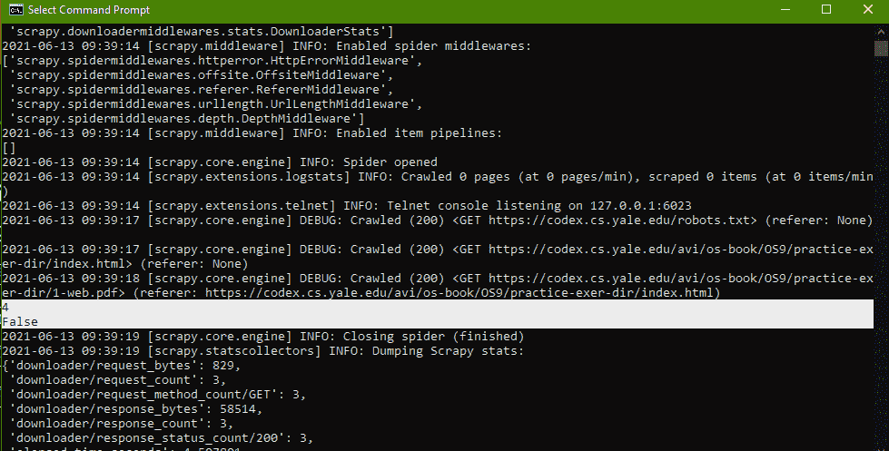
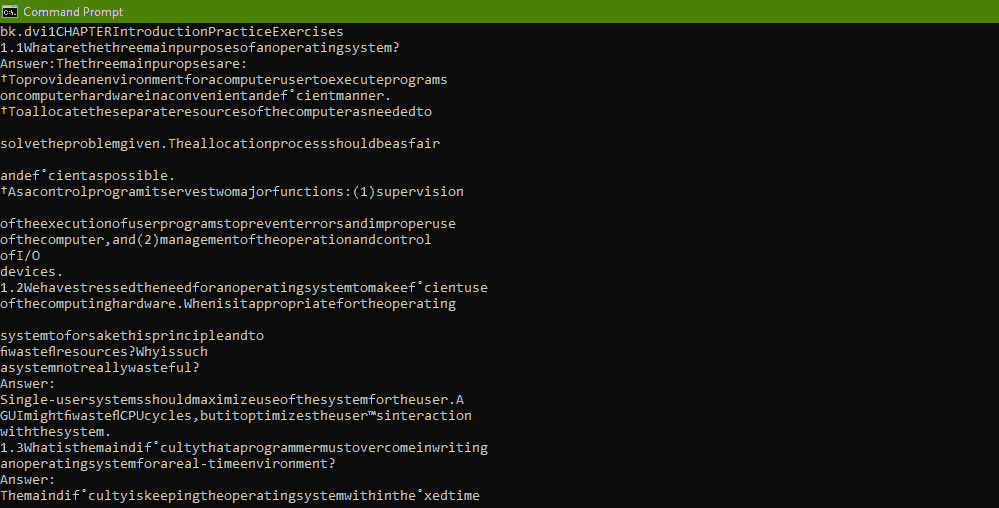

# 如何使用 Scrapy 在线解析 PDF 页面？

> 原文:[https://www . geesforgeks . org/how-用法-scrapy-to-parse-pdf-pages-online/](https://www.geeksforgeeks.org/how-to-use-scrapy-to-parse-pdf-pages-online/)

**前提条件:**[【scrappy】](https://www.geeksforgeeks.org/implementing-web-scraping-python-scrapy/)，[【pypdf 2】](https://www.geeksforgeeks.org/working-with-pdf-files-in-python/)，[【URL lib】](https://www.geeksforgeeks.org/python-urllib-module/)

在本文中，我们将使用 Scrapy 来解析任何在线 PDF，而无需将其下载到系统中。为此，我们必须使用 Python 的 PDF 解析器或编辑器库，称为 **PyPDF2** 。

**PyPDF2** 是 python 的 PDF 解析库，它提供了各种方法，如 reader 方法、writer 方法等，用于在线或离线修改、编辑和解析 pdf。

PyPDF2 类的所有构造函数都需要一个 PDF 文件流。现在，由于我们只能实现 pdf 文件的 URL，因此要将该 URL 转换为文件流或简单地打开该 URL，我们将需要使用 Python 的 urllib 模块，该模块可用于对 spider 返回的请求对象调用 **urlopen()** 方法。

**示例 1:** 我们将使用一些基本操作，如提取页码和检查文件是否加密。为此，我们将使用网址解析并找到响应，然后我们将检查文件页面，并使用 numPages 和 isEncrypted 进行加密。

Scrapy spider 抓取网页，在线找到要报废的 pdf 文件，然后从另一个变量 URL 中获取该 pdf 文件的 URL，然后使用 urllib 打开 URL 文件，并通过将 URL 的流链接传递给 object 的构造函数的参数来创建 PyPDF2 lib 的 reader 对象。

## 蟒蛇 3

```py
import io
import PyPDF2
import urllib.request
import scrapy
from scrapy.item import Item

class ParserspiderSpider(scrapy.Spider):

    name = 'parserspider'

    # URL of the pdf file . This is operating system
    # book solution of author Albert Silberschatz
       start_urls = ['https://codex.cs.yale.edu/avi/\
    os-book/OS9/practice-exer-dir/index.html']

    # default parse method
    def parse(self, response):    

        # getting the list of URL of the pdf
        pdfs = response.xpath('//tr[3]/td[2]/a/@href')

           # Extracting the URL
           URL = response.urljoin(pdfs[0].extract())

           # calling urllib to create a reader of the pdf url
           File = urllib.request.urlopen(URL)
           reader = PyPDF2.pdf.PdfFileReader(io.BytesIO(File.read()))

           # accessing some descriptions of the pdf file.
           print("This is the number of pages"+str(reader.numPages))
           print("Is file Encrypted?"+str(reader.isEncrypted))
```

**输出:**



首先输出 pdf 的页面，以及是否加密

**示例 2:** 在本例中，我们将提取 PDF 文件的数据(解析)，然后使用 PyPDF2 对象通过上述各种方法对 pdf 文件进行所需的更改。我们将把提取的数据打印到终端。

## 蟒蛇 3

```py
import io
import PyPDF2
import urllib.request
import scrapy
from scrapy.item import Item

class ParserspiderSpider(scrapy.Spider): 

    name = 'parserspider'

    # URL of the pdf file.
    start_urls = ['https://codex.cs.yale.edu/avi\
    /os-book/OS9/practice-exer-dir/index.html']

    # default parse method
    def parse(self, response): 

        # getting the list of URL of the pdf
        pdfs = response.xpath('//tr[3]/td[2]/a/@href')

        # Extracting the URL
        URL = response.urljoin(pdfs[0].extract())

        # calling urllib to create a reader of the pdf url
        File = urllib.request.urlopen(URL)
        reader = PyPDF2.pdf.PdfFileReader(io.BytesIO(File.read()))

        # creating data
        data=""
        for datas in reader.pages:
            data += datas.extractText()

        print(data)
```

**输出:**



已解析的 Pdf