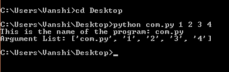
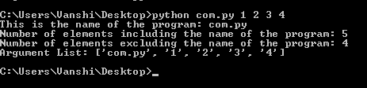
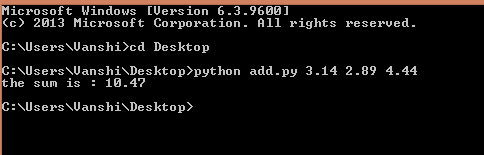

# 如何在 Python 中使用 sys . argv

> 原文:[https://www . geesforgeks . org/how-用法-sys-argv-in-python/](https://www.geeksforgeeks.org/how-to-use-sys-argv-in-python/)

[命令行参数](https://www.geeksforgeeks.org/python-set-6-arguments/)是那些在程序调用过程中与调用语句一起传递的值。因此，数组的第一个元素`sys.argv()`是程序本身的名称。`sys.argv()`是 Python 中[命令行参数](https://www.geeksforgeeks.org/python-set-6-arguments/)的数组。使用名为“`sys`”的模块。`sys.argv`类似于数组，取值也像 Python 数组一样。

**系统模块**

sys 模块提供了用于操作 Python 运行时环境不同部分的函数和变量。该模块提供对解释器使用或维护的一些变量以及与解释器强交互的函数的访问。

**示例:**

```
# Python program to demonstrate
# sys.argv

import sys

print("This is the name of the program:", sys.argv[0])

print("Argument List:", str(sys.argv))
```

**输出:**



上面的程序以“com.py”的名称保存，因此必须在下面的命令提示符中调用

**可与 sys.argv 一起使用的功能**

*   **len()-** 函数用于统计传递到命令行的参数数量。由于迭代是从 0 开始的，所以它也将程序的名称算作一个参数。如果一个人只想处理其他输入，他们可以使用(len(sys.argv)-1)。
*   **str()-** 该函数用于将数组表示为字符串数组。使显示命令行数组变得更容易和更好。

**示例:**

```
# Python program to demonstrate
# sys.argv

import sys

print("This is the name of the program:",
       sys.argv[0])
print("Number of elements including the name of the program:",
       len(sys.argv))
print("Number of elements excluding the name of the program:",
      (len(sys.argv)-1))
print("Argument List:",
       str(sys.argv))
```

**输出:**



以下程序使用运行时给出的输入执行加法:

```
# Python program to demonstrate
# sys.argv

import sys

add = 0.0

# Getting the length of command
# line arguments
n = len(sys.argv)

for i in range(1, n):
    add += float(sys.argv[i])

print ("the sum is :", add)
```

**输出:**

