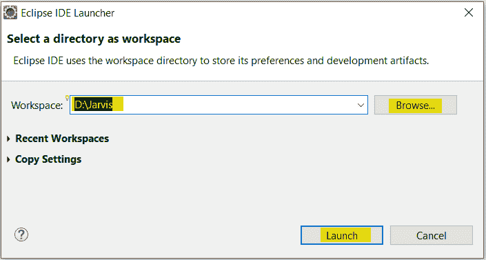
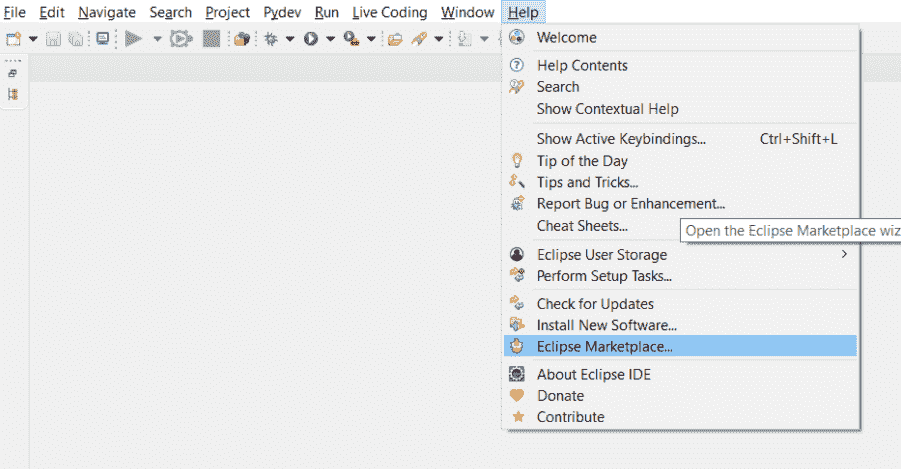
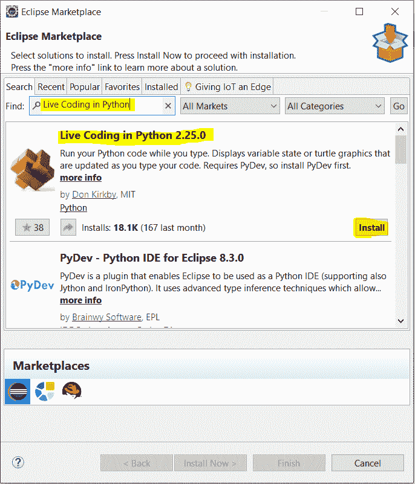
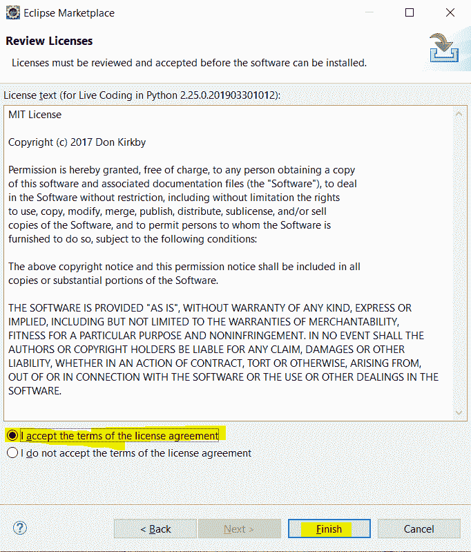
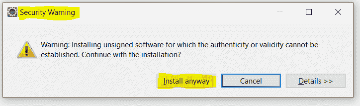
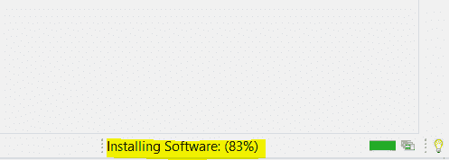
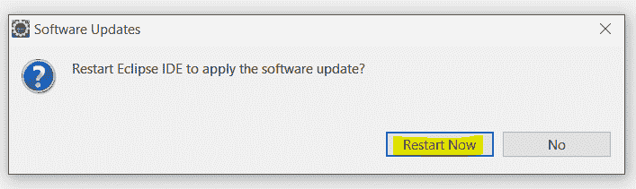
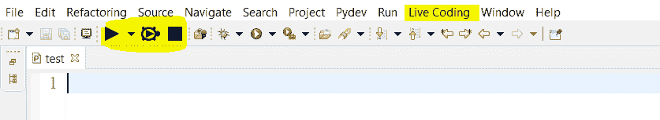
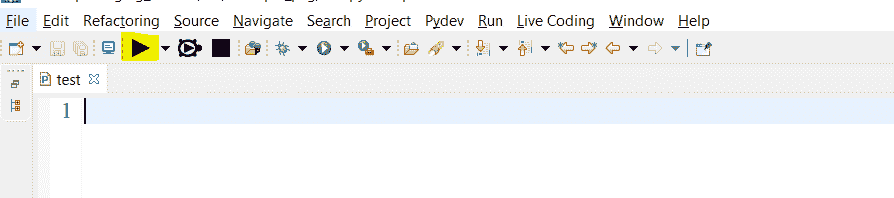
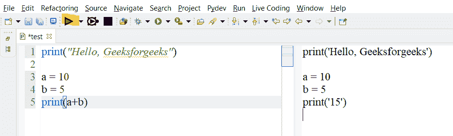

# 如何在 Eclipse 中使用 Python 的实时编码特性？

> 原文:[https://www . geeksforgeeks . org/如何在 eclipse 中使用 python 的实时编码功能/](https://www.geeksforgeeks.org/how-to-use-the-live-coding-feature-of-python-in-eclipse/)

在本文中，我们将讨论如何在 Eclipse 中使用 Python 的实时编码特性。每次程序员都要花很多时间调试他们的代码。尽管如此，他们还是没能调试好。这个扩展将帮助程序员减少他们的调试时间。此扩展可在[**Eclipse IDE**](https://www.eclipse.org/downloads/)**/**[**py charm IDE**](https://www.jetbrains.com/pycharm/download/)**下载。**

如果您不知道如何在 eclipse 中安装扩展或插件，请遵循以下简单步骤:

*   下载 [**Eclipse IDE**](https://www.eclipse.org/downloads/) 。
*   下载 Eclipse 后，将其安装在您的机器上。
*   安装 Eclipse 后，在 Eclipse 中下载 Python。
*   打开 Eclipse 集成开发环境，设置您的工作空间。

设置/选择您的工作区

*   完成上述步骤后，导航到“帮助”菜单选项卡。

Eclipse 的帮助菜单选项卡

*   在“帮助”菜单选项卡中，单击“Eclipse 市场”选项。

Eclipse 市场

*   搜索“Python 实时编码”(或使用此 [**链接**](https://marketplace.eclipse.org/content/live-coding-python#group-details) )并点击**安装**按钮。

实时编码功能安装

*   单击安装按钮后，接受所有条款和条件。

接受条款和条件

*   你会收到一个安全警告，点击“安装”按钮。

安全警告

*   下载和安装过程将开始。

安装软件

*   现在，重启 Eclipse 集成开发环境。

重新启动 Eclipse IDE

*   一旦您重新启动您的 Eclipse IDE，您将获得如下所示的选项:-

菜单选项卡中的实时编码

*   要开始使用实时编码功能，请点击如下所示的按钮:-

开始实时编码功能

左:代码部分，右:实时代码部分

**演示:**

<video class="wp-video-shortcode" id="video-615918-1" width="640" height="360" preload="metadata" controls=""><source type="video/mp4" src="https://media.geeksforgeeks.org/wp-content/uploads/20210601171044/1080_30_8.51_May202021.mp4?_=1">[https://media.geeksforgeeks.org/wp-content/uploads/20210601171044/1080_30_8.51_May202021.mp4](https://media.geeksforgeeks.org/wp-content/uploads/20210601171044/1080_30_8.51_May202021.mp4)</video>

**注意:**你也可以在 Pycharm IDE 下载这个插件。