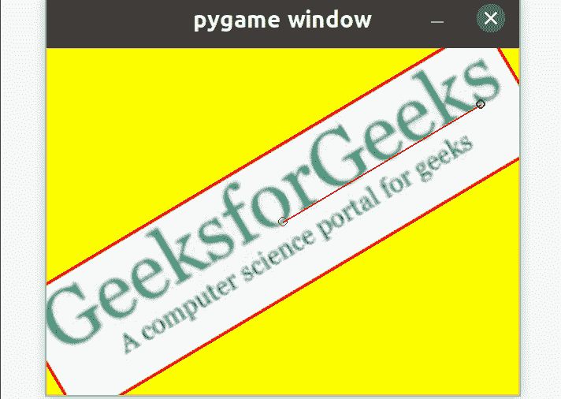

# 如何在 PyGame 中使用鼠标缩放和旋转图像？

> 原文:[https://www . geeksforgeeks . org/如何使用鼠标来缩放和旋转 pygame 中的图像/](https://www.geeksforgeeks.org/how-to-use-the-mouse-to-scale-and-rotate-an-image-in-pygame/)

在本文中，我们将讨论如何在 Pygame 中使用鼠标变换图像(即缩放和旋转图像)。

### 方法

**第一步:**首先导入库 Pygame 和数学。

```
import pygame
import math
from pygame.locals import *
```

**第二步:**现在，把我们想在游戏中使用的颜色作为输入。

```
color_1 = #RGB value of color 1
color_2 = #RGB value of color 2
color_n = #RGB value of color n
```

**步骤 3:** 然后，初始化构造函数

```
pygame.init()
```

**第四步:**设置你的 GUI 游戏的尺寸。

```
w, h = #Width dimension, #Height dimension
screen = pygame.display.set_mode((w, h))
```

**第五步:**设置运行游戏的运行值，即可以移动的角度。

```
running = True
angle = 0
scale = 1
```

**第六步:**接下来，把我们想用鼠标移动的图像作为输入

```
img_logo = pygame.image.load('#Enter the image url')
img_logo.convert()
```

**第七步:**在图像周围画一个边框。

```
rect_logo = img_logo.get_rect()
pygame.draw.rect(img_logo, color_1, rect_logo, 1)
```

**第八步:**定位 GUI 游戏的中心，得到鼠标的位置。

```
center = w//2, h//2
mouse = pygame.mouse.get_pos()
```

**步骤 9:** 将图像存储在一个新的变量中，并在图像周围构建一个矩形。

```
img = img_logo
rect = img.get_rect()
rect.center = center
```

**第十步:**设置你希望你的应用在运行状态下要做的事情。

```
while running:
    for event in pygame.event.get():
```

*   **步骤 10.1:** 一旦 app 处于运行状态，如果用户想退出，就让其退出。

```
        if event.type == QUIT:
            running = False
```

*   **步骤 10.2:** 在用户不想退出的情况下，设置图像应该旋转到什么角度。

```
        if event.type == KEYDOWN:
            if event.key == K_ra:
                if event.mod & KMOD_SHIFT:

                    # angle at which it should move left
                    angle -= 
                else:

                    # angle at which it should move right
                    angle += 
```

*   **步骤 10.3:** 此外，设置图像大小应该以什么比例减小或增大。

```
            elif event.key == K_sa:
                if event.mod & KMOD_SHIFT:
                    scale /= #scale at which the image size should decrease
                else:
                    scale *= #scale at which the image size should increase
```

*   **步骤 10.4:** 设置图像将旋转或调整大小的坐标、角度和比例。

```
        elif event.type == MOUSEMOTION:
```

*   **步骤 10.4.1:** 将事件的当前位置存储在新变量中。

```
            mouse = event.pos
```

*   **步骤 10.4.2:** 借助鼠标变量和图像中心定位笛卡尔坐标，旋转图像..

```
            x = mouse[0] - center[0]
            y = mouse[1] - center[1]
```

*   **第 10.4.3 步:**进一步借助公式√x <sup>2</sup> +y <sup>2</sup> 计算两点(0，0)和(x，y)之间的距离

```
            d = math.sqrt(x ** 2 + y ** 2)
```

*   **步骤 10.4.4:** 现在，使用 Python 方法 [**math.atan2()**](https://www.geeksforgeeks.org/atan2-function-python/) 计算图像应该旋转的角度(以度为单位)，该方法以弧度为单位返回 y/x 的反正切。

```
            angle = math.degrees(-math.atan2(y, x))
```

*   **步骤 10.4.5:** 使用函数 [**abs**](https://www.geeksforgeeks.org/abs-in-python/) 计算图像大小应该减小或增大哪个比例，该函数返回数字的大小。

```
            scale = abs(5 * d / w)
```

*   **步骤 10.4.6:** 使用旋转缩放功能计算运行状态下图像的更新位置，旋转缩放功能是一种组合的缩放和旋转变换。

```
            img = pygame.transform.rotozoom(img_logo, angle, scale)
```

*   **步骤 10.4.7:** 围绕更新后的图像构建矩形

```
            rect = img.get_rect()
            rect.center = center
```

**步骤 11:** 接下来需要设置屏幕颜色和屏幕上的图像。

```
    screen.fill(color_3)
    screen.blit(img, rect)
```

**第 12 步:**稍后，画出 [**长方形**](https://www.geeksforgeeks.org/how-to-draw-rectangle-in-pygame/)[**线条**](http://www.pygame.org/docs/ref/draw.html#pygame.draw.line)[](http://www.pygame.org/docs/ref/draw.html#pygame.draw.line)**和 [**圆圈**](http://www.pygame.org/docs/ref/draw.html#pygame.draw.circle) ，这将有助于移动图像。**

```
 pygame.draw.rect(screen, color_2, rect, #thickness of rectangle)
    pygame.draw.line(screen, color_3, center, mouse, #Thickness of line)
    pygame.draw.circle(screen, color_1, center, #radius of circle, #thickness of circumference)
    pygame.draw.circle(screen, color_2, mouse, #radius of circle, #thickness of circumference)
```

****步骤 13:** 此外，更新在 GUI 游戏中所做的更改。**

```
 pygame.display.update()
```

****第 14 步:**最后退出 GUI 游戏。**

```
pygame.quit()
```

**下面是实现。**

## **计算机编程语言**

```
# Python program to transform the 
# image with the mouse

#Import the libraries pygame and math
import pygame
import math
from pygame.locals import *

# Take colors input
RED = (255, 0, 0)
BLACK = (0, 0, 0)
YELLOW = (255, 255, 0)

#Construct the GUI game
pygame.init()

#Set dimensions of game GUI
w, h = 600, 440
screen = pygame.display.set_mode((w, h))

# Set running, angle and scale values
running = True
angle = 0
scale = 1

# Take image as input
img_logo = pygame.image.load('gfg_image.jpg')
img_logo.convert()

# Draw a rectangle around the image
rect_logo = img_logo.get_rect()
pygame.draw.rect(img_logo, RED, rect_logo, 1)

# Set the center and mouse position
center = w//2, h//2
mouse = pygame.mouse.get_pos()

#Store the image in a new variable
#Construct the rectangle around image
img = img_logo
rect = img.get_rect()
rect.center = center

# Setting what happens when game is
# in running state
while running:
    for event in pygame.event.get():

        # Close if the user quits the game
        if event.type == QUIT:
            running = False

        # Set at which angle the image will
        # move left or right
        if event.type == KEYDOWN:
            if event.key == K_ra:
                if event.mod & KMOD_SHIFT:
                    angle -= 5
                else:
                    angle += 5

            # Set at what ratio the image will
            # decrease or increase
            elif event.key == K_sa:
                if event.mod & KMOD_SHIFT:
                    scale /= 1.5
                else:
                    scale *= 1.5

        # Move the image with the specified coordinates,
        # angle and scale        
        elif event.type == MOUSEMOTION:
            mouse = event.pos
            x = mouse[0] - center[0]
            y = mouse[1] - center[1]
            d = math.sqrt(x ** 2 + y ** 2)
            angle = math.degrees(-math.atan2(y, x))
            scale = abs(5 * d / w)
            img = pygame.transform.rotozoom(img_logo, angle, scale)
            rect = img.get_rect()
            rect.center = center

    # Set screen color and image on screen
    screen.fill(YELLOW)
    screen.blit(img, rect)

    # Draw the rectangle, line and circle through
    # which image can be transformed 
    pygame.draw.rect(screen, BLACK, rect, 3)
    pygame.draw.line(screen, RED, center, mouse, 2)
    pygame.draw.circle(screen, RED, center, 6, 1)
    pygame.draw.circle(screen, BLACK, mouse, 6, 2)

    # Update the GUI game
    pygame.display.update()

# Quit the GUI game
pygame.quit()
```

****输出:****

****