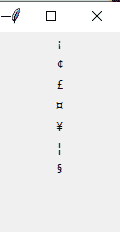

# 如何在 Tkinter 中使用 Unicode 和特殊字符？

> 原文:[https://www . geeksforgeeks . org/如何使用-unicode 和特殊字符-in-tkinter/](https://www.geeksforgeeks.org/how-to-use-unicode-and-special-characters-in-tkinter/)

**先决条件:** [**Tkinter**](https://www.geeksforgeeks.org/python-gui-tkinter/)

Python 为开发图形用户界面提供了多种选择。在所有的 GUI 方法中，Tkinter 是最常用的方法。它是 Python 附带的 Tk 图形用户界面工具包的标准 Python 接口。Python 搭配 Tkinter 是创建 GUI 应用程序最快最简单的方法。

在本文中，我们将学习如何在 Tkinter 中使用 Unicode &特殊字符。

**进场:**

*   制作一个包含 Unicode 值的列表。
*   遍历所有 Unicode 值，然后传入标签文本
*   我们将使用**“u 前缀”**来显示 Unicode 值。

> **语法:** u'\u {Unicode 值} '

**示例:**

```
for "Not sign" unicode value is "00AC"

Input
u'\u00AC'

Output
¬
```

**下面是实现:-**

## 蟒蛇 3

```
# Import Tkinter
from tkinter import *

# Create Object
root = Tk()

# Set geometry
root.geometry("100x200")

# Unicodes values
unicodes_values = [
'\u00A1',
'\u00A2',
'\u00A3',
'\u00A4',
'\u00A5',
'\u00A6',
'\u00A7'
]

# Iterate through all unicode values
for unicodes_value in unicodes_values:
    Label(root, text = u'{unicodes_value}'.format(
      unicodes_value = unicodes_value)).pack()

# Execute Tkinter
root.mainloop()
```

**输出:**

