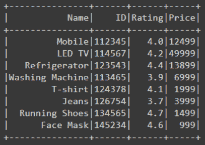

# 如何验证 Pyspark 数据框列类型？

> 原文:[https://www . geesforgeks . org/如何验证-py spark-data frame-column-type/](https://www.geeksforgeeks.org/how-to-verify-pyspark-dataframe-column-type/)

使用大数据框时，数据框由任意数量的具有不同数据类型的列组成。为了对数据进行预处理以对其进行操作，我们必须知道数据框的维度和数据框中存在的列的数据类型。

在本文中，我们将了解如何验证数据框的列类型。为了验证列类型，我们使用了 dtypes 函数。dtypes 函数用于返回包含列名和列类型的元组列表。

> **语法:**df . dt types()
> 
> 其中，df 是数据帧

首先，我们将创建一个数据框架，然后查看一些示例和实现。

## 计算机编程语言

```
# importing necessary libraries
from pyspark.sql import SparkSession

# function to create new SparkSession
def create_session():
  spk = SparkSession.builder \
      .master("local") \
      .appName("Product_details.com") \
      .getOrCreate()
  return spk

def create_df(spark,data,schema):
  df1 = spark.createDataFrame(data,schema)
  return df1

if __name__ == "__main__":

  # calling function to create SparkSession
  spark = create_session()

  input_data = [("Mobile",112345,4.0,12499),
          ("LED TV",114567,4.2,49999),
          ("Refrigerator",123543,4.4,13899),
          ("Washing Machine",113465,3.9,6999),
          ("T-shirt",124378,4.1,1999),
          ("Jeans",126754,3.7,3999),
          ("Running Shoes",134565,4.7,1499),
          ("Face Mask",145234,4.6,999)]

  schema = ["Name","ID","Rating","Price"]

  # calling function to create dataframe
  df = create_df(spark,input_data,schema)

  # visualizing the dataframe
  df.show()
```

**输出:**



**示例 1:使用 dtypes()函数**验证数据框的列类型

在下面的示例代码中，我们创建了 Dataframe，然后为了获取 Dataframe 中所有列的列类型，我们使用了 dtypes 函数，方法是将 *df.dtypes* 与 f 字符串一起使用，同时找到我们打印的所有列的数据类型。这给出了包含列的名称和数据类型的元组列表。

## 计算机编程语言

```
# finding data type of the all the 
# column using dtype function and 
# printing
print(f'Data types of all the columns is : {df.dtypes}')

# visualizing the dataframe
df.show()
```