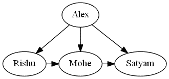

# 如何使用 Graphviz 在 Python 中可视化神经网络？

> 原文:[https://www . geeksforgeeks . org/如何使用 graphviz 可视化 python 中的神经网络/](https://www.geeksforgeeks.org/how-to-visualize-a-neural-network-in-python-using-graphviz/)

在本文中，我们将看到如何使用 Graphviz 在 python 中绘制(可视化)神经网络。Graphviz 是一个开源图形可视化软件的 python 模块。可视化在研究者中非常流行。它将结构信息表示为抽象图形和网络的图表，这意味着您只需要提供关于其拓扑结构的图形的唯一文本描述，这将自动读取和创建图像。

**安装:**

对于窗口终端:

```py
pip install graphviz
```

对于蟒蛇码头:

```py
conda install -c anaconda graphviz
```

## 用 Graphviz 绘制简单图形

**进场:**

*   导入模块。
*   创建 Diagraph 的新对象。
*   将**节点()**和**边()**添加到图形对象中。
*   使用 render()对象保存源代码。

**下面是实现:**

## 蟒蛇 3

```py
# import module
from graphviz import Digraph

# instantiating object
dot = Digraph(comment='A Round Graph')

# Adding nodes
dot.node('A', 'Alex')
dot.node('B', 'Rishu')
dot.node('C', 'Mohe')
dot.node('D', 'Satyam')

# Adding edges
dot.edges(['AB', 'AC', 'AD'])
dot.edge('B', 'C', constraint = 'false')
dot.edge('C', 'D', constraint = 'false')

# saving source code
dot.format = 'png'
dot.render('Graph', view = True) 
```

**输出:**

```py
Graph.png
```



**我们可以查 t** **他用 dot.source 方法生成的源代码:**

## 蟒蛇 3

```py
print(dot.source)
```