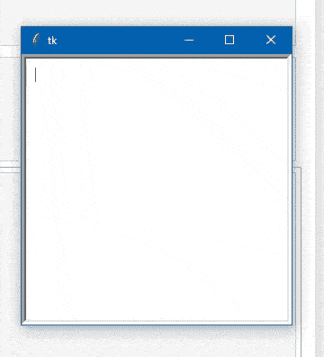
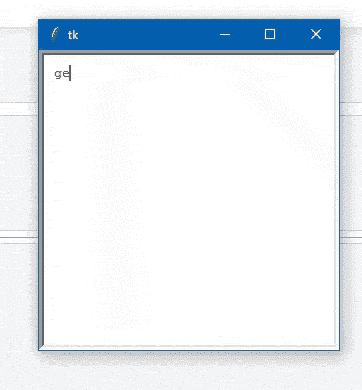

# 如何在 Tkinter 文本框内换行？

> 原文:[https://www . geeksforgeeks . org/如何在 tkinter 文本框内包装文本/](https://www.geeksforgeeks.org/how-to-wrap-text-within-tkinter-text-box/)

在本文中，我们将看到如何使用名为[**的 Tkinter 模块对 TKinter 文本框中的文本进行换行**](https://www.geeksforgeeks.org/textwrap-text-wrapping-filling-python/) 模块。textwrap 模块可用于包装和格式化纯文本。该模块通过调整输入段落中的换行符来设置文本格式。

**例 1:**

首先我们将把 Tkinter 库导入到代码中，然后我们将它声明为我们的窗口的根，然后在声明窗口的大小之后，我们将调用 Tkinter 中被称为 text()的函数，该函数将在该窗口中提供文本框，然后声明文本框的大小，然后打包到窗口中，或者将文本框组合到窗口中。

**下面是实现:**

## 蟒蛇 3

```py
# import tkinter module 
from tkinter import *       

# Create Object
root = Tk() 

# Initialize tkinter window with dimensions 100x100             
root.geometry('300x300')     

text=Text(root,
          width = 50,
          height = 50,
          padx = 10, 
          pady = 10)

# pack the text-Aera in the window
text.pack()

root.mainloop()
```

**输出:**



**例 2:**

这里我们有一个问题，就像在盒子的末尾，当我们写一些东西的时候，它会把文本打断到新的一行。一般来说，为了包装文本，我们使用文本。以下是我们如何使用单词=wrap 的基本概念

**使用换行=WORD 选项。这里有一个例子:**

```py
from tkinter import *
root = Tk()
t = Text(wrap=WORD)
t.pack()
root.mainloop()
```

**下面是实现:**

## 蟒蛇 3

```py
# import tkinter module 
from tkinter import *       

# Create Object
root = Tk() 

# Initialize tkinter window with dimensions 100x100             
root.geometry('300x300')     

text=Text(root, width = 50, height = 50, 
          wrap = WORD, padx = 10, pady = 10)

# pack the text-Aera in the window
text.pack()

root.mainloop()
```

