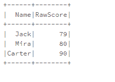
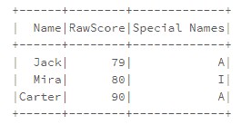
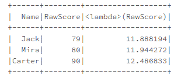

# 如何用 Python 编写 Spark UDF(用户定义函数)？

> 原文:[https://www . geesforgeks . org/如何编写-spark-UDF-用户定义-python 中的函数/](https://www.geeksforgeeks.org/how-to-write-spark-udf-user-defined-functions-in-python/)

在本文中，我们将讨论 UDF(用户定义函数)以及如何用 Python Spark 编写这些函数。UDF，基本上代表用户定义函数。UDF 将允许我们直接在 python 中的数据框和 SQL 数据库中应用这些函数，而无需单独注册它们。它还可以帮助我们为数据框创建新列，通过 UDF 向数据框列应用一个函数，因此它将扩展我们的数据框功能。它可以使用 udf()方法创建。

**udf():** 这个方法会使用 [lambda](https://www.geeksforgeeks.org/python-lambda-anonymous-functions-filter-map-reduce/) 函数来循环数据，它的参数会接受 lambda 函数，而 lambda 值会变成函数的参数，我们要做成一个 udf。

### Pyspark 数据框示例

让我们创建一个数据框，这个数据框的主题是学生的名字，以及他/她在 100 分测试中的原始分数。

## 蟒蛇 3

```
from pyspark.sql import SparkSession
from pyspark.sql.types import IntegerType,StringType
from pyspark.sql.functions import udf

spark = SparkSession.builder.appName('UDF PRACTICE').getOrCreate()

cms = ["Name","RawScore"]
data =  [("Jack", "79"),
        ("Mira", "80"),
        ("Carter", "90")]

df = spark.createDataFrame(data=data,schema=cms)

df.show()
```

**输出:**



### 创建示例函数

现在，我们要做一个函数。因此，为了便于理解，我们将做一个简单的函数来拆分列，并检查，如果该列中的遍历对象(变得等于‘J’(大写 J)或‘C’(大写 C)或‘M’(大写 M)，那么它将转换该单词的第二个字母及其大写版本。该代码的实现是:

## 蟒蛇 3

```
def Converter(str):
    result = ""
    a = str.split(" ")

    for q in a:
        if q == 'J' or 'C' or 'M':
            result += q[1:2].upper()

    return result
```

### 用样本函数制作 UDF

现在，我们将把它转换成我们的 UDF 函数，这反过来将减少我们的数据工作量。为此，我们在 UDF 内部使用了 lambda。

## 蟒蛇 3

```
NumberUDF = udf(lambda m: Converter(m))
```

### 在数据帧上使用 UDF

接下来我们将使用 withcolumn()，记住 withcolumn()将返回完整的数据帧。所以我们将只使用我们现有的 df 数据帧，返回值将只存储在 df 中(基本上我们将附加它)。

## 蟒蛇 3

```
df.withColumn("Special Names", NumberUDF("Name")).show()
```

**输出:**



**注**:我们也可以一步完成所有这些东西。

### 带注释的 UDF

现在，一个简单而聪明的方法是使用**“ANNOTATIONS”(或装饰者)**。这将在较少的步骤中创建我们的 UDF 函数。为此，我们所要做的就是在 udf 函数前面使用@符号( **decorator)** ，并在它的参数部分给出函数的返回类型，即把 return type 赋值为 Intergertype()，StringType()，等等。

## 蟒蛇 3

```
@udf(returnType=StringType())
def Converter(str):
    result = ""
    a = str.split(" ")

    for q in a:
        if q == 'J' or 'C' or 'M':
            result += q[1:2].upper()
        else:
            result += q
    return result

df.withColumn("Special Names", Converter("Name")) \
    .show()
```

**输出:**


**示例:**

现在，让我们假设学校有一个评分方案，根据平方根加 3 来校准学生的分数(即他们将校准 15 分中的分数)。因此，我们将定义一个 UDF 函数，这次我们将指定返回类型。即浮点数据类型。因此，该函数的声明将是–

## 蟒蛇 3

```
def SQRT(x):
    return float(math.sqrt(x)+3)
```

现在，我们将定义一个 udf，它的返回类型将始终是 float，也就是说，我们强制该函数以及 UDF 只给我们浮点数形式的结果。该功能的定义将是–

## 蟒蛇 3

```
UDF_marks = udf(lambda m: SQRT(m),FloatType())
```

udf 的第二个参数 floatingtype()将总是强制 UDF 函数只返回 floating type 中的结果。现在，我们将使用我们的 udf 函数，在我们的数据框中的 RawScore 列上标记 UDF，并将生成一个名为“ <lambda>RawScore”的新列，这将是该列的默认命名。这方面的代码如下所示–</lambda>

## 蟒蛇 3

```
df.select("Name","RawScore", UDF_marks("RawScore")).show()
```

**输出:**

