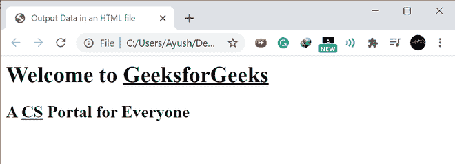
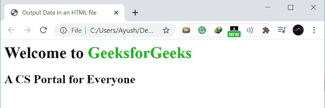

# 如何用 Python 写一个 HTML 文件？

> 原文:[https://www . geesforgeks . org/如何用 python 编写 html 文件/](https://www.geeksforgeeks.org/how-to-write-to-an-html-file-in-python/)

**Python** 语言如今在几乎每个领域都有很大的用途，它可以和其他技术一起使用，让我们的生活变得更加轻松。python 的一个这样的用途是将数据输出到一个 HTML 文件中。

我们可以使用以下两种方法将任意数量的输入数据保存到 python 的 HTML 文件中。

**示例 1:创建一个 HTML 文件，并将输入数据保存到其中。**

**进场:**

*   创建一个 HTML 文件。

```
Function_Name = open("Complete_File_Name","File_operation")
```

*   将 HTML 格式的输入数据添加到文件中。

```
Function_Name.write("Adding_Input_data_using_HTML_Synatx_separted_by_/n")
```

*   保存 HTML 文件。

```
Function_Name.close()
```

*   从保存的位置打开 HTML 文件。

**下面是实现:**

## 蟒蛇 3

```
# Creating an HTML file
Func = open("GFG-1.html","w")

# Adding input data to the HTML file
Func.write("<html>\n<head>\n<title> \nOutput Data in an HTML file \
           </title>\n</head> <body><h1>Welcome to <u>GeeksforGeeks</u></h1>\
           \n<h2>A <u>CS</u> Portal for Everyone</h2> \n</body></html>")

# Saving the data into the HTML file
Func.close()
```

**输出:**


**GFG-1.html**文件是在文件夹中创建的



检查**GFG-1.html**文件的输出数据

**示例 2:创建并保存一个 HTML 文件，然后向其中添加输入数据。**

**进场:**

*   **创建一个 HTML 文件并保存。**

```
Function_Name = open("Complete_File_Name","File_operation")
Function_Name.close()
```

*   从保存的位置打开 HTML 文件。
*   现在将输入数据添加到创建的 HTML 文件中。

```
Function_Name = open(File_Location,"File_operation")
Function_Name.write("Adding_Input_data_using_HTML_Synatx_separted_by_/n")
```

*   保存 HTML 文件。

```
Function_Name.close()
```

*   再次从保存的位置打开 HTML 文件，检查输出数据。

**下面是实现:**

## 蟒蛇 3

```
# Opening the existing HTML file
Func = open("GFG-2.html","w")

# Adding input data to the HTML file
Func.write("<html>\n<head>\n<title> \nOutput Data in an HTML file\n \
           </title>\n</head> <body> <h1>Welcome to \
           <font color = #00b300>GeeksforGeeks</font></h1>\n \
           <h2>A CS Portal for Everyone</h2>\n</body></html>")

# Saving the data into the HTML file
Func.close()
```

**输出:**


输入数据保存到**GFG-2.html**文件中



检查**GFG-2.html**文件的输出数据

我们已经使用 **python** 中的一个简单函数成功地将**输出数据**保存到了一个 **HTML** 文件中。上述方法中的任何一种都可以用来获得期望的结果。