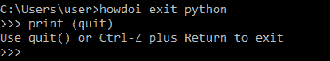
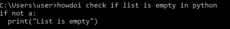
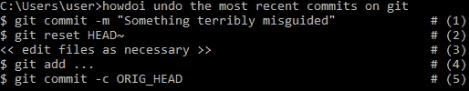
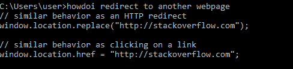
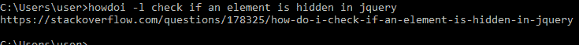

# Python 中的 howdoi

> 原文:[https://www.geeksforgeeks.org/howdoi-in-python/](https://www.geeksforgeeks.org/howdoi-in-python/)

**howdoi** 是用 Python 编写的命令行工具。它给出了基本编程任务的答案，同时仍然在控制台中工作，直接从命令行。它从 StackOverflow 上的顶级答案中抓取代码。你需要一个互联网连接来使用 howdoi。

*howdoi* 将回答各种与编程和编码相关的查询。比如获取语法方面的帮助、搜索特定用途的库、解决错误、使用预定义的函数及其应用程序等。

**安装命令:**

```
pip install howdoi
```

**用法:**

```
howdoi *QUERY*
```

**其他可选参数有:**

*   **-h :** 显示此帮助信息并退出
*   **-p POS :** 在指定位置选择答案(默认:1)
*   **-al :** 显示答案全文
*   **-l :** 仅显示答案链接
*   **-c :** 启用彩色输出
*   **-n NUM_ANSWERS :** 要返回的答案数
*   **-C :** 清除缓存
*   **-v :** 显示当前版本的 howdoi

**例:**

*   howdoi 告诉我们，在 C 语言中，可以通过使用“//”给出注释。


*   howdoi 告诉我们可以使用 quit()
    退出 python



*   howdoi 告诉我们如何检查 python 中的列表是否为空。



*   howdoi 告诉我们，git 上最近的提交可以通过以下步骤
    撤销



*   howdoi 告诉我们如何重定向到另一个网页。



*   -l 可选参数显示从其中获取答案的 StackOverflow 文章的链接。

