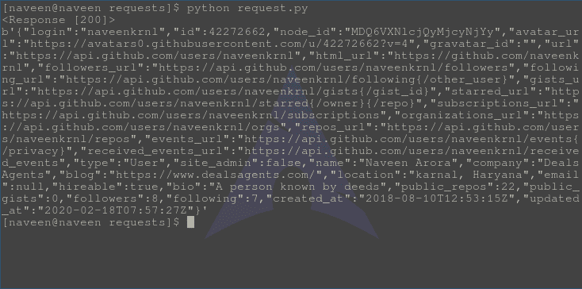

# Http 请求方法–Python 请求

> 原文:[https://www . geesforgeks . org/http-request-methods-python-requests/](https://www.geeksforgeeks.org/http-request-methods-python-requests/)

Python 请求模块有几个内置的方法，可以使用 GET、POST、PUT、PATCH 或 HEAD 请求向指定的 URI 发出 Http 请求。Http 请求意味着要么从指定的 URI 检索数据，要么将数据推送到服务器。它作为客户机和服务器之间的请求-响应协议。
网络浏览器可以是客户端，托管网站的计算机上的应用程序可以是服务器。本文围绕可用于向特定 URI 发出请求的各种方法展开。

## Http 请求方法

| 方法 | 描述 |
| --- | --- |
| [获取](#get) | GET 方法用于使用给定的 URI 从给定的服务器检索信息。 |
| [开机自检](#post) | POST 请求方法请求 web 服务器接受包含在请求消息正文中的数据，很可能是为了存储它 |
| [PUT](#put) | PUT 方法要求将封闭实体存储在提供的 URI 下。如果 URI 引用了一个已经存在的资源，它将被修改，如果 URI 没有指向一个现有的资源，那么服务器可以用那个 URI 创建资源。 |
| [删除](#delete) | DELETE 方法删除指定的资源 |
| [头部](#head) | HEAD 方法要求一个与 GET 请求相同的响应，但是没有响应体。 |
| [补丁](#patch) | 它用于修改功能。PATCH 请求只需要包含对资源的更改，而不是完整的资源 |

### 得到

GET 方法用于使用给定的 URI 从给定的服务器检索信息。GET 方法发送附加到页面请求的编码用户信息。页面和编码信息用“？”分隔性格。
例如:

```py
https://www.google.com/search?q=hello
```

#### 如何通过 Python 请求发出 GET 请求

Python 的 requests 模块提供了一个名为 **get()** 的内置方法，用于向指定的 URI 发出 get 请求。
**语法–**

```py
requests.get(url, params={key: value}, args)
```

**示例–**
为了示例的目的，让我们尝试向 github 的 API 发出请求。

## 蟒蛇 3

```py
import requests

# Making a GET request
r = requests.get('https://api.github.com / users / naveenkrnl')

# check status code for response received
# success code - 200
print(r)

# print content of request
print(r.content)
```

将此文件保存为 request.py 并通过终端运行，

```py
python request.py
```

**输出–**



更多信息，请访问 [GET 方法–Python 请求](https://www.geeksforgeeks.org/get-method-python-requests/)

### 邮政

POST 是万维网使用的 HTTP 支持的一种请求方法。根据设计，POST 请求方法请求 web 服务器接受包含在请求消息正文中的数据，很可能是为了存储它。它通常在上传文件或提交完整的 web 表单时使用。

#### 如何通过 Python 请求发出 POST 请求

Python 的请求模块提供了一个名为 **post()** 的内置方法，用于向指定的 URI 发出 post 请求。
**语法–**

```py
requests.post(url, params={key: value}, args)
```

**示例–**
为了示例目的，让我们尝试向 httpbin 的 API 发出请求。

## 蟒蛇 3

```py
import requests

# Making a POST request
r = requests.post('https://httpbin.org / post', data ={'key':'value'})

# check status code for response received
# success code - 200
print(r)

# print content of request
print(r.json())
```

将此文件保存为 request.py 并通过终端运行，

```py
python request.py
```

**输出–**


更多信息，请访问–[POST 方法–Python 请求](https://www.geeksforgeeks.org/post-method-python-requests/)

### 放

PUT 是万维网使用的 HTTP 支持的请求方法。PUT 方法要求将封闭实体存储在提供的 URI 下。如果 URI 引用了一个已经存在的资源，它将被修改，如果 URI 没有指向一个现有的资源，那么服务器可以用那个 URI 创建资源。

#### 如何通过 Python 请求发出 PUT 请求

Python 的请求模块提供了一个名为 **put()** 的内置方法，用于向指定的 URI 发出 put 请求。
**语法–**

```py
requests.put(url, params={key: value}, args)
```

**示例–**
为了示例目的，让我们尝试向 httpbin 的 API 发出请求。

## 蟒蛇 3

```py
import requests

# Making a PUT request
r = requests.put('https://httpbin.org / put', data ={'key':'value'})

# check status code for response received
# success code - 200
print(r)

# print content of request
print(r.content)
```

将此文件保存为 request.py 并通过终端运行，

```py
python request.py
```

**输出–**


更多信息，请访问–[PUT 方法–Python 请求](https://www.geeksforgeeks.org/put-method-python-requests/)

### 删除

DELETE 是万维网使用的 HTTP 支持的请求方法。DELETE 方法删除指定的资源。与 PUT 请求一样，您需要为此操作指定一个特定的资源。如果响应包括描述状态的实体，则成功响应应为 200(确定)，如果动作尚未实施，则为 202(已接受)，如果动作已实施，但响应不包括实体，则为 204(无内容)。
删除操作的 URI 示例

```py
http://www.example.com/articles/12345
```

#### 如何通过 Python 请求发出删除请求

Python 的 requests 模块提供了一个名为 **delete()** 的内置方法，用于向指定的 URI 发出 delete 请求。
**语法–**

```py
requests.delete(url, params={key: value}, args)
```

**示例–**
为了示例目的，让我们尝试向 httpbin 的 API 发出请求。

## 蟒蛇 3

```py
import requests

# Making a DELETE request
r = requests.delete('https://httpbin.org / delete', data ={'key':'value'})

# check status code for response received
# success code - 200
print(r)

# print content of request
print(r.json())
```