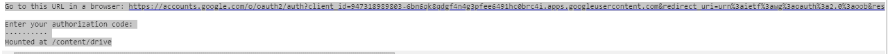
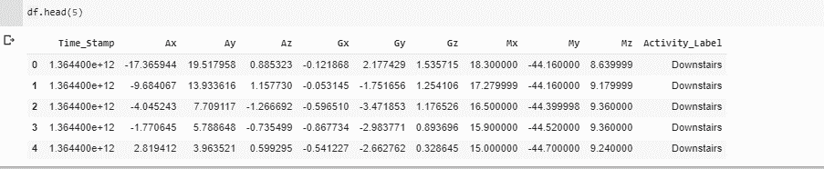
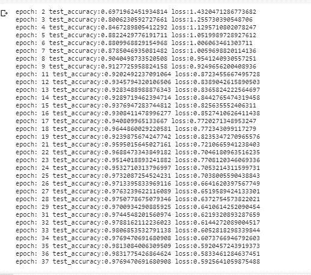
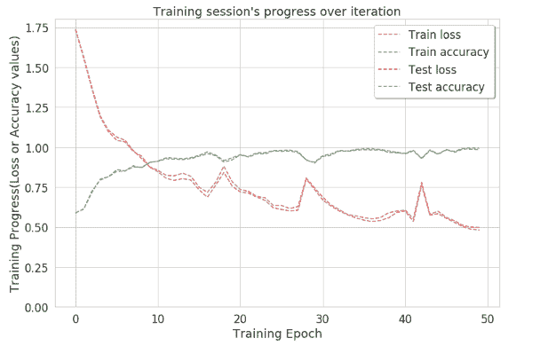

# 人类活动识别–使用深度学习模型

> 原文:[https://www . geesforgeks . org/人类-活动-识别-使用-深度学习-模型/](https://www.geeksforgeeks.org/human-activity-recognition-using-deep-learning-model/)

**使用加速度计等智能手机传感器进行人体活动识别**是研究的热门话题之一。HAR 是时间序列分类问题之一。在这个项目中，各种机器学习和深度学习模型已经被开发出来，以获得最佳的最终结果。在相同的序列中，我们可以使用递归神经网络(RNN)的 LSTM(长短期记忆)模型来识别人类的各种活动，如站立、上楼和下楼等。

**LSTM 模型**是一种能够学习序列预测问题中顺序依赖的递归神经网络。使用这个模型是因为这有助于记住任意时间间隔内的值。

人体活动识别数据集可以从下面给出的链接下载: [HAR 数据集](https://archive.ics.uci.edu/ml/datasets/human+activity+recognition+using+smartphones)
T3】活动:

*   步行
*   楼上
*   在楼下
*   坐着的
*   直立的

加速度计检测作为矢量的适当加速度的大小和方向，并可用于感测方向(因为重量方向发生变化)。根据角动量守恒，陀螺仪保持沿轴的方向，因此该方向不受支架倾斜或旋转的影响。
**理解数据集:**

*   这两个传感器都会随着时间的推移在三维空间中生成数据。
    (“XYZ”代表 X、Y 和 Z 方向的 3 轴信号。)
*   可用数据通过应用噪声滤波器进行预处理，然后在固定宽度的窗口 ie 中采样。，每个窗口有 128 个读数。

**训练和测试数据分离为**
80%志愿者的读数作为训练数据，其余 20%志愿者的记录作为测试数据。所有数据都存在于使用上面提供的链接下载的文件夹中。

**阶段**

*   选择数据集
*   上传驱动器中的数据集，以便在谷歌合作实验室中工作
*   数据集清理和数据预处理
*   选择模型并构建深度学习网络模型
*   在安卓工作室导出。

这个项目使用的 IDE 是谷歌合作实验室，这是处理深度学习项目的最佳时机。第 1 阶段如上所述是从下载数据集的地方开始的。按照这个顺序从项目开始在谷歌合作实验室打开一个新的笔记本首先导入所有必要的库。

**Code: Importing Libraries**

```py
import pandas as pd
import numpy as np
import pickle
import matplotlib.pyplot as plt
from scipy import stats
import tensorflow as tf
import seaborn as sns
from sklearn import metrics
from sklearn.model_selection import train_test_split

%matplotlib inline 
```

**第 2 阶段:**
它正在笔记本中上传数据集，在此之前，我们需要将笔记本安装在驱动器上，以便将此笔记本保存在我们的驱动器上，并在需要时进行检索。

```py
sns.set(style="whitegrid", palette="muted", font_scale=1.5)
RANDOM_SEED = 42

from google.colab import drive
drive.mount('/content/drive')
```

**输出:**

```py
You will see a pop up similar to one shown in the screenshot below, open the link and copy the authorization code and paste it in the authorization code bar and enter the drive will be mounted.
```



**代码:上传数据集**

```py
from google.colab import files
uploaded = files.upload()
```

现在进入模型构建和训练阶段，我们需要寻找不同的模型，以帮助构建更高精度的模型。这里选择了递归神经网络的 LSTM 模型。下图显示了数据的外观。



**阶段 3:**
从数据预处理开始。在这个阶段，大约 90%的时间被消耗在实际的数据科学项目上。在这里，原始数据以一些有用和有效的格式被获取和转换。
**编码:进行数据转换，对数据进行归一化**

```py
#transforming shape
reshaped_segments = np.asarray(
    segments, dtype = np.float32).reshape(
    -1 , N_time_steps, N_features)

reshaped_segments.shape
```

**代码:拆分数据集**

```py
X_train, X_test, Y_train, Y_test = train_test_split(
    reshaped_segments, labels, test_size = 0.2, 
    random_state = RANDOM_SEED)
```

测试规模取为 20%，即在总记录中，20%的记录用于测试准确性，其余记录用于训练模型。

班级数量= 6(走、坐、站、跑、上下楼)

**第四阶段:**在这个阶段选择的模型是 RNN 的 LSTM 模型。

**代码:模型搭建**

```py
def create_LSTM_model(inputs):
    W = {
        'hidden': tf.Variable(tf.random_normal([N_features, N_hidden_units])),
        'output': tf.Variable(tf.random_normal([N_hidden_units, N_classes]))
    }
    biases = {
        'hidden': tf.Variable(tf.random_normal([N_hidden_units], mean = 0.1)),
        'output': tf.Variable(tf.random_normal([N_classes]))
    }
    X = tf.transpose(inputs, [1, 0, 2])
    X = tf.reshape(X, [-1, N_features])
    hidden = tf.nn.relu(tf.matmul(X, W['hidden']) + biases['hidden'])
    hidden = tf.split(hidden, N_time_steps, 0)

    lstm_layers = [tf.contrib.rnn.BasicLSTMCell(
        N_hidden_units, forget_bias = 1.0) for _ in range(2)]
    lstm_layers = tf.contrib.rnn.MultiRNNCell(lstm_layers)

    outputs, _ = tf.contrib.rnn.static_rnn(lstm_layers, 
                                           hidden, dtype = tf.float32)

    lstm_last_output = outputs[-1]
    return tf.matmul(lstm_last_output, W['output']) + biases['output']
```

**代码:**使用 AdamOptimizer 执行优化，以修改变量的损失值，从而提高准确性并减少损失。

```py
L2_LOSS = 0.0015
l2 = L2_LOSS * \
  sum(tf.nn.l2_loss(tf_var) for tf_var in tf.trainable_variables())
loss = tf.reduce_mean(tf.nn.softmax_cross_entropy_with_logits(
    logits = pred_y, labels = Y)) + l2

Learning_rate = 0.0025
optimizer = tf.train.AdamOptimizer(learning_rate = Learning_rate).minimize(loss)
correct_pred = tf.equal(tf.argmax(pred_softmax , 1), tf.argmax(Y,1))
accuracy = tf.reduce_mean(tf.cast(correct_pred, dtype = tf.float32))
```

**代码:进行 50 次模型训练迭代，获得最高精度，减少损失**

```py
# epochs is number of iterations performed in model training.
N_epochs = 50  
batch_size = 1024

saver = tf.train.Saver()
history = dict(train_loss=[], train_acc=[], test_loss=[], test_acc=[])
sess = tf.InteractiveSession()
sess.run(tf.global_variables_initializer())
train_count = len(X_train)

for i in range(1, N_epochs + 1):
    for start, end in zip(range(0, train_count, batch_size), 
                          range(batch_size, train_count + 1, batch_size)):
        sess.run(optimizer, feed_dict={X: X_train[start:end],
                                       Y: Y_train[start:end]})
    _, acc_train, loss_train = sess.run([pred_softmax, accuracy, loss], feed_dict={
        X: X_train, Y: Y_train})
    _, acc_test, loss_test = sess.run([pred_softmax, accuracy, loss], feed_dict={
        X: X_test, Y: Y_test})
    history['train_loss'].append(loss_train)
    history['train_acc'].append(acc_train)
    history['test_loss'].append(loss_test)
    history['test_acc'].append(acc_test)

    if (i != 1 and i % 10 != 0):
        print(f'epoch: {i} test_accuracy:{acc_test} loss:{loss_test}')
predictions, acc_final, loss_final = sess.run([pred_softmax, accuracy, loss], 
                                              feed_dict={X: X_test, Y: Y_test})
print()
print(f'final results : accuracy : {acc_final} loss : {loss_final}')

```

**输出:**

所以，用这种方法在第 50 次迭代时精度达到了接近 1。这表明通过这种方法可以清楚地识别大多数标签。为了获得正确识别的活动的准确计数，创建了混淆矩阵。

**代码:精度图**

```py
plt.figure(figsize=(12,8))

plt.plot(np.array(history['train_loss']), "r--", label="Train loss")
plt.plot(np.array(history['train_acc']), "g--", label="Train accuracy")

plt.plot(np.array(history['test_loss']), "r--", label="Test loss")
plt.plot(np.array(history['test_acc']), "g--", label="Test accuracy")

plt.title("Training session's progress over iteration")
plt.legend(loc = 'upper right', shadow = True)
plt.ylabel('Training Progress(Loss or Accuracy values)')
plt.xlabel('Training Epoch')
plt.ylim(0)

plt.show()
```


**混淆矩阵:**混淆矩阵不亚于 2D 矩阵，因为它有助于计算正确识别的活动的准确计数。换句话说，它描述了分类模型在测试数据集上的性能。
**代号:混乱矩阵**

```py
max_test = np.argmax(Y_test, axis=1)
max_predictions = np.argmax(predictions, axis = 1)
confusion_matrix = metrics.confusion_matrix(max_test, max_predictions)

plt.figure(figsize=(16,14))
sns.heatmap(confusion_matrix, xticklabels = LABELS, yticklabels = LABELS, annot =True, fmt = "d")
plt.title("Confusion Matrix")
plt.xlabel('Predicted_label')
plt.ylabel('True Label')
plt.show()
```

这是到目前为止关于这个项目的完整描述。它可以用有线电视新闻网这样的模型或 KNN 这样的机器学习模型来构建。