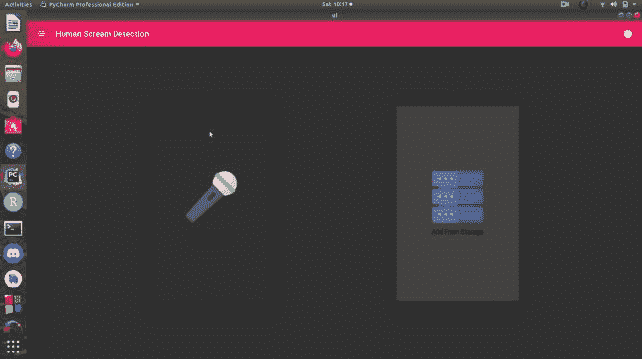
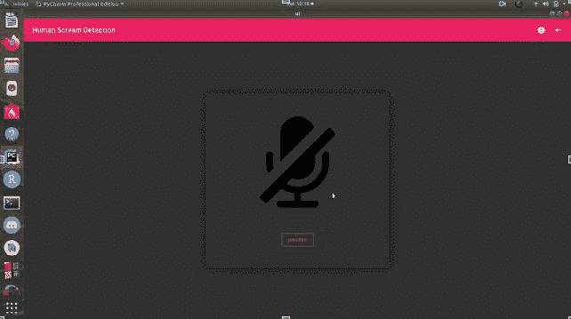
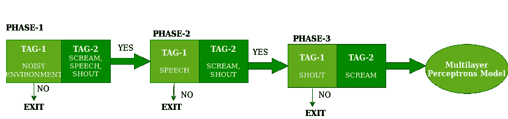
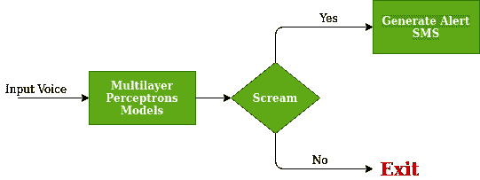
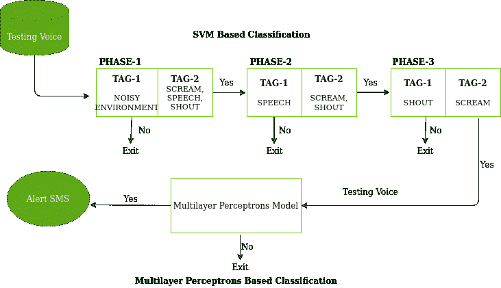

# 控制犯罪率的人体尖叫检测与分析——项目构想

> 原文:[https://www . geesforgeks . org/human-scream-detection-and-analysis-for-control-犯罪率-project-idea/](https://www.geeksforgeeks.org/human-scream-detection-and-analysis-for-controlling-crime-rate-project-idea/)

**项目名称:**利用机器学习和深度学习控制犯罪率的人体尖叫检测与分析

犯罪是当今社会最大的社会问题，并且日益蔓延。每天都有成千上万的犯罪发生，而且现在世界各地仍有许多犯罪发生。犯罪发生在许多人的脸上，它可以发生在任何人的脸上，像抢劫、谋杀、强奸、严重和简单的攻击、杀人等。在许多情况下，犯罪现场没有警察，这可能是因为他们没有适当的地址，或者有时没有人通知他们。因此，我们试图在我们项目的帮助下解决这个问题，其中重点是及时发现犯罪，并通过**短信**(短消息服务)形式的警报信息，利用位置共享帮助最近的警察局官员及时到达犯罪现场。

### 介绍

正如标题所示，该项目将是一个桌面应用程序，它本身有一个在后台工作的功能，通过使用**机器学习**和**深度学习**概念，它将在实时环境中检测和分析人类的尖叫声，如果该应用程序发现其周围有严重的情况，它将自动向最近的警察局发送警报消息及其用户的位置。不仅如此，该应用程序将能够从背景噪声中检测出清晰的人类声音。

**目的:**本项目的目的是利用先进的技术来帮助某人挽救生命和控制犯罪率。

### 使用的工具和技术 **:**

1.  整个项目后端使用 python 语言开发
2.  本项目采用 Kivy 框架设计了适用于桌面和安卓应用的应用界面。
3.  机器学习的 SVM(支持向量机)用于尖叫声的检测和分类。
4.  深度学习的多层感知器模型用于确认检测到的尖叫声。

### 所需技能:

1.  核心和高级 Python 知识是必需的
2.  需要基本的 Kivy 框架知识
3.  机器学习需要 SVM(支持向量机)基础知识
4.  机器学习需要神经网络知识
5.  必须熟悉图书馆，如熊猫、NumPy、scikit-learn、TensorFlow 和 librosa。

### 履行

让我们将这个项目的实施分为不同的步骤，如下所述:

#### 第一步:用户界面设计

首先，开发项目的 UI 或用户界面。我们将使用 Kivy ( Python)框架开发用户界面，用户将使用该框架进行交互。我们来看看这个项目的 UI。

主屏幕

录制屏幕

#### 第二步:为人类尖叫检测准备一个数据集

这个项目的整个数据集分为两类，一类是正类，包括大约 2000 个人类尖叫声来训练模型，另一类是负类，包括大约 3000 个不被认为是尖叫的负面声音。

**注:**本项目数据集来自[https://www.freesoundeffects.com/](https://www.freesoundeffects.com/)等不同网站。

#### 第三步:提取多功能 CCs

下一步是使用 Librosa 库从数据集中提取 MFCC，并将提取的 MFCC 保存在计算机上的 **CSV** 文件中。

**注:** MFCCs 代表 Mel 频率倒谱系数，是自动语音和说话人识别中广泛使用的特征。

#### 第四步:SVM 模型的训练及其保存

接下来，我们将训练 SVM(支持向量机)模型在那些我们在上一步中创建的 MFCCs 上，当整个训练完成后，我们将使用 TensorFlow 库保存它。下面是使用 SVM 分类器检测噪声、语音、叫喊和尖叫的示意图。

利用 SVM 分类器检测噪声、语音、呼喊和尖叫

#### 第五步:MPN 模型的训练及其保存

现在，我们将对数据集中存在的声音训练 MPN(多层感知器模型)，以获得模型的良好精度，当整个训练完成后，再像前面一样使用张量流库保存它。MPN 的工作图如下。

MPN 的工作

#### 步骤 6:生成警报消息的方法

现在，在成功地训练和保存了这两个模型之后，现在我们将继续测试这两个模型，并且根据这两个模型提供的响应，我们将决定风险级别，并且根据风险级别，我们将生成警报消息。

在本项目中，将生成两种警报消息，即基于周围条件的高风险警报消息和中等风险警报消息。

*   **高风险提示信息:**当两个模型都检测到周围有人尖叫的情况下，系统会产生高风险提示信息。
*   **中等风险预警消息:**当两个模型中有一个模型检测到周围有人尖叫时，系统会自动生成一条中等风险预警消息。

#### 第七步:给最近的派出所发短信

然而，该项目目前正在开发中，所以我们提供的想法只是如何开发这个功能。对于该功能的开发，我们可以借助数据库，并在项目检测到任何紧急情况时向该号码发送短信。

#### 工作图

向您提供了这个项目的工作图，它解释了两个模型的内部工作，并将用于实现项目。

两种模式(SVM 和 MPN)的联合内部工作

**输出:**

<video class="wp-video-shortcode" id="video-624413-1" width="640" height="360" preload="metadata" controls=""><source type="video/mp4" src="https://media.geeksforgeeks.org/wp-content/uploads/20210605220446/progeeks_output.mp4?_=1">[https://media.geeksforgeeks.org/wp-content/uploads/20210605220446/progeeks_output.mp4](https://media.geeksforgeeks.org/wp-content/uploads/20210605220446/progeeks_output.mp4)</video>

### 项目在现实生活中的应用

这个项目是为了社会安全而提出的。这个项目旨在帮助降低犯罪率，也旨在帮助警察的工作。此外，这个项目的成功也将鼓励开发商建造对社会安全更有用的东西。

### 项目验收

该研究论文已在**第五届** **发明系统与控制国际会议【ICISC 2021】**上发表，主题为[通过三阶段监督学习和深度学习进行人类尖叫检测](https://link.springer.com/chapter/10.1007/978-981-16-1395-1_28)。

### 团队成员

1.  [**【yash mathur】**](https://auth.geeksforgeeks.org/user/yashmathur123123/profile)
2.  [**【riya mathur】**](https://auth.geeksforgeeks.org/user/riyamathur/profile)

**Github 链接:**[https://Github . com/themckingjester/Human _ snow _ Detection _ using _ ml _ and _ deep _ learning](https://github.com/themockingjester/Human_Scream_Detection_using_ml_and_deep_learning)