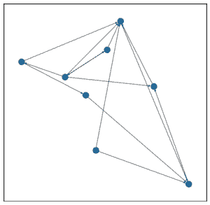
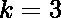

# 使用 Networxx 模块的超链接诱导主题搜索(HITS)算法| Python

> 原文:[https://www . geesforgeks . org/hyperlink-induced-topic-search-hits-algorithm-use-networxx-module-python/](https://www.geeksforgeeks.org/hyperlink-induced-topic-search-hits-algorithm-using-networxx-module-python/)

**超链接诱导主题搜索** (HITS)算法是一种对网页进行评分的链接分析算法，由乔恩·克莱因伯格开发。该算法用于网络链接结构，以发现与特定搜索相关的网页并对其进行排名。
HITS 使用中枢和权威来定义网页之间的递归关系。在理解 HITS 算法之前，我们首先需要了解枢纽和权威。

*   给定对搜索引擎的查询，这一组高度相关的网页被称为**根**。他们是潜在的**当局**。
*   不太相关但指向根中页面的页面称为**中枢**。因此，权威是许多中心链接到的页面，而中心是链接到许多权威的页面。

**算法–**

> ->让迭代次数为 *k* 。
> - >每个节点被分配一个中心分数= 1 和一个权威分数= 1。
> - >重复 *k* 次:
> 
> *   **枢纽更新:**每个节点的枢纽得分= (它所指向的每个节点的权限得分)。
> *   **权限更新:**每个节点的权限分数= (指向它的每个节点的 Hub 分数)。
> *   *通过将每个 Hub 分数除以所有 Hub 分数平方和的平方根，并将每个 Authority 分数除以所有 Authority 分数平方和的平方根，对分数进行归一化*。(可选)

现在，让我们看看如何使用 Networxx 模块实现这个算法。
让我们考虑以下图表:



使用(无归一化)运行 HITS 算法时，

```py
Initially,
Hub Scores:        Authority Scores:
A -> 1             A -> 1
B -> 1             B -> 1
C -> 1             C -> 1
D -> 1             D -> 1
E -> 1             E -> 1
F -> 1             F -> 1
G -> 1             G -> 1
H -> 1             H -> 1

After 1st iteration,
Hub Scores:        Authority Scores:
A -> 1             A -> 3
B -> 2             B -> 2
C -> 1             C -> 4
D -> 2             D -> 2
E -> 4             E -> 1
F -> 1             F -> 1
G -> 2             G -> 0
H -> 1             H -> 1

After 2nd iteration,
Hub Scores:        Authority Scores:
A -> 2             A -> 4
B -> 5             B -> 6
C -> 3             C -> 7
D -> 6             D -> 5
E -> 9             E -> 2
F -> 1             F -> 4
G -> 7             G -> 0
H -> 3             H -> 1

After 3rd iteration,
Hub Scores:        Authority Scores:
A -> 5             A -> 13
B -> 9             B -> 15
C -> 4             C -> 27
D -> 13            D -> 11
E -> 22            E -> 5
F -> 1             F -> 9
G -> 11            G -> 0
H -> 4             H -> 3
```

Python 包 Networkx 有一个运行 HITS 算法的内置函数。参考上面的图表，这将是可视化的。

## 蟒蛇 3

```py
# importing modules
import networkx as nx
import matplotlib.pyplot as plt

G = nx.DiGraph()

G.add_edges_from([('A', 'D'), ('B', 'C'), ('B', 'E'), ('C', 'A'),
                  ('D', 'C'), ('E', 'D'), ('E', 'B'), ('E', 'F'),
                  ('E', 'C'), ('F', 'C'), ('F', 'H'), ('G', 'A'),
                  ('G', 'C'), ('H', 'A')])

plt.figure(figsize =(10, 10))
nx.draw_networkx(G, with_labels = True)

hubs, authorities = nx.hits(G, max_iter = 50, normalized = True)
# The in-built hits function returns two dictionaries keyed by nodes
# containing hub scores and authority scores respectively.

print("Hub Scores: ", hubs)
print("Authority Scores: ", authorities)
```

**输出:**


```py
Hub Scores:  {'A': 0.04642540386472174, 'D': 0.133660375232863,
              'B': 0.15763599440595596, 'C': 0.037389132480584515, 
              'E': 0.2588144594158868, 'F': 0.15763599440595596,
              'H': 0.037389132480584515, 'G': 0.17104950771344754}

Authority Scores:  {'A': 0.10864044085687284, 'D': 0.13489685393050574, 
                    'B': 0.11437974045401585, 'C': 0.3883728005172019,
                    'E': 0.06966521189369385, 'F': 0.11437974045401585,
                    'H': 0.06966521189369385, 'G': 0.0}
```