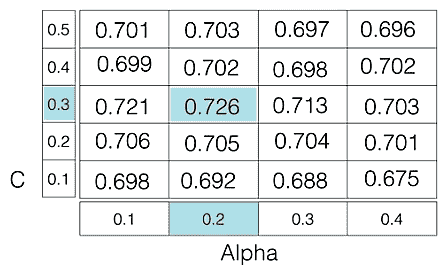

# 超参数调谐

> 原文:[https://www.geeksforgeeks.org/hyperparameter-tuning/](https://www.geeksforgeeks.org/hyperparameter-tuning/)

机器学习模型被定义为具有许多参数的数学模型，这些参数需要从数据中学习。通过用现有数据训练模型，我们能够拟合模型参数。
然而，还有另一类参数，称为 ***【超参数】*** ，不能直接从常规训练过程中学习。它们通常在实际训练过程开始之前就已经固定了。这些参数表达了模型的重要属性，如模型的复杂性或学习速度。

模型超参数的一些例子包括:

1.  逻辑回归分类器中的惩罚，即 L1 或 L2 正则化
2.  训练神经网络的学习速率。
3.  支持向量机的 C 和σ超参数。
4.  k 近邻中的 k。

本文的目的是探索调整机器学习模型超参数的各种策略。

模型可以有许多超参数，寻找参数的最佳组合可以被视为一个搜索问题。超参数调整的两个最佳策略是:

*   [GridSearchCV](https://scikit-learn.org/stable/modules/generated/sklearn.model_selection.GridSearchCV.html)
*   [随机抽样的 earchv](https://scikit-learn.org/stable/modules/generated/sklearn.model_selection.RandomizedSearchCV.html)

**GridSearchCV**
在 GridSearchCV 方法中，针对一系列超参数值评估机器学习模型。这种方法被称为`GridSearchCV`，因为它从超参数值网格中搜索最佳超参数集。

例如，如果我们想要设置逻辑回归分类器模型的两个超参数 C 和 Alpha，具有不同的值集。gridsearch 技术将使用 hyerparameters 的所有可能组合构建模型的多个版本，并将返回最佳版本。

如图所示，对于 C = [0.1，0.2，0.3，0.4，0.5]和 Alpha = [0.1，0.2，0.3，0.4]。
对于组合 ***C=0.3，Alpha=0.2*** ，表现得分出来是 **0.726(最高)**，因此被选中。


*下面的代码说明了如何使用 GridSearchCV*

```
# Necessary imports
from sklearn.linear_model import LogisticRegression
from sklearn.model_selection import GridSearchCV

# Creating the hyperparameter grid
c_space = np.logspace(-5, 8, 15)
param_grid = {'C': c_space}

# Instantiating logistic regression classifier
logreg = LogisticRegression()

# Instantiating the GridSearchCV object
logreg_cv = GridSearchCV(logreg, param_grid, cv = 5)

logreg_cv.fit(X, y)

# Print the tuned parameters and score
print("Tuned Logistic Regression Parameters: {}".format(logreg_cv.best_params_)) 
print("Best score is {}".format(logreg_cv.best_score_))
```

**输出:**

> 调整后的逻辑回归参数:{'C': 3.7275937203149381}
> 最佳得分为 0.72720310005

***缺点*** : GridSearchCV 会遍历超参数的所有中间组合，这使得网格搜索的计算量非常大。

**随机化搜索 CV**
随机化搜索 CV 解决了 GridSearchCV 的缺点，因为它只通过固定数量的超参数设置。它以随机方式在网格中移动，以找到最佳超参数集。这种方法减少了不必要的计算。
 *以下代码说明了如何使用随机化搜索 CV*

```
# Necessary imports
from scipy.stats import randint
from sklearn.tree import DecisionTreeClassifier
from sklearn.model_selection import RandomizedSearchCV

# Creating the hyperparameter grid 
param_dist = {"max_depth": [3, None],
              "max_features": randint(1, 9),
              "min_samples_leaf": randint(1, 9),
              "criterion": ["gini", "entropy"]}

# Instantiating Decision Tree classifier
tree = DecisionTreeClassifier()

# Instantiating RandomizedSearchCV object
tree_cv = RandomizedSearchCV(tree, param_dist, cv = 5)

tree_cv.fit(X, y)

# Print the tuned parameters and score
print("Tuned Decision Tree Parameters: {}".format(tree_cv.best_params_))
print("Best score is {}".format(tree_cv.best_score_))
```

**输出:**

> 优化决策树参数:{'min_samples_leaf': 5，' max_depth': 3，' max_features': 5，' criteria ':' Gini ' }
> 最佳得分为 0.7265625