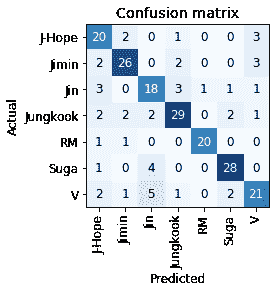
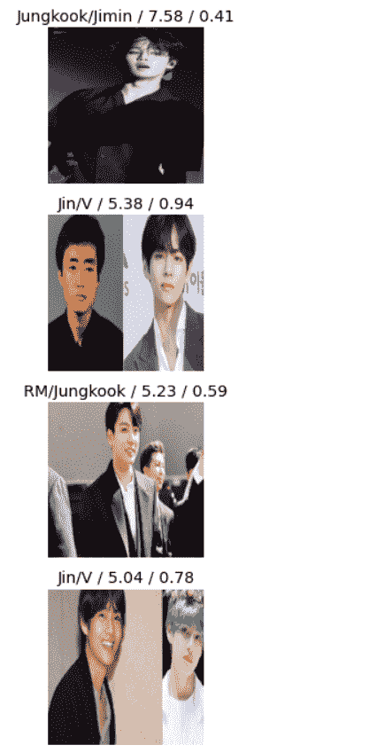

# 识别基站的成员——一个图像分类器

> 原文:[https://www . geeksforgeeks . org/identify-members-of-BTS-an-image-classifier/](https://www.geeksforgeeks.org/identify-members-of-bts-an-image-classifier/)

BTS 是一个著名的 K-Pop 乐队，由 7 名成员组成。本文研究一个图像分类器，它可以从图片中识别乐队成员的名字。图像分类器将使用 fastai 构建。这是一个深度学习图书馆，旨在使深度学习民主化。它建立在 PyTorch 的基础上，并且有许多重量优化的模型可以随时使用。应用程序将托管在 Binder 上，最终产品如下所示:

<video class="wp-video-shortcode" id="video-685622-1" width="640" height="360" preload="metadata" controls=""><source type="video/mp4" src="https://media.geeksforgeeks.org/wp-content/uploads/20210915173945/BTS_Classifier.mp4?_=1">[https://media.geeksforgeeks.org/wp-content/uploads/20210915173945/BTS_Classifier.mp4](https://media.geeksforgeeks.org/wp-content/uploads/20210915173945/BTS_Classifier.mp4)</video>

## **准备数据集**

与任何图像分类器一样，模型需要在数据集上进行训练，从中可以推断和提取对应于特定类别的特征。BTS 图像分类器将包含 7 个类别(成员总数)。数据集可以通过手动收集不同成员的图像，然后将它们放在该类别的文件夹中来准备。为了加快这个过程，可以使用 Python 脚本来创建数据集。该脚本将从谷歌图像搜索获取图像。(免责声明:使用这些图像可能会导致侵犯版权，因此继续进行，风险自负)。

名为 **simple_images** 的文件夹将出现在脚本所在的位置。在 **simple_images** 文件夹中，对应于 7 个成员中的每一个成员的 150 个图像的文件夹将会出现。

是时候对分类器进行编码了。建议使用谷歌 Collab(训练时 GPU 会派上用场)，并将数据集上传到谷歌驱动。

## 蟒蛇 3

```
# Import fastbook
from fastbook import *
from fastai.vision.widgets import *
from google.colab import drive 
drive.mount('/content/drive')

import fastbook
fastbook.setup_book()

class DataLoaders(GetAttr):
    def __init__(self, *loaders): self.loaders = loaders

    def __getitem__(self, i): return self.loaders[i]
    train, valid = add_props(lambda i, self: self[i])
```

**数据加载器**是一个负责向模型提供有效训练数据集的类。

## 蟒蛇 3

```
# Import the required function to download from the Simple Image Download library.
from simple_image_download import simple_image_download as simp
# Create a response instance.
response = simp.simple_image_download
# The following lines would look up Google Images and download the number of images specified.
# The first argument is the term to search, and the second argument is the number of images to be downloaded.
response.download('BTS Jin', 150)
response.download('BTS Jimin', 150)
response.download('BTS RM', 150)
response.download('BTS J-Hope', 150)
response.download('BTS Suga', 150)
response.download('BTS Jungkook', 150)
```

## 清理数据

已下载的图像可能尺寸不同。最好让数据集中的所有图像具有统一的维度。 *fastai* 库对此有一个功能:

## 蟒蛇 3

```
bts = bts.new(
    item_tfms=RandomResizedCrop(224, min_scale=0.5),
    batch_tfms=aug_transforms())
dls = bts.dataloaders(path)
```

所有图像都被调整到 224 x 224，这是训练数据集中图像的标准大小。

## 创建模型

是时候创造**学习者了。**学习者是将从提供的数据集*学习*的模型。当提供的图像不是训练集的一部分时，它将能够预测输出(独立变量)。这里使用的学习者被称为“Resnet18”。它已经被预训练过了，这意味着权重被调整了，这样模型应该能够在没有进一步调整的情况下进行合理的预测。这个想法叫做**转学**。

## 蟒蛇 3

```
learn = cnn_learner(dls, resnet18, metrics=error_rate)
learn.fine_tune(8)
```

**微调(8)** 表示学习进行了 8 个时期。这个号码可以玩。准确性和计算能力/时间之间的权衡是需要考虑的。

现在模型已经训练好了，结果可以通过查看混淆矩阵来可视化。

## 蟒蛇 3

```
interp = ClassificationInterpretation.from_learner(learn)
interp.plot_confusion_matrix()
```

<center>
</center>

理想情况下，只有混淆矩阵的对角线元素应该是非零的。可以看出，在模型的预测中，存在一些错误的分类。

可以看到顶部**损耗**的图像。这些通常是模型非常确定地错误预测或不太确定地正确预测的图像。

## 蟒蛇 3

```
interp.plot_top_losses(5, nrows=5)
```

<center></center>

## 部署模型

该模型将使用 Binder 进行部署。需要粘贴笔记本的 GitHub 网址。首先需要导出模型，以及扩展名为*的文件。需要生成 pkl* 。

## 蟒蛇 3

```
learn.export()
path = Path()
path.ls(file_exts='.pkl')
```

访问[网站](https://mybinder.org/)获取活页夹。粘贴包含笔记本和*的 GitHub 储存库的网址。pkl* 文件。在“打开的网址”空白处，输入笔记本的网址。点击“启动”，几分钟后，网络应用程序就可以使用了。

**注意:**这个图像分类器最早是在 Fast 中教的。人工智能深度学习课程，第 2 讲。